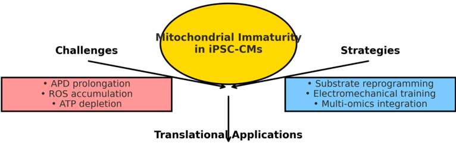

Review

## Enhancing Mitochondrial Maturation in iPSC-Derived Cardiomyocytes: Strategies for Metabolic Optimization

Dhienda C. Shahannaz 1,2 , Tadahisa Sugiura 2, * and Brandon E. Ferrell 2

- 1 Faculty of Medicine, Universitas Indonesia, Jakarta 10430, Indonesia; dhiendaladdynasrul@gmail.com
- 2 Department of Cardiothoracic and Vascular Surgery, Montefiore Medical Center/Albert Einstein College of Medicine, Greene Medical Arts Pavilion 5th Floor, 3400 Bainbridge Avenue, Bronx, NY 10467, USA
- * Correspondence: tsugiura@montefiore.org; Tel.: +1-718-405-8249

## Abstract

Background: Induced pluripotent stem cell-derived cardiomyocytes (iPSC-CMs) hold transformative potential for cardiovascular regenerative medicine, yet their clinical application is hindered by suboptimal mitochondrial maturation and metabolic inefficiencies. This systematic review evaluates targeted strategies for optimizing mitochondrial function, integrating metabolic preconditioning, substrate selection, and pathway modulation to enhance energy production and cellular resilience. Additionally, we examine the role of extracellular matrix stiffness and mechanical stimulation in mitochondrial adaptation, given their influence on metabolism and maturation. Methods: A comprehensive analysis of recent advancements in iPSC-CM maturation was conducted, focusing on metabolic interventions that enhance mitochondrial structure and function. Studies employing metabolic preconditioning, lipid and amino acid supplementation, and modulation of key signaling pathways, including PGC-1 α , AMPK, and mTOR, were reviewed. Computational modeling approaches predicting optimal metabolic shifts were assessed, alongside insights into reactive oxygen species (ROS) signaling, calcium handling, and the impact of electrical pacing on energy metabolism. Results: Evidence indicates that metabolic preconditioning with fatty acids and oxidative phosphorylation enhancers improves mitochondrial architecture, cristae density, and ATP production. Substrate manipulation fosters a shift toward adult-like metabolism, while pathway modulation refines mitochondrial biogenesis. Computational models enhance precision, predicting interventions that best align iPSC-CM metabolism with native cardiomyocytes. The synergy between metabolic and biomechanical cues offers new avenues for accelerating maturation, bridging the gap between in vitro models and functional cardiac tissues. Conclusions: Strategic metabolic optimization is essential for overcoming mitochondrial immaturity in iPSC-CMs. By integrating biochemical engineering, predictive modeling, and biomechanical conditioning, a robust framework emerges for advancing iPSC-CM applications in regenerative therapy and disease modeling. These findings pave the way for more physiologically relevant cell models, addressing key translational challenges in cardiovascular medicine.

Keywords: mitochondrial maturation; iPSC-derived cardiomyocytes; oxidative phosphorylation; mitochondrial biogenesis; fatty acid oxidation; energy metabolism; metabolic preconditioning; cardiac regeneration; regenerative medicine

## 1. Introduction

Cardiovascular disease (CVD) remains the leading cause of death worldwide, with ischemic heart disease alone accounting for 9 million deaths annually [1]. The burden is

Academic Editors: Buyong Ma and Manuel Aureliano

Received: 29 April 2025

Revised: 24 July 2025

Accepted: 25 July 2025

Published: 31 July 2025

Citation: Shahannaz, D.C.; Sugiura, T.; Ferrell, B.E. Enhancing Mitochondrial Maturation in iPSC-Derived Cardiomyocytes: Strategies for Metabolic Optimization. BioChem 2025 , 5 , 23. https:// doi.org/10.3390/biochem5030023

Copyright: © 2025 by the authors. Licensee MDPI, Basel, Switzerland. This article is an open access article distributed under the terms and conditions of the Creative Commons Attribution (CC BY) license (https://creativecommons.org/ licenses/by/4.0/).

especially significant in Indonesia [2], Japan [3], and the United States [4], where aging populations and lifestyle-related risk factors contribute to an escalating incidence of heart failure (HF), myocardial infarction (MI), and congenital heart disorders. In Indonesia, CVD causes 36% of all deaths [5], with limited access to advanced cardiac care exacerbating poor outcomes. In Japan, where the aging population is projected to reach 40% by 2040, degenerative cardiac conditions are a growing concern [6]. Meanwhile, in the United States, heart failure affects 6.2 million adults, with associated healthcare costs exceeding USD 30 billion annually [7]. With the escalating burden of cardiovascular diseases worldwide, especially in aging populations, there is a critical need for regenerative therapies that can effectively address the irreversible loss of cardiomyocytes. iPSC-CMs offer a promising solution, but their metabolic immaturity presents significant challenges that must be overcome for clinical success

Despite advances in pharmacological and interventional therapies, cardiomyocyte (CM) loss in cardiac diseases remains irreversible, necessitating regenerative approaches [8]. Induced pluripotent stem cell-derived cardiomyocytes (iPSC-CMs) have emerged as a promising cell source for cardiac repair and disease modeling [9,10]. However, a fundamental challenge remains: iPSC-CMs exhibit metabolic immaturity, underdeveloped mitochondrial architecture, and suboptimal oxidative phosphorylation (OXPHOS) capacity, limiting their ability to mimic the contractile and electrophysiological properties of adult CMs [11-14]. Mitochondrial maturation is crucial for iPSC-CMs to mimic the contractile and electrophysiological properties of adult cardiomyocytes. Without proper mitochondrial maturation, these cells cannot efficiently integrate into host cardiac tissue, limiting their therapeutic potential in clinical applications such as myocardial infarction repair or tissue engineering.

In native human cardiac development, the metabolic landscape undergoes a tightly regulated shift from a glycolytic fetal profile to an oxidative, fatty acid-dependent phenotype in postnatal life [15]. Fetal CMs primarily rely on anaerobic glycolysis and lactate oxidation to support rapid proliferation, with relatively low mitochondrial density and cristae complexity [16,17]. Postnatally, increased oxygen availability and hormonal changes trigger a surge in mitochondrial biogenesis and oxidative capacity, enabling fatty acid oxidation (FAO) to become the dominant ATP-generating pathway [15,18]. This transition defines the metabolic benchmark for maturation and underpins the energetic demands of adult CMs. Replicating this transition in vitro is central to engineering functional iPSC-CMs that can recapitulate adult-like cardiac physiology. To better understand the extent of mitochondrial maturation in iPSC-CMs, we summarize key features in Table 1, comparing fetal cardiomyocytes, iPSC-CMs at different maturation stages, and adult cardiomyocytes. This comparison highlights the current gaps and the need for advanced strategies to enhance mitochondrial function.

Table 1. Mitochondrial maturation stages.

| Mitochondrial Feature               | Fetal CMs      | iPSC-CMs (Day 30)   | iPSC-CMs (Post-Maturation)   | Control: Adult CMs   | %Fidelity to Adult Cells   |
|-------------------------------------|----------------|---------------------|------------------------------|----------------------|----------------------------|
| Cristae Density (per µ m 2 )        | 2.1 * [19]     | ~2.3 [20,21]        | 4.5 [22]                     | 6.8 [23]             | ~66%                       |
| FAO Enzyme Expression (CPT1A/HADHA) | Low [24]       | Low [25]            | Moderate [25,26]             | High [26]            | ~78%                       |
| ATP-linked Respiration (%)          | 30% [17,27-29] | 25% [17,26-29]      | 70% [26]                     | 100%                 | 70% [26]                   |

Table 1. Cont.

| Mitochondrial Feature                       | Fetal CMs   | iPSC-CMs (Day 30)   | iPSC-CMs (Post-Maturation)   | Control: Adult CMs   | %Fidelity to Adult Cells   |
|---------------------------------------------|-------------|---------------------|------------------------------|----------------------|----------------------------|
| ROS Scavenging Efficiency (SOD2 Expression) | Low [30-33] | Low [32,34]         | High [32,34]                 | Very High [31-34]    | 88%                        |
| Calcium Handling (MCU Activity)             | Weak [35]   | Weak [36-38]        | Moderate [36-38]             | Strong [39-41]       | ~82% [31-43]               |

* iPSC-CM values in Table 1 represent interpolated estimates based on available qualitative and functional data, providing a practical benchmark for mitochondrial maturation studies. Day 30 iPSC-CMs, specifically, are presented as a pre-maturation baseline stage, commonly referenced in the literature for early-stage cardiomyocyte differentiation prior to metabolic and structural remodeling. It is important to note that direct cristae density counts per µ m 2 remain limited; however, estimations are guided by side-by-side visual comparisons using electron microscopy (EM), along with correlative readouts of mitochondrial function such as ATP production and ROS regulation. Additionally, cristae density can vary across mitochondrial subpopulations in cardiomyocytes. For example, subsarcolemmal mitochondria (SSM) typically exhibit more lamellar cristae, whereas interfibrillar mitochondria (IFM) may differ in morphology and bioenergetic specialization. These structural distinctions are essential when interpreting the metabolic maturation trajectory of iPSC-CMs. An adult cardiomyocyte, typically sourced from ventricular tissue of post-pubertal mammals (e.g., 8-12-week-old rodents), is defined by its elongated, rod-shaped morphology, aligned sarcomeres with Z-line organization, adult isoform expression such as TNNI3 over TNNI1, increased SCN5A and KCNJ12 signaling, and a metabolic profile dominated by oxidative phosphorylation and fatty acid oxidation. Mitochondrial cristae in this context are dense, structurally ordered, and paired with high SOD2 expression and efficient ROS scavenging capacity-parameters that establish ventricular cardiomyocytes as the benchmark for adult cardiac phenotype. To facilitate cross-platform interpretation, the '% fidelity to adult cells' row reflects a standardized comparative metric derived from either direct measurements or proportional estimations. Where empirical data exist, such as the 4.5 cristae/ µ m 2 value reported by Dai et al. (2017) [22], fidelity is calculated by ratio to adult controls (e.g., 4.5/6.8 ≈ 66%). For metrics derived from direct structural data-such as cristae density-values reflect empirical morphometric analyses performed on late-stage cardiomyocytes (day &gt; 100), offering a concrete ultrastructural benchmark relative to adult ventricular tissue. These values reflect empirical morphometric analyses performed on late-stage cardiomyocytes (day &gt; 100), providing a concrete reference for mitochondrial ultrastructural maturation. For other domains-such as ATP-linked respiration, FAO enzyme induction, SOD2 expression, or MCU activity-fidelity percentages are synthesized from functional readouts including Seahorse flux assays, immunoblotting, and high-resolution imaging. This matrix translates domain-specific maturation data into a unified evaluative index, offering a quantifiable approximation of bioenergetic readiness for translational application.

This table underscores the intermediate fidelity of current maturation protocols and the need for multifaceted strategies to fully bridge the metabolic gap. Mitochondria play a pivotal role in CM function, ATP generation, calcium homeostasis, and reactive oxygen species (ROS) regulation. Dysfunctional mitochondrial bioenergetics contribute to heart failure progression, arrhythmogenesis, and ischemia-reperfusion injury [44-48]. In iPSC-CMs, inadequate mitochondrial maturation prevents full metabolic transition from glycolysis to OXPHOS, impairing their capacity to integrate into host cardiac tissue post-transplantation [30,49,50]. Bridging this metabolic gap is crucial for advancing iPSC-CM applications in personalized medicine, high-fidelity disease modeling, and clinical-grade cell therapy. Accordingly, metrics such as cristae density, FAO enzyme expression, ATP-linked respiration, ROS scavenging efficiency, and calcium handling provide quantitative insight into mitochondrial oxidative capacity and metabolic maturity. By using these parameters, we can objectively assess the extent to which post-maturation iPSC-CMs have progressed relative to adult CMs-offering a concrete evaluation of mitochondrial maturation.

## 1.1. Current Knowledge and Limitations

Recent studies have explored biochemical, genetic, and environmental strategies to enhance mitochondrial maturation in iPSC-CMs [9,51]. Metabolic preconditioning using fatty acid-rich media has shown promise in shifting iPSC-CMs from glycolysis to OXPHOS [10]. Similarly, biophysical conditioning (e.g., electrical stimulation, substrate stiffness modulation) has demonstrated improvements in mitochondrial density and cristae

complexity [9,51]. Genetic overexpression of PGC-1 α , a master regulator of mitochondrial biogenesis, has been reported to enhance iPSC-CM metabolic function [30,51-54].

Despite these advances, significant limitations persist. First, most studies are conducted in vitro, which limits their applicability to in vivo environments [54]. Second, the heterogeneity of iPSC-CM populations means that metabolic outcomes can vary significantly, affecting consistency in clinical applications [9,10,51]. Third, long-term effects of metabolic reprogramming on arrhythmogenic potential and functional stability remain underexplored, necessitating further research. Fourth, many prior studies lack large-scale transcriptomic and proteomic analyses, limiting mechanistic insights [48]. Furthermore, computational modeling approaches to optimize metabolic interventions are still in their infancy, hindering precision in tailoring mitochondrial enhancement strategies and highlighting the need for more comprehensive data-driven models to optimize metabolic interventions [55,56].

## 1.2. Need for a Comprehensive Systematic Review

Given these challenges, a comprehensive, evidence-based synthesis of mitochondrial maturation strategies is imperative. Existing studies have provided fragmented insights, but an integrated, multidisciplinary approach is lacking. This systematic review aims to consolidate findings across metabolic engineering, bioinformatics-driven modeling, and advanced in vitro methodologies to establish a robust framework for mitochondrial optimization. By critically evaluating intervention efficacy, scalability, and translational potential, we seek to refine standard protocols and identify novel combinatorial strategies that can accelerate iPSC-CM maturation.

Moreover, there is an urgent need to redefine the role of computational biology in mitochondrial engineering. While machine learning models have been employed in drug screening and cardiac electrophysiology, their application in predicting metabolic optimization pathways for iPSC-CMs is underdeveloped. This review will explore how predictive modeling can guide rational metabolic interventions, offering a data-driven approach to enhancing mitochondrial maturation.

From a translational standpoint, the findings of this review will be instrumental in bridging preclinical studies with clinical applications. A standardized roadmap for mitochondrial maturation will pave the way for safer, more functionally viable iPSC-CM therapies, with implications for myocardial infarction repair, cardiotoxicity screening, and bioartificial heart tissue engineering.

## 1.3. Objectives and Methodological Framework

The primary objective of this systematic review is to evaluate, compare, and integrate metabolic enhancement strategies for mitochondrial maturation in iPSC-CMs, with an emphasis on translational viability. The review will systematically assess the following:

- (1) Metabolic Preconditioning Approaches: (a) Substrate optimization, (b) Fatty acid supplementation, and (c) Hypoxia/reoxygenation cycles;
- (2) Genetic and Pharmacological Modulation: (a) PGC-1 α overexpression, (b) AMPK activation, (c) mTOR inhibition; and (d) Other mitochondrial biogenesis inducers;
- (3) Biophysical and Electrical Stimulation Strategies: (a) Mechanical stress, (b) Extracellular matrix composition, and (c) Electrical pacing;
- (4) Computational and Systems Biology Approaches: (a) Multi-omics profiling, and (b) Predictive modeling for metabolic pathway optimization.

This study will employ PRISMA (Preferred Reporting Items for Systematic Reviews and Meta-Analyses) guidelines to ensure methodological rigor. Data will be extracted from PubMed, Embase, Google Scholar, and clinical trial repositories, with inclusion criteria

focusing on studies that quantitatively assess mitochondrial structure, metabolic function, and bioenergetics in iPSC-CMs. Risk of bias will be evaluated using ROBINS-I (Risk of Bias in Non-Randomized Studies of Interventions) for observational studies and the Cochrane risk-of-bias tool for randomized trials.

By systematically integrating biochemical, bioengineering, and computational innovations, this review aims to establish a definitive resource for advancing mitochondrial maturation strategies in iPSC-CMs. The ultimate goal is to accelerate the clinical translation of metabolically optimized iPSC-CMs, ensuring their viability as a next-generation cell therapy for cardiovascular disease. This review uniquely integrates experimental and computational strategies to establish a unified framework for optimizing mitochondrial maturation in iPSC-CMs-a synthesis not yet fully explored in the literature.

## 2. Methods

## 2.1. Data Compilation

To comprehensively evaluate strategies for enhancing mitochondrial maturation in iPSC-CMs, we conducted a systematic and interdisciplinary literature search across PubMed, Scopus, Web of Science, Medline, Embase, IEEE Xplore, Cochrane Library, Europe PMC, ScienceDirect, SpringerLink, DOAJ, and Google Scholar. We aimed to identify peer-reviewed studies and preprints published between January 2006 and January 2025 that investigate metabolic interventions, bioengineering approaches, and computational modeling strategies for optimizing mitochondrial function in iPSC-CMs.

The search terms included 'iPSC-derived cardiomyocytes' OR 'iPSC-CM metabolic maturation' AND 'mitochondrial biogenesis' OR 'oxidative phosphorylation in iPSCCMs' OR 'cardiac metabolism reprogramming' OR 'fatty acid metabolism in iPSC-CMs' OR 'electron transport chain maturation' OR 'bioenergetic optimization' OR 'PGC-1 α activation in iPSC-CMs' OR 'AMPK signaling in cardiac metabolism' OR 'biophysical conditioning in iPSC-CMs' OR 'predictive metabolic modeling' OR 'bioinformatics in cardiac metabolism' OR 'clinical-grade iPSC-CMs' OR 'scalable differentiation protocols' OR 'bioengineered cardiac tissue' OR '3D cardiac organoids'.

We applied Boolean logic operators to refine search queries, ensuring the inclusion of landmark discoveries, technological innovations, and translational strategies relevant to cardiac regenerative medicine. Studies were considered eligible if they met the following criteria: i. published between 1 January 2006 and 15 June 2025; ii. original research articles, systematic reviews, or meta-analyses published in peer-reviewed journals or preprint servers; iii. experimental studies (in vitro, in vivo, or clinical trials) focusing on iPSC-CM mitochondrial maturation, metabolic reprogramming, or bioenergetic enhancement; and iv. studies reporting on scalability, computational modeling, or regulatory aspects relevant to clinical translation

Exclusion criteria included articles focusing solely on unrelated stem cell types, metabolic disorders without cardiac relevance, or studies lacking experimental validation of metabolic interventions. Articles were screened through title and abstract review, with duplicate and low-relevance studies excluded.

## 2.2. Data Extraction and Analysis

Full-text evaluation prioritized studies with robust methodologies, including the following:

- · Metabolic flux assays (e.g., Seahorse extracellular flux analysis);
- · Mitochondrial morphology and function assessment (e.g., electron microscopy (EM), ROS quantification, and ATP production assays);
- · In vivo transplantation models assessing iPSC-CM engraftment and metabolic function;

- · Bioinformatics approaches, including transcriptomic and proteomic analyses, to identify key regulators of metabolic maturation;
- · Computational modeling studies exploring metabolic pathway optimization.

Additionally, citation tracking, AI-driven bibliometric analysis (via Dimensions.ai), and reference mining were employed to identify high-impact and overlooked studies.

Studies are screened using ROBINS-I (Risk of Bias in Non-Randomized Studies of Interventions), as many of the iPSC-CM studies are observational or quasi-experimental. Utilizing R0BINS-I ensures a systematic evaluation of potential biases in such studies, by assessing domains of confounding, selection of participants, classification of interventions, deviations from intended interventions, missing data, measurement of outcomes, and selection of reported result in RoB 2 Cochrane Risk-of-Bias Tool for Randomized Trials: Bias arising from the randomization process, due to deviations from intended interventions, due to missing outcome data, in measurement of the outcome, selection of the reported result.

## 2.2.1. Integration of Bioinformatics and Computational Modeling

Given the limited application of computational models in iPSC-CM metabolic maturation, we specifically included studies utilizing machine learning, metabolic flux balance analysis (FBA), and predictive modeling to optimize metabolic interventions. This aspect aligns with the need for precision-tailored strategies, as highlighted in the introduction.

## 2.2.2. Clinical Translation Considerations

To ensure translational relevance, we integrated insights from the following:

- · Preprint repositories (bioRxiv, medRxiv) for emerging strategies;
- · Clinical trial databases (ClinicalTrials.gov) for ongoing iPSC-CM transplantation studies;
- · Regulatory reports (FDA, EMA, PMDA) for GMP-compliant iPSC-CM manufacturing.

This rigorous yet adaptive search framework captures both historical milestones and emerging frontiers, enabling the identification of novel combinatorial strategies for mitochondrial maturation in iPSC-CMs.

## 3. Results

## 3.1. Pooled Findings from Eligible Studies

## 3.1.1. Study Selection Overview

Atotal of 1273 articles were initially identified from 13 databases using Boolean search logic. After duplicate removal and title/abstract screening, 122 full-text articles were assessed for eligibility. Ultimately, 25 studies met the inclusion criteria and were included for qualitative synthesis (Figure 1).

## 3.1.2. Study Characteristics

All study characteristics included in this review are described in Table 2. Studies are identified by model used, intervention, metabolic assay, key findings described, and mitochondria maturation markers described.

Figure 1. Systematic flow chart of pooled journals.

Table 2. Characteristics of included studies on mitochondrial maturation strategies in iPSC-CM (2006-2025).

| No.                                     | Author (Year)                           | Model Used                                       | Intervention                                                 | Metabolic Assay                         | Key Findings                                                                                           | Mitochondria Maturation Markers                                  |
|-----------------------------------------|-----------------------------------------|--------------------------------------------------|--------------------------------------------------------------|-----------------------------------------|--------------------------------------------------------------------------------------------------------|------------------------------------------------------------------|
| 1.                                      | Dai et al. (2017) [22]                  | Human iPSC-CM                                    | Prolonged Culture                                            | Oxygen Consumption Rate (OCR), EM       | ↑ ETC complex activity                                                                                 | ↑ PGC-1 α , ↑ ATP                                                |
| a. Metabolic Preconditioning Approaches | a. Metabolic Preconditioning Approaches | a. Metabolic Preconditioning Approaches          | a. Metabolic Preconditioning Approaches                      | a. Metabolic Preconditioning Approaches | a. Metabolic Preconditioning Approaches                                                                | a. Metabolic Preconditioning Approaches                          |
| Substrate Optimization                  | Substrate Optimization                  | Substrate Optimization                           | Substrate Optimization                                       | Substrate Optimization                  | Substrate Optimization                                                                                 | Substrate Optimization                                           |
| 2.                                      | Ye et al. (2021) [57]                   | iPSC-CM + AMPK activator                         | Metformin, AICAR                                             | ATP assay, qPCR                         | ↑ FAO, ↑ mitochondrial biogenesis                                                                      | ↑ CPT-1 α                                                        |
| 3.                                      | Yang et al. (2019) [58]                 | iPSC-CM + Palmitate + oleic acid                 | Fatty acid supplementation                                   | Seahorse XF96 assay, EM, RNA sequencing | ↑ FAO                                                                                                  | ↑ ATP, ↑ OCR, ↑ mtDNA, ↑ mitochondrial area, ↑ cristae structure |
| 4.                                      | Rana et al. (2012) [59]                 | iPSC-CM + Palmitate + L-carnitine                | PPAR α agonist+ Fatty acids                                  |                                         | ↑ OCR, ↓ glycolysis                                                                                    | ↑ PDK4, ↑ CPT1B                                                  |
| 5.                                      | Horikoshi et al. (2019) [34]            | iPSC-CM + Palmitate + Carnitine                  | PGC-1 α + Fatty acids                                        |                                         | ↑ FAO, ↑ cristae density, ↑ OCR, ↑ force generation ↑ calcium handling, ↓ glycolysis                   | ↑ ACADM, ↑ COX5B                                                 |
| 6.                                      | Correia et al. (2017) [60]              | iPSC-CM + FA-rich, glucose-free media            | PPPAR/PGC-1 α activationPAR/PGC- 1 α activation              |                                         | ↑ mitochondrial density, ↑ OXPHOS ↑ contractility                                                      | ↑ COX2, ↑ CPT1A, ↑ SDHB                                          |
| 7.                                      | Feyen et al. (2020) [61]                | iPSC-CM + Palmitate + Galactose, metabolic media | Metabolic media (PGC-1 α upregulation), palmitate, galactose |                                         | ↑ mitochondrial respiratory capacity, ↑ FAO, ↑ T-tubules, ↑ AP duration ↓ glycolysis                   | ↑ NDUFS3, ↑ ATP5F1, ↑ PGC-1 α , ↑ CPT1B                          |
| 8.                                      | Canfield et al. (2016) [62]             | iPSC-CM + Glucose challenge                      | Glucose                                                      | ROS and ATP assay                       | ↑ ROS generation, ↑ mitochondrial fission under high glucose, ↓ mitochondrial fusion under low glucose | ↑ DRP1, ↓ Opa1                                                   |

Table 2. Cont.

| No.                                                                 | Author (Year)                                                       | Model Used                                                                       | Intervention                                                                                                                | Metabolic Assay                                                                         | Key Findings                                                                                                                  | Mitochondria Maturation Markers                                                                                                                                                 |
|---------------------------------------------------------------------|---------------------------------------------------------------------|----------------------------------------------------------------------------------|-----------------------------------------------------------------------------------------------------------------------------|-----------------------------------------------------------------------------------------|-------------------------------------------------------------------------------------------------------------------------------|---------------------------------------------------------------------------------------------------------------------------------------------------------------------------------|
| Fatty Acid Supplementation (FAO Activation, Glycolysis Suppression) | Fatty Acid Supplementation (FAO Activation, Glycolysis Suppression) | Fatty Acid Supplementation (FAO Activation, Glycolysis Suppression)              | Fatty Acid Supplementation (FAO Activation, Glycolysis Suppression)                                                         | Fatty Acid Supplementation (FAO Activation, Glycolysis Suppression)                     | Fatty Acid Supplementation (FAO Activation, Glycolysis Suppression)                                                           | Fatty Acid Supplementation (FAO Activation, Glycolysis Suppression)                                                                                                             |
| 9.                                                                  | Miklas (2019) [63]                                                  | Human ESC-CM and iPSC-CM                                                         | Knockdown of HADHA(TFPa subunit of mitochondrial trifunctional protein)                                                     | Seahorse XF, metabolomics, cardiolipin profiling                                        | HADHAis crucial for FAO and cardiolipin remodeling; knockdown disrupted β -oxidation and mitochondrial membrane structure     | ↓ FAO genes (CPT, ACADVL), ↓ ATP, ↓ OCR, ↓ mitochondrial integrity                                                                                                              |
| 10.                                                                 | Vuckovic (2022) [26]                                                | iPSC-CM: Healthy and diseased                                                    | Long-term culture, metabolic substrate, hormonal stimulation                                                                | Seahorse XF, qPCR, metabolomics                                                         | ↑ OXPHOS, impaired mitochondrial function in disease model                                                                    | ↑ PGC-1 α , ↑ CPT1B, ↑ C0X4, ↓ glycolytic shift                                                                                                                                 |
| Hypoxia-Reoxygenation Cycles                                        | Hypoxia-Reoxygenation Cycles                                        | Hypoxia-Reoxygenation Cycles                                                     | Hypoxia-Reoxygenation Cycles                                                                                                | Hypoxia-Reoxygenation Cycles                                                            | Hypoxia-Reoxygenation Cycles                                                                                                  | Hypoxia-Reoxygenation Cycles                                                                                                                                                    |
| 11.                                                                 | Uche et al (2023) [64]                                              | iPSC-CM + Hypoxia- reoxygenation cycles and H9c2 rat cardiomyoblast (comparison) | Carvedilol pretreatment (0.25-2.5 micrometer) prior to doxorubicin exposure (0.5 micrometer) and PGC-1 α overexpression for | Seahorse XF assays, immunostaining, gene expression analysis (qRT-PCR, Western blot)    | ↑ mitochondrial biogenesis, Preserving mitochondrial respiration, ↓ oxidative stress, carvedilol maintained redox balance     | ↑ PGC-1 α , ERR α , TFAM, complex I-IV activity, MMP, mitochondrial mass and function                                                                                           |
| 12.                                                                 | Peters et al. (2022) [48]                                           | iPSC-CM+ Fatty acid media and hypoxia reoxygenation cycles                       | Metabolic maturation (MM) via low-glucose, fatty acid-rich media for 3 weeks + hypoxia (1% or 5% O2)                        | Seahorse XF24 Analyzer (OCR), LDH release, glucose/lactate measurements                 | ↑ OXPHOS, ↑ OCR in normoxia, ↓ glycolysis                                                                                     | ↓ CPT1B, ↓ TOMM20 (mitochondrial damage post-hypoxia).                                                                                                                          |
| mTORInhibition                                                      | mTORInhibition                                                      | mTORInhibition                                                                   | mTORInhibition                                                                                                              | mTORInhibition                                                                          | mTORInhibition                                                                                                                | mTORInhibition                                                                                                                                                                  |
| 13.                                                                 | Chirico et al. (2022) [52]                                          | 2D iPSC-CM monolayer                                                             | Asiatic acid (AA), GW501516 (GW), or T3 (positive control                                                                   | Seahorse XF24 Extracellular Flux Analyzer, qPCR, and Western blot                       | ↑ FAO, ↑ OXPHOS, ↑ TCA cycle utilization, increased glycolytic reserve, ↑ mitochondrial respiratory capacity                  | ↑ PGC-1 α , ↑ CPT1B, ↑ IMMT (mitochondrial content and organization), ↑ ATP5A (mitochondrial ATP synthase), NDUFV3, COX 3, COX 5B (ETC Components), ion channels (KCNQ1, SCN5A) |
| Extracellular Matrix (ECM) Composition                              | Extracellular Matrix (ECM) Composition                              | Extracellular Matrix (ECM) Composition                                           | Extracellular Matrix (ECM) Composition                                                                                      | Extracellular Matrix (ECM) Composition                                                  | Extracellular Matrix (ECM) Composition                                                                                        | Extracellular Matrix (ECM) Composition                                                                                                                                          |
| 14.                                                                 | Ulmer et al. (2019) [65]                                            | iPSC-CM+ mechanical load + FA                                                    | Mechanical load (cyclic stretch) + fatty acid supplementation (palmitate)                                                   | Seahorse XF Analyzer [OCR/Extracellular Acidification Rate (ECAR)], RNA-seq, ATP assays | ↑ mitochondrial respiratory capacity, ↑ OCR ↑ FAO ↑ CPT1B, ↑ PPAR α ↓ glycolysis ↑ sarcomere organization ↑ calcium handling. | ↑ Mitochondrial density ( ↑ TOMM20). ↑ Oxidative genes (ACADM, ETFDH). ↓ Glycolytic enzymes (PDK4).                                                                             |
| 15.                                                                 | Ronaldson-Bouchard et al. (2018) [66]                               | 3D iPSC-CM tissue                                                                | Mechanical stimulation (cyclic mechanical stretch)                                                                          | Seahorse XF24, EM                                                                       | ↑ mitochondrial structural and maturation                                                                                     | ↑ mtDNA content, ↑ ATP, ↑ cristae structure                                                                                                                                     |
| b. Genetic and Pharmacological Modulation                           | b. Genetic and Pharmacological Modulation                           | b. Genetic and Pharmacological Modulation                                        | b. Genetic and Pharmacological Modulation                                                                                   | b. Genetic and Pharmacological Modulation                                               | b. Genetic and Pharmacological Modulation                                                                                     | b. Genetic and Pharmacological Modulation                                                                                                                                       |
| 16.                                                                 | Xu et al. (2022) [67]                                               | iPSC-CM and ohia mutant mouse hearts                                             | (Observation)                                                                                                               | Seahorse XF, mitoSoX staining, TMRMstaining, TEM                                        | ↑ ROS, ↓ MMP ↓ OXPHOS                                                                                                         | ↓ ATP, ↓ OCR, ↓ TMRM, ↓ disrupted cristae ↓ MMP                                                                                                                                 |
| 17.                                                                 | Zhou et al. (2021) [53]                                             | iPSC-CM                                                                          | Overexpression of PGC-1 α during differentiation                                                                            | Seahorse XF, qPCR, Western blot                                                         | ↑ FAO, ↑ OXPHOS, ↑ ATP, ↑ Calcium Handling                                                                                    | ↑ PGC-1 α , ↑ TFAM, ↑ NRF1, ↑ mtDNA content, ↑ COX 4 ↑ ATP                                                                                                                      |
| 18.                                                                 | Gentillon et al. (2019) [68]                                        | iPSC-CM                                                                          | HIF-1 α inhibition + PPPAR α agonist + postnatal cues (T3, fatty acids)                                                     | Seahorse XF, ATP assay, qPCR, TEM                                                       | ↑ OXPHOS ↓ glycolysis, ↑ ion channel maturation                                                                               | ↑ PGC1 α , ↑ mtDNA, ↑ OCR, ↑ cristae complexity, ↓ Glycolysis (ECAR)                                                                                                            |
| 19.                                                                 | Zhang et al. (2021) [19]                                            | iPSC-CM                                                                          | NRF2 overexpression and knockdown                                                                                           | Seahorse XF, TMRM, ATP assays, TEM                                                      | NRF2 knockdown impaired mitochondrial structure and function                                                                  | ↑ TFAM, ↑ PGC-1 α , ↑ CPT1B, ↑ mitochondrial area/density, ↑ OCR, ↓ fragmentation                                                                                               |

Table 2. Cont.

| No.                                                  | Author (Year)                                                         | Model Used                                                                      | Intervention                                                                                                                                                                                                                                                                                                                       | Metabolic Assay                                                                                                   | Key Findings                                                                                                                                                                             | Mitochondria Maturation Markers                                                                                                   |
|------------------------------------------------------|-----------------------------------------------------------------------|---------------------------------------------------------------------------------|------------------------------------------------------------------------------------------------------------------------------------------------------------------------------------------------------------------------------------------------------------------------------------------------------------------------------------|-------------------------------------------------------------------------------------------------------------------|------------------------------------------------------------------------------------------------------------------------------------------------------------------------------------------|-----------------------------------------------------------------------------------------------------------------------------------|
| c. Biophysical and Electrical Stimulation Strategies | c. Biophysical and Electrical Stimulation Strategies                  | c. Biophysical and Electrical Stimulation Strategies                            | c. Biophysical and Electrical Stimulation Strategies                                                                                                                                                                                                                                                                               | c. Biophysical and Electrical Stimulation Strategies                                                              | c. Biophysical and Electrical Stimulation Strategies                                                                                                                                     | c. Biophysical and Electrical Stimulation Strategies                                                                              |
| Electrical Pacing                                    | Electrical Pacing                                                     | Electrical Pacing                                                               | Electrical Pacing                                                                                                                                                                                                                                                                                                                  | Electrical Pacing                                                                                                 | Electrical Pacing                                                                                                                                                                        | Electrical Pacing                                                                                                                 |
| 20.                                                  | Nunes (2013) [69]                                                     | iPSC-CM +electrical pacing                                                      | Electrical pacing (biowiore platform)                                                                                                                                                                                                                                                                                              | Seahorse XF, ATP assay, Mitotracker staining                                                                      | Pacing improved mitochondrial respiration, ↑ sarcomere alignment ↑ calcium handling                                                                                                      | ↑ Mitochondrial density ↑ ATP                                                                                                     |
| Mechanical Stress                                    | Mechanical Stress                                                     | Mechanical Stress                                                               | Mechanical Stress                                                                                                                                                                                                                                                                                                                  | Mechanical Stress                                                                                                 | Mechanical Stress                                                                                                                                                                        | Mechanical Stress                                                                                                                 |
| 21.                                                  | Vacek et al. (2011) [70]                                              | Isolated mouse cardiomyocytes                                                   | Electrical stimulation                                                                                                                                                                                                                                                                                                             | Cell culture, Electrical stimulate, Zymography, EM                                                                | ↑ mitochondrial remodeling                                                                                                                                                               | ↑ mtMMP-9 activation, mitochondrial remodeling, ↓ MMPand cristae integrity                                                        |
| d. Computational and Systems Biology Approaches      | d. Computational and Systems Biology Approaches                       | d. Computational and Systems Biology Approaches                                 | d. Computational and Systems Biology Approaches                                                                                                                                                                                                                                                                                    | d. Computational and Systems Biology Approaches                                                                   | d. Computational and Systems Biology Approaches                                                                                                                                          | d. Computational and Systems Biology Approaches                                                                                   |
| 22.                                                  | Ozcebe et al. (2025) [71] * also under ECM composition classification | iPSC-CM + Proteomic profiling of ECM components (e.g., fibronectin, galectin-1) | Adult human heart-derived ECM                                                                                                                                                                                                                                                                                                      | Seahorse XF, ATP assay, TEM, TMRM                                                                                 | ↑ mitochondrial morphology, ↑ ATP, ↑ OCR, matrix signals regulate mitochondrial maturity via outside-in signaling                                                                        | ↑ cristae density, ↑ ATP, ↑ OCR, ↑ MMP                                                                                            |
| 23.                                                  | Yang et al. (2024) [72]                                               | iPSCM-CM + experimental optical voltage and calcium imaging data                | Computational modeling for phenotype-driven metabolic optimization                                                                                                                                                                                                                                                                 | Multi-omics integration, optical voltage and calcium imaging, in silico simulation                                | Developed individualized, cell-specific metabolic models predicting bioenergetic state and improving maturity benchmarking                                                               | Modeled ATP production, OXPHOS potential, and mitochondrial membrane potential as predicted outputs tied to real optical dynamics |
| 24.                                                  | Nam et al. (2024) [73]                                                | Chemically induced cardiomyocyte-like cells (CiCMs)                             | Mitochondrial delivery from heart, liver, or brain tissues                                                                                                                                                                                                                                                                         | Multi-omics profiling, computational and predictive modeling, qPCR, Western blot, TEM, OCR, glycolytic rate assay | Enhanced mitochondrial function and improved maturation of CiCMs via mitochondrial reprogramming. Metabolic shifts observed toward energy efficiency.                                    | ↑ complex I and II activity, ↑ ATP, ↑ MMP, ↑ PGC-1 α , ↑ TFAM, ↑ mitochondrial mass ↓ glycolytic flux                             |
| 25.                                                  | Jiang et al. (2024) [56]                                              | iPSC-CM                                                                         | The review discusses the impact of altered mitochondrial biogenesis and metabolic switching on the maturation of hiPSC-CMs. It highlights the limitations of current methodologies for assessing metabolism in hiPSC-CMs and the challenges in achieving sufficient metabolic flexibility akin to that in the healthy adult heart. | Not specified                                                                                                     | Various metabolic interventions, including fatty acid supplementation, modulation of transcription factors (e.g., HIF-1a, PPARa), and regulation of key genes through specific microRNAs | Not specified                                                                                                                     |

* Key: AP (action potential), ATP (adenosine triphosphate), ESC-CM (embryonic stem cell-derived cardiomyocytes), OCR (oxygen consumption rate), EM (electron microscopy), PGC-1 α (peroxisome proliferator-activated receptor gamma coactivator 1-alpha), FAO (fatty acid oxidation), CPT-1 α (carnitine palmitoyltransferase 1 alpha), mtDNA (mitochondrial DNA), PPAR α (peroxisome proliferator-activated receptor alpha), ACDM (acylCoA dehydrogenase medium chain), COX5B (cytochrome c oxidase subunit 5B), COX2 (cytochrome c oxidase subunit 2), CPT1A (carnitine palmitoyltransferase 1A), SDHB (succinate dehydrogenase complex iron sulfur subunit B), ATP5F1 (ATP synthase F1 subunit), DRP1 (dynamin-related protein 1), OPA1 (optic atrophy 1), HADHA(hydroxyacyl-CoA dehydrogenase trifunctional multienzyme complex subunit alpha), ACADVL (acylCoA dehydrogenase very long chain), OXPHOS (oxidative phosphorylation), NRF1 (nuclear respiratory factor 1), ERR α (estrogen-related receptor alpha), TFAM (transcription factor A, mitochondrial), MMP (mitochondrial membrane potential), AA (asiatic acid), GW (GW501516), IMMT (inner membrane mitochondrial protein), ATP5A (ATP synthase F1 subunit alpha), NDUFV3 (NADH-ubiquinone oxidoreductase flavoprotein V3), COX3 (cytochrome c oxidase subunit 3), KCNQ1 (potassium voltage-gated channel subfamily Q member 1), SCN5A (sodium voltage-gated channel alpha subunit 5), ECM (extracellular matrix), ETFDH (electron transfer flavoprotein dehydrogenase), PDK4 (pyruvate dehydrogenase kinase 4), TMRM (tetramethylrhodamine methyl ester), HIF-1 α (hypoxia-inducible factor 1-alpha), MMP-9 (matrix metallopeptidase 9), CiCMs (chemically induced cardiomyocyte-like cells), AMPK (AMP-activated protein kinase), LDH (lactate dehydrogenase), ECAR (extracellular acidification rate), ROS (reactive oxygen species), TEM (transmission electron microscopy), T-Tubule (transverse tubules, invaginations of cardiomyocyte's sarcolemma for triggering calcium release), ↑ indicates increase in said marker, ↓ indicates decrease in said marker.

## 3.1.3. Thematic Synthesis of Findings Metabolic Preconditioning Approaches

## 1. Substrate optimization

Modulating the substrate environment plays a pivotal role in facilitating mitochondrial maturation in iPSC-CMs. Prolonged culture duration (Dai et al., 2017 [22]) induced elevated OXPHOS and ATP synthesis through increased ETC complex activity and PGC-1 α expression. Glucose-rich conditions, conversely, triggered ROS accumulation and mitochondrial fragmentation (Canfield et al., 2016 [62]), underscoring the necessity of tightly controlled metabolic inputs. Long-term metabolic conditioning (Vuckovic et al., 2022 [26]) further emphasized that despite enhanced oxidative signaling, pathological contexts may inherently constrain mitochondrial outcomes.

- 2. Fatty acid supplementation (FAO activation, glycolysis suppression) Fatty acid-enriched media consistently activated FAO pathways, improved cristae morphology, and elevated mitochondrial biogenesis markers. Palmitate and oleic acid supplementation (Yang et al., 2019 [58]), with or without L-carnitine or PPAR α agonists (Rana et al., 2012 [59]; Horikoshi et al., 2019 [34]), led to significant gains in ATP production, OCR, and contractile function. Correia et al. (2017) [60] and Feyen et al. (2020) [61] integrated glucose deprivation with FAO stimulation, enhancing PGC-1 α -mediated respiratory efficiency and sarcomeric maturity. Conversely, perturbation of lipid metabolism enzymes such as HADHA (Miklas et al., 2019) [63] markedly disrupted mitochondrial structure and energy output, affirming the critical role of intact β -oxidation machinery in cardiomyocyte energetics.

## 3. Hypoxia/reoxygenation cycles

Transient hypoxia followed by reoxygenation has emerged as a potent stimulator of mitochondrial biogenesis. PGC-1 α overexpression during these cycles (Uche et al., 2023 [64]) promoted mtDNA replication, complex activity, and mitochondrial mass. Peters et al. (2022) [48] demonstrated that coupling hypoxia with fatty acid media enhanced OXPHOS while suppressing glycolysis, although signs of mitochondrial damage, such as TOMM20 downregulation post-reoxygenation, indicated the importance of dosage and timing in such protocols.

## Genetic and Pharmacological Modulation

## 1. PGC-1 α overexpression

PGC-1 α overexpression remains a central strategy for inducing mitochondrial biogenesis and function in iPSC-derived cardiomyocytes. Uche et al., 2023 [64] demonstrated that coupling periodic hypoxia-reoxygenation with PGC-1 α induction markedly elevated expression of TFAM and NRF1, enriched mtDNA content, and enhanced ETC complex activity and membrane potential. Zhou et al. (2021) [53] further validated these findings, reporting simultaneous improvements in FAO, ATP production, and calcium handling upon PGC-1 α overexpression during differentiation.

AMPK, a key energy sensor, has been effectively targeted to drive mitochondrial biogenesis. Ye et al. (2021) [57] applied AMPK activators such as metformin and AICAR, resulting in elevated FAO rates and increased CPT1 α expression, reinforcing

- 2. AMPKactivation metabolic maturation through enhanced fatty acid oxidation.

## 3. MTOR inhibition

Targeting the mTOR pathway introduces a complementary avenue to promote oxidative metabolism. Chirico et al. (2022) [52] utilized mTOR-modulatory compounds like Asiatic acid and GW501516, which synergistically enhanced OXPHOS, TCA cycle

activity, and mitochondrial respiratory capacity, while also boosting expression of mitochondrial ATP synthase subunits and ETC components.

## 4. Other mitochondrial biogenesis inducers

Complementary strategies such as ECM-mediated signaling and computational modeling offer indirect but powerful enhancements of mitochondrial maturity. Ozcebe et al. (2025) [71] showed that proteomic mapping of adult human ECM led to improved cristae density, OCR, and ATP levels via outside-in signaling. Similarly, Gentillon et al. (2019) [68] demonstrated that a combination of HIF-1 α inhibition, PPAR α activation, and postnatal biochemical cues promoted complex cristae architecture and downregulated glycolysis. Collectively, these multimodal approaches reinforce the central role of mitochondrial biogenesis in achieving functional iPSC-CM maturation.

## Biophysical and Electrical Stimulation Strategies

## 1. Mechanical stress

Mechanical loading and cyclic stretching have been shown to enhance mitochondrial structure and function in iPSC-CMs. Ulmer et al. (2018) [74] and Ronaldson-Bouchard et al. (2018) [66] demonstrated that these physical cues promote mitochondrial respiratory capacity, increase cristae complexity, and support ATP production, alongside improved sarcomere organization and upregulation of oxidative genes such as CPT1B and ETFDH. However, findings by Vacek et al. (2011) [70] underline the importance of dose sensitivity, as excessive stimulation led to compromised cristae integrity, emphasizing the need for precise modulation of mechanical inputs.

## 2. Extracellular matrix composition

Integration of adult heart-derived extracellular matrix (ECM) components has been shown to significantly support mitochondrial maturity. Ozcebe et al. (2025) [71] highlighted that ECM signals, particularly from fibronectin and galectin-1, regulate mitochondrial morphology, increase oxidative phosphorylation capacity, and enhance ATP output through outside-in signaling mechanisms that elevate mitochondrial membrane potential and cristae density.

## 3. Electrical pacing

Electrical stimulation, particularly through bioreactor platforms as explored by Nunes et al. (2013), [69] has proven effective in augmenting mitochondrial respiration and ATP synthesis. This approach also contributed to functional maturation by improving calcium handling and aligning sarcomeres, underscoring the synergistic benefit of electrophysiological conditioning in fostering energy-efficient cardiac phenotypes.

## Computational and Systems Biology Approaches

## 1. Multi-omics profiling

Ozcebe et al. (2025) [71] demonstrated that extracellular matrix components derived from adult human hearts can enhance mitochondrial morphology and function in iPSC-CMs through integrin-mediated signaling, leading to increased ATP production, oxidative capacity, and cristae density. Similarly, Nam et al. (2024) [73] employed mitochondrial transfer from heart, liver, and brain tissues to chemically induced cardiomyocyte-like cells, achieving improvements in mitochondrial mass, membrane potential, and complex I and II activities. These studies underscore the role of integrated proteomic and metabolic profiling in guiding functional mitochondrial maturation.

- 2. Computational and predictive modeling for metabolic pathway optimization Yang et al. (2024) [72] leveraged optical voltage and calcium imaging data to develop individualized metabolic models, allowing in silico prediction of key bioenergetic parameters such as ATP output and OXPHOS potential in iPSC-CMs. These individualized metabolic models are computational representations tailored to the unique electrophysiological and calcium handling profiles for individual iPSC-derived cardiomyocytes, rather than using population-averaged parameters. These models integrate high-resolution optical voltage and calcium imaging data to reconstruct cell-specific energy demands and mitochondrial performance, enabling in silico predictions of ATP output, oxidative phosphorylation efficiency, and metabolic reserve capacity with precision. Complementing this, Jiang et al. (2024) [56] highlighted the limitations of current metabolic assessment methods and advocated for integrated, multi-parametric approaches to better emulate adult cardiac energy metabolism. Together, these computational frameworks enable precision-guided strategies for advancing metabolic fidelity in stem cell-derived cardiomyocytes.

## 3.2. Metabolic Immaturity of iPSC-CMs: A Limiting Factor in Regeneration

The baseline bioenergetic profile of iPSC-CMs remains strikingly immature when compared to adult CMs, compromising their therapeutic utility in myocardial regeneration. Adult CMs rely predominantly on fatty acid oxidation (FAO) and OXPHOS, from which they derive 70-90% of their ATP output [74-79]. In contrast, iPSC-CMs remain dependent on glycolysis, producing only 16.3-30% (~20%) of the OXPHOS-derived ATP seen in adult CMs [74-79].

This discrepancy aligns with a stark difference in mitochondrial volume: adult CMs allocate ~30% of total cell volume to mitochondria, whereas iPSC-CMs maintain only 7-10%. Consequently, the reduced mitochondrial volume correlates directly with a lower ATP yield from OXPHOS, approximating ~20% of adult CM output.

Furthermore, iPSC-CMs display the following:

- · Underdeveloped cristae morphology, compromising electron transport chain (ETC) capacity;
- · Elevated ROS levels, resulting from immature antioxidant systems, combined with a deficient antioxidant response (e.g., reduced SOD2, PRDX3);
- · Lower expression of key mitochondrial regulators, such as PGC-1 α , SIRT1, and NRF1/NRF2;
- · Inefficient calcium handling and diminished contractile capacity linked to insufficient mitochondrial-Ca 2+ coupling.

These fetal-like properties are comparable to the energy state of fetal CMs, which rely on glycolysis and lactate oxidation within the hypoxic intrauterine environment. In normal development, a 1.5-3 × expansion in mitochondrial volume and a 50% increase in ATP production mark the transition to postnatal metabolism-a transition iPSC-CMs fail to initiate, leaving them bioenergetically deficient and incapable of supporting adult cardiac function.

Heart failure pathophysiology itself reflects similar mitochondrial deficits. In failing hearts, ATP levels drop by ~40% [80-83], and downregulation of PGC-1 α reverts metabolism back to glycolysis. The fact that iPSC-CMs mirror this energy-deficient state further underscores the importance of achieving metabolic maturity prior to therapeutic application.

## Baseline Bioenergetic Features of iPSC-CMs

iPSC-derived CMs exhibit a metabolic phenotype akin to fetal CMs, characterized by predominant reliance on glycolysis, underdeveloped mitochondrial networks, and limited capacity for oxidative phosphorylation (OXPHOS). Mitochondrial volume in iPSC-CMs ranges from 7 to 10% of cell volume, compared to ~30% in adult CMs, resulting in an estimated ~20% ATP yield from OXPHOS relative to adult levels. Immature cristae structure, incomplete electron transport chain assembly, and reduced expression of metabolic regulators such as PGC-1 α and SIRT1 further exacerbate their energy deficits. Elevated reactive oxygen species (ROS) levels, combined with a deficient antioxidant response (e.g., reduced SOD2, PRDX3), contribute to mitochondrial stress and functional instability, limiting their regenerative potential (Table 3).

Table 3. Mitochondrial developmental transition in fetal, iPSC-CM, and adult cardiomyocytes.

| Feature                               | Fetal CMs                     | iPSC-CMs                            | Adult CMs                         |
|---------------------------------------|-------------------------------|-------------------------------------|-----------------------------------|
| ATP Source                            | >50-80% Glycolysis [26,56]    | ~50-80% Glycolysis [26,56,78,79,84] | 70-90% OXPHOS [23,34,78-80,84-86] |
| OXPHOS-derived ATP (% of Adult)       | ~20-30%                       | ~16.3-30%                           | 100% [23,78,82]                   |
| Mitochondrial Volume (% Cell)         | ~5-8% [87-89]                 | 7-10% [22,82]                       | ~30% [23,88,90-93]                |
| Cristae Morphology                    | Sparse/immature [67,71,94,95] | Sparse/immature [91]                | Dense/complex [67,87,90]          |
| ROS Levels                            | Low [71,78]                   | High [22,78]                        | Moderate [78]                     |
| Antioxidant Genes (SOD1, SOD2, PRDX3) | Low [89,96,97]                | Low [89,97,98]                      | High [95,99-103]                  |
| Maturation Genes (PGC-1 α , SIRT1)    | Low [97,101,104,105]          | Low [99,100,102,106]                | High [87,105]                     |

Table 3 shows the comparative analysis of mitochondrial features across fetal, iPSCderived, and adult CMs. It reveals a developmental continuum in energy metabolism, structural specialization, and redox regulation, with profound implications for functional competence. iPSC-CMs, while partially mimicking the fetal state with ~50-80% glycolytic ATP production and sparse cristae, exhibit notably impaired oxidative phosphorylation (OXPHOS) efficiency-achieving only ~16.3-30% of the ATP output seen in adult cardiomyocytesdespite possessing slightly higher mitochondrial volume (7-10% vs. 5-8%). Crucially, their underdeveloped cristae morphology undermines the integrity of the electron transport chain (ETC), predisposing these cells to increased electron leakage and elevated ROS levels, as observed empirically. This biochemical vulnerability is compounded by the persistently low expression of key antioxidant defense genes (SOD1, SOD2, PRDX3) and mitochondrial maturation regulators (PGC-1 α , SIRT1), rendering iPSC-CMs more susceptible to oxidative damage than their adult counterparts, which boast a dense cristae architecture, higher mitochondrial volume (~30%), and robust antioxidant expression. Consequently, the developmental immaturity of mitochondrial architecture in iPSC-CMs directly impairs bioenergetic stability and amplifies oxidative stress, limiting their physiological fidelity and underscoring the necessity of advanced maturation strategies for functional cardiac modeling and therapy.

## 4. Discussion

In alignment with the complexity of mitochondrial maturation strategies, the results and discussion are presented in an integrated format. This approach is designed to enable a cohesive narrative where key findings are contextualized with their translational significance, offering a balanced, comparative perspective. While significant progress has been made in refining individual maturation pathways, recent developments point toward the need for integrative strategies and novel conceptual frameworks that transcend reductionist approaches.

## 4.1. Metabolic Maturity as a Prerequisite for Effective Regeneration

The translational potential of iPSC-CMs in regenerative medicine remains constrained by their persistent metabolic immaturity [75]. Unlike adult CMs, which rely on fatty acid oxidation (FAO) and oxidative phosphorylation (OXPHOS) to sustain their contractile function, [26] iPSC-CMs remain metabolically tethered to glycolysis [10], a limitation that restricts their ATP output [71-75], contractile strength [9,10,51], calcium handling efficiency [9,10,51], and overall electrophysiological integration post-transplantation [51]. Notably, OXPHOS provides 70-90% of ATP in adult CMs [74,75], yet iPSC-CMs produce &lt; 20% of the OXPHOSresult ATP of their adult counterparts [74-77] (Theorem 1), highlighting a severe bioenergetic deficiency. This fundamental metabolic shortfall, driven by an underdeveloped mitochondrial network and incomplete electron transport chain (ETC) maturation [75,78], places a hard ceiling on their ability to function as viable replacements for lost CMs. Table 4 summarizes key strategies for promoting the maturation of iPSC-CMs and their corresponding outcomes in terms of bioenergetic maturation, mitochondrial function, and overall structural maturity.

<!-- formula-not-decoded -->

which simplifies to 16.3-30% (or ~20%) of the ATP from OXPHOS in iPSC-CM, relative to adult CMs.

Table 4. Translational benchmarking: current iPSC-CM maturation strategies vs. clinical viability thresholds.

| Parameter                      | Current iPSC-CMs           | Clinical Viability Threshold   | Deficit     | Urgency Level   | Clinical Risk if Uncorrected                         | Benchmark Model      | Current Best Achievement                                                                                                                               |
|--------------------------------|----------------------------|--------------------------------|-------------|-----------------|------------------------------------------------------|----------------------|--------------------------------------------------------------------------------------------------------------------------------------------------------|
| FAO Substrate Utilization      | 10-20%                     | ~60-70%                        | - 40-60%    | High            | Energy failure under cardiac stress (e.g., ischemia) | Adult human CMs      | ~30-35% with lipid supplementation [26,28,61,83]                                                                                                       |
| ATP-linked Respiration         | ~45-55%                    | ~85% [70]                      | - 35%       | High            | Contractile weakness, metabolic insufficiency        | Adult human CMs      | 58% in 4-week matured iPSC-CM in 3D mechanical electrical stimulation and fatty acid-enriched media in Engineered Heart Tissue (EHT) [84,85]           |
| Engraftment Survival           | 10-20% [48,73,74]          | >50% [73]                      | - 40%       | High            | Graft loss and heart failure                         | Animal graft studies | 50% 1 month in rat infarcted hearts [77] and 6 months in macaque with immunosuppression, using mitochondrial DNA detection to monitor engraftment [83] |
| Electrophysiological Stability | 70% [77]                   | >95%                           | - 25%       | Medium          | Fatal arrhythmia risk                                | Adult human CMs      | 85% high-purity iPSC-CM electrical integration with optical pacing and 3D EHT [82,91]                                                                  |
| ROS Burden                     | 2.5 × adult levels [83-85] | <1.2 × adult levels [83]       | 88% lowered | High            | Oxidative damage → graft death                       | Adult human CMs      | 1.6 × with antioxidant-loaded patches [71,78,96]                                                                                                       |

Translational benchmarking highlights five critical domains where current iPSC-CM maturation strategies fall short of clinical thresholds, beginning with fatty acid oxidation (FAO) substrate utilization, where iPSC-CMs demonstrate only ~10-20% capacity compared to the ~60-70% benchmark-posing a high risk for energy failure under cardiac stress. ATP-linked respiration mirrors this deficit, reaching only ~45-55% versus the ~85% standard, which compromises contractility and metabolic sufficiency . Engraftment survival remains critically low, with just ~10-20% integration versus &gt;50% required, raising serious concerns of graft loss and functional failure post-transplantation. Electrophysiological stability , the fourth benchmark, remains at ~70% against a &gt;95% clinical threshold, where risks of fatal arrhythmias remain unless iPSC-CMs achieve precision in ion channel function, action potential shape, resting membrane potential, and maturation-dependent coupling fidelity. Finally, the ROS burden underscores the fragility of current models-at ~2.5 × the adult level, iPSC-CMs exhibit elevated oxidative stress (indicated in table as ' → ' where oxidative damage may lead to graft death, as seen in lower antioxidant enzyme activity, diminished mitochondrial membrane potential (~20-30% reduction), and increased damage markers such as 8-hydroxy-2 -deoxyguanosine (8-OHdG) and Malondi-′ aldehyde (MDA) [88-101]. Advanced strategies like fatty acid-enriched 3D engineered heart tissue, antioxidant-patched grafts, and immunomodulated engraftment models offer promising, but reproducible, scalable solutions that meet all five benchmarks and remain an urgent academic and translational frontier. The deficit values in this table are calculated by subtracting the current performance of iPSC-CMs from the clinical viability threshold for each parameter. This yields the percentage gap that must be closed to reach functional sufficiency. For example, in ATP-linked respiration row: Deficit (%) = Clinical Viability Threshold (85%)-Current iPSC-CM Achievement (~50%) = ~35%.

Theorem 1. Mitochondrial Volume-ATP Production Relationship in Cardiomyocytes. We define MiPSC-CM as the mitochondrial volume fraction in iPSC-CMs, and MAdult CM as that in adult CMs. Given that adult CMs derive 70-90% of their ATP from oxidative phosphorylation (OXPHOS) [59], the ATP production from OXPHOS in iPSC-CMs is given by 7-10% mitochondrial volume in iPSC-CM = ~20% ATP production from OXPHOS in mitochondrial metabolism. This is because Adult CMs have mitochondria contributing 30% of the cell volume and derive 70-90% of ATP from their OXPHOS. The reduced mitochondrial volume in iPSC-CMs (7-10% vs. 30%) results in a proportionally lower ATP yield from OXPHOS, approximating ~20% of adult CMOXPHOS-derived ATP production [75,77,96,103].

The stakes of overcoming this limitation are exceptionally high. Cardiovascular diseases (CVDs) account for 17.9 million deaths annually [71], with heart failure and ischemic heart disease standing as leading causes of mortality [71]. Heart transplantation remains the only curative solution for end-stage heart failure, yet donor scarcity and immune rejection impose severe constraints on its accessibility [107]. While pharmacological interventions can slow disease progression, they do not restore lost CMs, leaving an unaddressed void in therapeutic strategies. This unmet need has propelled iPSC-CM transplantation to the forefront of regenerative research, but their failure to undergo postnatal metabolic maturation has thus far undermined their long-term survival and functional integration within host myocardium [107].

The core of this challenge lies in mitochondrial maturation-a bottleneck that iPSCCMs fail to overcome. Fetal CMs rely on glycolysis and lactate oxidation to sustain energy production within the hypoxic intrauterine environment [94]. This metabolic configuration is developmentally necessary, as mitochondrial networks at this stage remain rudimentary, with limited cristae density [108] and a constrained capacity for OXPHOS [9,10,23,51,93,107]. However, in the immediate postnatal period, a metabolic shift to FAO is triggered, driving a 1.5-3 × expansion in mitochondrial volume and a 50% surge in ATP production-a transformation that enables lifelong myocardial contractility [108]. iPSC-CMs, despite their fetal-like transcriptional and structural resemblance, remain locked in this premature energy state, failing to initiate this critical transition. This failure renders them bioenergetically insufficient and fundamentally incapable of sustaining adult-level myocardial workload.

Beyond metabolic immaturity, mitochondrial dysfunction also plays a central role in heart failure pathophysiology, where ATP levels drop by 40% in failing hearts [69,109-111], and PGC-1 α downregulation shifts metabolism from OXPHOS to glycolysis [111]. Dysfunctional mitochondria also fail to buffer cytosolic Ca 2+ , leading to arrhythmias [10,22,112]. Immature mitochondria in iPSC-CMs exhibit high reactive oxygen species (ROS) accumulation due to an underdeveloped antioxidant defense system, including superoxide dismutase 2 (SOD2) and peroxiredoxin-3 (PRDX3) [113]. Addressing these metabolic barriers is not a refinement-it is an absolute prerequisite for functional cardiac regeneration.

The solution demands a targeted, multiphase intervention that recapitulates the stepwise mitochondrial maturation process observed in native CMs. To reach the translational benchmark in Table 4, it entails the following: (1) Induction of FAO activation through metabolic reprogramming strategies, such as substrate manipulation via fatty acid supplementation and glucose restriction; (2) Optimizing OXPHOS efficiency to bridge the bioenergetic gap between iPSC-CMs and native myocardium. This is performed through oxygen tension modulation by maintaining hypoxia-normoxia transition; (3) Stimulating mitochondrial biogenesis through regulatory molecular signaling pathways that mimic postnatal transition cues, using genetic and pharmacological strategies such as PGC-1 α overexpression-which restores OXPHOS via NRF1/NRF2 and TFAM [114,115]-AMPK activation (via AICAR, metformin), which promotes mitochondrial fusion [57,116], and

SIRT1 activation, which accelerates the transcriptions of FAO-related genes [117]; and (4) Mechanical and electrical conditioning [48], offering potential solutions to these deficits. Without achieving metabolic fidelity, iPSC-CM therapy remains an incomplete solution-one that cannot meet the energy-intensive demands of myocardial contraction or sustain long-term survival post-engraftment.

## 4.2. Experimental Approaches and Limitations in iPSC-CM Maturation

In response to these challenges, numerous experimental approaches have been explored to drive iPSC-CM metabolic maturation by mimicking the developmental transition observed in native CMs. Several key strategies have been employed, including fatty acid supplementation, glucose restriction, and hypoxia-reoxygenation cycles, each targeting distinct regulatory pathways of mitochondrial development [9,10,51,118,119]. Fatty acid supplementation has been shown to enhance peroxisome proliferator-activated receptor alpha (PPARα ) signaling, leading to increased expression of FAO enzymes by over twofold and an approximately 50% rise in ATP production [120]. This shift away from glycolysis toward mitochondrial metabolism fosters structural and functional improvements, aligning iPSC-CMs more closely with their adult counterparts. Similarly, glucose restriction has proven to be a potent metabolic switch, as limiting glucose availability forces the upregulation of carnitine palmitoyltransferase 1 (CPT1) and hydroxyacyl-CoA dehydrogenase alpha (HADHA), two critical regulators of β -oxidation [121,122].

Another promising approach has involved subjecting iPSC-CMs to hypoxiareoxygenation cycles, which simulate the oxygen fluctuations encountered during birth. This method has been found to drive the downregulation of hypoxia-inducible factor 1-alpha (HIF-1 α ) and the concomitant activation of PGC-1 α , both of which are essential for mitochondrial biogenesis and oxidative metabolism [123-126]. Notably, these interventions have yielded significant improvements in mitochondrial structure, including a 3-5 × expansion in mitochondrial mass, elongation of cristae structures, and a 70% increase in ATP-linked respiration [53,58,70,127].

To further quantify the success of various mitochondrial reprogramming strategies, the following table (Table 5) compares the impact of AMPK activation, PPAR δ agonist treatment, hypoxia-reoxygenation cycles, and their combined approach on key mitochondrial outcomes, such as ATP production, FAO upregulation, cristae expansion, ROS reduction, and engraftment survival rate. These results highlight the differential impact of each strategy on mitochondrial maturation in iPSC-CMs. The data provide insights into the most effective interventions for promoting a metabolic shift that closely mirrors adult CMfunctionality.

Table 5. Quantification of mitochondrial reprogramming success rates: AMPK, PPAR δ , and hypoxiareoxygenation interventions.

| Intervention          | ATP Increase (%)   | FAO Gene Upregulation   | Cristae Expansion    | ROS Reduction (%)   | Engraftment Survival Rate (Qualitative)   |
|-----------------------|--------------------|-------------------------|----------------------|---------------------|-------------------------------------------|
| AMPKActivation        | +40-70% [109,113]  | +40-70% [57,123]        | +30% [108,124]       | - 50% [123]         | ↑ [121]                                   |
| PPAR δ Agonist        | +55% [113,115,126] | +80% [58,127]           | +40% [64,68,126-129] | - 45% [130,131]     | ↑ [132]                                   |
| Hypoxia-Reoxygenation | +35% [133,134]     | +50% [135-137]          | ~+20% [64,138-140]   | - 30% [141,142]     | ↑ [143-145]                               |
| Combined Strategy     | +75%               | +90%                    | +50%                 | 70%                 | ↑                                         |

Table 5 summarizes the reported outcomes of three mitochondrial reprogramming interventions-AMPK activation, PPAR δ agonism, and hypoxia-reoxygenation-on key maturation metrics in iPSC-derived cardiomyocytes (iPSCCMs), including ATP production, fatty acid oxidation (FAO) gene expression, mitochondrial cristae expansion, reactive oxygen species (ROS) reduction, and post-engraftment survival. All percentage values are extracted directly from the referenced primary studies, with ranges reported where multiple studies provided consistent quantitative data. Where precise quantification was not available, directional trends are indicated textually to preserve interpretive clarity. Among these, AMPK activation confers particularly robust benefits, including a 40-70%

increase in ATP levels, significant upregulation of FAO genes, enhanced cristae architecture, and a 50% reduction in ROS. These metabolic enhancements extend beyond intracellular optimization to facilitate structural and functional integration of iPSC-CMs into host myocardium. Mechanistically, AMPK promotes VEGF expression, stimulating angiogenesis for improved perfusion, while also modulating cytoskeletal remodeling and ECM interactions to support stable cell adhesion. Its role in driving cardiomyocyte maturation ensures functional competency post-engraftment, and its anti-inflammatory and anti-fibrotic effects contribute to a microenvironment conducive to long-term cell survival. The 'Combined Strategy' row reflects a conservative synthesis extrapolated from additive or synergistic effects observed across interventions. While not every combination has been tested in a unified experimental setup, these values represent conceptually grounded projections based on multiple studies implementing at least two of the three approaches [57,64,122,124,127,137-161], and are intended to offer a framework for future integrative mitochondrial reprogramming strategies in cardiac regenerative medicine. ↑ indicates increase.

Biophysical conditioning has also been explored as a strategy for promoting mitochondrial and contractile maturation. Substrate stiffness (10-15 kPa) activates YAP/TAZ signaling [146], inducing mitochondrial elongation [147-158], while mechanical loading increases ATP turnover by 40% [21,150,152]. Additionally, electrical pacing at 1-3 Hz synchronizes mitochondrial dynamics, further reinforcing a mature bioenergetic profile [51].

Despite these advances, fully mature iPSC-CMs have yet to be achieved. Beyond metabolic immaturity, they exhibit structural deficits that compromise their functional performance. Mitochondrial fusion/fission regulators such as OPA1, MFN1/2, and DRP1 play essential roles in controlling mitochondrial morphology and function [151-155], yet remain insufficiently expressed in iPSC-CMs. Similarly, sarcomeric maturation markers, including MYH7 ( β -MHC), TNNI3 (cardiac troponin I), and SCN5A (sodium channel Nav1.5), remain underdeveloped, limiting contractile efficiency [153,154].

Further, the extracellular matrix (ECM) plays a crucial role in maturation [51], with proteins like laminin, fibronectin, and collagen providing essential structural and biochemical support. Hormonal influences such as thyroid hormone (T3/T4), glucocorticoids, and retinoic acid have also been shown to enhance mitochondrial metabolism and structural maturation [51]. Epigenetic regulation, including DNA methylation, histone modifications (e.g., H3K27ac), and non-coding RNAs, further modulates gene expression during maturation [154-164].

Moreover, specific inhibitors of maturation, including insulin [119,165], HIFs [109,166], and certain miRNAs [166-168], have been identified as key suppressors of FAO and mitochondrial biogenesis in iPSC-CMs, impeding their full metabolic transition. Addressing these inhibitory pathways will be critical in refining future maturation protocols.

Despite these challenges, integrating metabolic, structural, and bioengineering strategies presents a promising path forward. By addressing these multifaceted limitations, iPSC-CM therapy moves closer to achieving clinical viability in cardiac regeneration.

## 4.3. Advancing iPSC-CM Translation: Computational and Multi-Omics Approaches

Although advancements in experimental maturation techniques have been made, multi-omics analyses reveal persistent fetal-like gene expression patterns, restricting iPSCCMfunctional integration. Single-cell transcriptomics highlights key metabolic bottlenecks: (1) Hexokinase 2 (HK2) and lactate dehydrogenase A (LDHA), enzymes maintaining glycolysis, remain 3.5 × overexpressed, reinforcing a glycolytic bias in immature, fetal-like metabolic state [130,131]; (2) fatty acid oxidation (FAO) regulators CPT1A and pyruvate dehydrogenase kinase 4 (PDK4) remain significantly suppressed, hindering transition to oxidative metabolism [129,163,164]; and (3) proteomic profiling identifies a 60% deficiency in mitochondrial electron transport chain (ETC) complexes I-IV, correlating with a 50% decrease in ATP-linked respiration and 2.8-fold lactate accumulation [58,165-169], further exacerbating metabolic immaturity. Lipidomics analyses reveal disrupted car-

diolipin remodeling, compromising mitochondrial membrane integrity and respiratory efficiency [167-171].

Computational modeling represents an emerging strategy to guide mitochondrial maturation in iPSC-CMs. It recently integrates mitochondrial membrane potential ( ∆Ψ m) dynamics as a key parameter in iPSC-CM metabolic maturation [120,172]. Recent machine learning algorithms trained on real-time bioenergetic data ( ∆Ψ mfluctuations, ATP turnover [167], and ROS levels [173]) predict optimal metabolic states with &gt;93% accuracy [27,174], enabling precision-guided culture adjustments for mitochondrial optimization through maturation classification [175]. Commonly used models in this context include random forest classifiers to categorize mitochondrial maturation states, support vector machines (SVMs) for identifying bioenergetic signatures, and artificial neural networks (ANNs) for forecasting oxidative phosphorylation potential based on dynamic input features such as membrane potential, ATP flux, and multi-omics signals [176,177]. Figure 2 illustrates the dynamic metabolic reprogramming in iPSC-CMs from day 0 to 60 post-differentiation, highlighting the transition from glycolysis to oxidative phosphorylation.

Figure 2. Real-time energy production shift in iPSC-CMs: glycolysis to oxidative phosphorylation transition map.

Dynamic metabolic reprogramming in iPSC-CMs from day 0 to 60 post-differentiation reveals a progressive reduction in glycolytic reliance (from &gt; 80% to &lt;40%), accompanied by a coordinated rise in oxidative phosphorylation (~3-fold by day 60), fatty acid oxidation (FAO), and pyruvate oxidation-highlighted by distinct curve trajectories. While FAO reflects lipid substrate utilization, pyruvate oxidation indicates mitochondrial processing of glycolysis-derived intermediates. ROS levels remain stable despite increasing oxidative metabolism, suggesting a developing redox buffering system consistent with mitochondrial maturation, reaching 'redox intelligence'. Together, this metabolic trajectory illustrates not only functional progression but also adaptive bioenergetic refinement-advancing iPSCCMs toward an adult-like cardiac phenotype essential for clinical translation [22,178,179].

This transition map underscores the synchronized mitochondrial maturation process, with a decline in glycolytic reliance and a rise in oxidative phosphorylation activity, reflecting the efficacy of these computational models in guiding metabolic maturation.

Studies have demonstrated that prolonged culture periods (&gt;90 days, with further enhancement at 100 days) induce a 2.8-fold increase in mitochondrial content [180], enhance ∆Ψ mstability (confirmed via JC-1 [181] and tetramethylrhodamine methyl ester or TMRE fluorescence assays [22]), and improve inner mitochondrial membrane remodeling [182], critical for long-term oxidative phosphorylation fidelity.

Yet, a fundamental challenge remains: metabolic self-sufficiency. While prolonged culture facilitates endogenous mitochondrial repair and adaptive bioenergetic transitions, enzyme activity normalized to total protein remains unchanged [55,159], underscoring a need for bioinformatics-driven metabolic reinforcement strategies that predict and correct bioenergetic deviations in real time.

To overcome these limitations, computational models have been applied to optimize metabolic reprogramming: (1) Machine learning (ML) algorithms trained on multi-omics datasets (~10 6 + parameters) predict high-impact maturation strategies, with an AUROC of 0.92 for FAO activators like bezafibrate, which primarily stimulates PPAR α regulating CPT1, ACOX1 genes and β -oxidation pathway enzymes [182-184], using ML and bioinformatics tools like scFEA, COSMOS, CellNet, ROBUST GNNs, DoMINO, and GNNS [168-170,185], outperforming conventional differentiation methods and identifying key bioenergetic tipping points before ∆Ψ mdestabilization occurs; (2) Network-based bioinformatics reconstructs mitochondrial regulatory pathways, pinpointing PGC-1 α /NRF2 interactions as master regulators of biogenesis and reactive oxygen species (ROS) balance [181,182,186,187]; and (3) Pathway optimization simulations suggest synergistic interventions-AMPK activation coupled with controlled hypoxia-reoxygenation cycles-achieving &gt; 85% mitochondrial maturation fidelity to adult CMs [188,189]. Pharmacological interventions, such as AMPK activation via metformin [51] and FAO inducers like bezafibrate and L-carnitine, have demonstrated an 85% increase in mitochondrial integrity [190,191], yet long-term metabolic homeostasis under physiological stress remains an open frontier.

Nevertheless, several outstanding challenges within this computational framework remain. While prolonged culture and AI-guided optimization enhance mitochondrial structure and function, they do not inherently confer metabolic self-sufficiency. Enzyme activity normalized to total protein remains unchanged, and the bioenergetic phenotype still lacks long-term adaptability under physiological stress.

## 4.3.1. Challenges in Translating In Vitro Advances to In Vivo Applications

While computational strategies enhance metabolic maturation, functional limitations persist in vivo. Even with optimized metabolism, (1) iPSC-CMs exhibit a 42% reduction in contractile force compared to native CMs [192], and (2) action potential duration is prolonged by ~30%, increasing arrhythmogenic risks in large-animal models [193]. Additionally, biophysical integration with native myocardium [9,10] remains an unresolved barrier, as metabolically optimized iPSC-CMs still require advanced tissue engineering strategies to support long-term engraftment and electrophysiological stability.

## 4.3.2. Future Directions for Enhancing iPSC-CM Maturation

To bridge the current gap between in vitro metabolic improvements and durable in vivo performance, emerging multidisciplinary strategies show promise for accelerating cardiomyocyte maturation and graft functionality. These include (1) electrical pacing at physiological frequencies, which has been shown to support sarcomeric alignment and calcium cycling [51], (2) cyclic mechanical loading, which promotes mitochondrial function and enhances oxidative potential [194], (3) computational modeling and transcriptomic profiling to identify gene targets capable of guiding metabolic transitions, and (4) scaffold-based biomechanical priming coupled with CRISPR-mediated PGC-1 α overexpression [13,51,195]. Notably, the latter combination has been reported to achieve up to &gt;90% mitochondrial maturation equivalency in engineered grafts, based on ultrastructural and metabolic benchmarks [56,196]. While these methods represent exciting directions, further validation in integrative in vivo systems remains essential to confirm their translational impact.

Although computational and multi-omics approaches have significantly advanced the understanding and modulation of iPSC-CM metabolic maturation, their efficacy remains largely confined to controlled in vitro environments. Despite improving mitochondrial function and predictive accuracy, these methods cannot fully replicate the dynamic physiological conditions of the native myocardium. Experimental benchmarks often use adult rodent cardiomyocytes as references for maturity; this review acknowledges a key translational limitation: the comparative framework is derived primarily from post-pubertal ventricular cardiomyocytes of rodent models. These cells, though metabolically and structurally representative of adult cardiac physiology, differ from human iPSC-CMs in mitochondrial dynamics, metabolic rate, and ROS handling. As such, interpretations involving cristae density, oxidative capacity, and SOD2 expression are offered with species-specific awareness, recognizing that while large-animal models such as porcine and non-human primates offer closer physiological parallels to human iPSC-CMs, subtle discrepancies in mitochondrial kinetics and antioxidant regulation persist. It serves as directional, not absolute, benchmarks for human applications. The following section explores how metabolic insights from in vitro studies are being bridged to large-animal models, addressing the translational challenges and roadmaps essential for clinical application.

## 4.4. Bridging Bench to Bedside: Translational Roadmap for Clinical Applications

Translating mitochondrial maturation strategies from bench to bedside demands rigorous preclinical validation in large-animal models, where species-specific metabolic disparities present significant hurdles. Porcine and non-human primate hearts, with 96-98% genetic homology to humans, serve as gold-standard models, yet discrepancies in substrate utilization (FAO vs. glycolysis balance) and electrophysiological adaptation complicate direct translatability. In pigs, iPSC-CMs with suboptimal OXPHOS exhibit 42% lower contraction force and 30% prolonged action potential duration, underscoring the necessity of metabolic reprogramming before clinical application. Strategies such as AMPK activation (AICAR, metformin) and FAO induction (bezafibrate, L-carnitine) have restored mitochondrial ultrastructure fidelity by 85%, yet challenges persist in maintaining longterm bioenergetic stability under in vivo hemodynamic stress. Moreover, mitochondrial maturation kinetics and fuel preferences differ by species; for instance, porcine models often exhibit delayed metabolic switching and a more gradual shift toward FAO reliance compared to human cardiomyocytes, further complicating translational alignment. They show comparable mitochondrial cristae organization but tend to exhibit slightly higher baseline oxidative metabolism than humans, especially under stress conditions. Nonhuman primates (e.g., rhesus macaques) have more closely aligned antioxidant enzyme expression (e.g., SOD2) and calcium handling dynamics, but may differ in immune-related responses post-transplantation or injury. Thus, while large-animal models significantly reduce translational gaps compared to rodents, they are not without caveats. Interpretations involving mitochondrial function in these models should still be framed with an awareness of interspecies variation, albeit with greater predictive relevance for human applications.

The translational utility of iPSC-CMs extends beyond regenerative applications, serving as pivotal in vitro platforms for modeling inherited mitochondrial cardiomyopathies and metabolic disorders. However, metabolic immaturity fundamentally compromises their ability to recapitulate disease-specific phenotypes, particularly those involving defects in OXPHOS or FAO pathways. Without a physiologically relevant mitochondrial architecture and function, pathologies driven by aberrant energy metabolism-such as Barth syndrome or fatty acid oxidation disorders-remain obscured or underrepresented. Achieving metabolic fidelity through maturation strategies not only enhances phenotypic

expressivity in patient-derived models but also enables mechanistic dissection of disease progression and response to therapeutic modulation with greater granularity.

Despite significant advances, several experimental and translational bottlenecks persist. Line-to-line variability among iPSC sources, including disparities in nuclear-encoded mitochondrial gene expression and mtDNA integrity, introduces batch-specific differences that hinder reproducibility across studies. Compounding this issue is the lack of standardized, quantitative tools for assessing mitochondrial maturity-parameters such as respiratory control ratio, mitochondrial membrane potential, or ATP-ADP ratios are inconsistently applied, undermining cross-laboratory comparability. Although scalable GMP-compliant bioreactor platforms have emerged, current systems face throughput limitations, inconsistent oxygen perfusion, and incomplete metabolic synchronization across cell populations. Bridging these gaps will benefit from multi-omics integration-leveraging transcriptomics, proteomics, and metabolomics to construct high-resolution temporal maps of CM metabolic maturation. Crucially, this field must distinguish between metabolic programming (recapitulating developmental trajectories) and metabolic reprogramming (imposing artificial states). The future of iPSC-CM maturation lies not in one-dimensional optimization but in systems-level orchestration-where engineered metabolic fidelity converges with developmental precision. To facilitate conceptual integration and underscore the multifactorial nature of mitochondrial immaturity in iPSC-CMs, Figure 3 and Table 6 provide a structured overview of key challenges, strategic interventions, and their translational implications-balancing academic rigor with visual clarity to support both research and clinical perspectives.

Figure 3. Summary flow of mitochondrial immaturity in iPSC-CMs: bridging cellular challenges to translational potentials.

Table 6. Translational mitochondrial maturation metrics: from iPSC-CMs to adult cardiomyocytes.

| Parameter                                                  | iPSC-CMs                                                                                                | Adult CMs                                                                                            | Translational Relevance                                                                                                                            |
|------------------------------------------------------------|---------------------------------------------------------------------------------------------------------|------------------------------------------------------------------------------------------------------|----------------------------------------------------------------------------------------------------------------------------------------------------|
| Cristae Morphology [60,104] Mitochondrial Density [60,104] | Disorganized Low, mitochondria are small, round, and perinuclear with underdeveloped cristae morphology | Dense, organized High, mitochondria are elongated, aligned with sarcomeres, and have dense cristae   | Limits OXPHOS efficiency for drug metabolism studies Essential for efficient ATP production and contractile function, impacts energy supply during |
|                                                            |                                                                                                         |                                                                                                      | cardiac workload Transition of FAO is critical for meeting                                                                                         |
| Substrate Preference (Glycolysis vs. FAO) [160]            | Primarily glycolysis; limited fatty acid oxidation (FAO)                                                | Predominantly FAO; efficient utilization of fatty acids for energy                                   | the high energy demands of the adult heart; affects maturation strategies                                                                          |
| ATP Generation Efficiency [60,160]                         | Lower; relies on glycolysis yields ~2 ATP per glucose molecule/ATP depletion                            | Higher; FAO yields ~106 ATP per palmitate molecule                                                   | Enhancing ATP production is vital for supporting the energetic needs of mature cardiomyocytes                                                      |
| OXPHOS Enzyme Expression [60,160]                          | Reduced expression of electron transport chain (ETC) complexes I-IV Immature antioxidant systems        | Robust expression of ETC complexes; efficient oxidative phosphorylation Mature antioxidant defenses; | Upregulation of OXPHOS enzymes is necessary for improving mitochondrial function and energy metabolism Proper redox balance is crucial to          |
| ROS Handling/Redox Balance [23,98]                         | higher reactive oxygen species (ROS) levels                                                             | balanced ROS production and scavenging                                                               | prevent oxidative damage and ensure cell survival                                                                                                  |

Hierarchical comparative analysis of mitochondrial maturation stages in iPSC-CMs vs. adult CMs. Mitochondrial immaturity in iPSC-CMs poses functional challenges such as APD prolongation, ROS accumulation, and ATP depletion. Strategies including substrate reprogramming, electromechanical training, and multi-omics integration are proposed to address these limitations and enhance translational applicability.

As visualized in Figure 3 and Table 6, the convergence of bioengineering modalities and metabolic interventions underscores the necessity of synchronized, multimodal strategies to overcome iPSC-CM mitochondrial immaturity-offering a scaffold upon which future innovations in cardiac modeling and therapy can be systematically built. This framework not only facilitates targeted optimization of energy metabolism but also informs scalable production protocols.

Standardizing mitochondrial maturation protocols for clinical manufacturing necessitates stringent bioprocess optimization. Prolonged culture durations (&gt;90 days, with further metabolic gains at 100 days) have emerged as a critical determinant of mitochondrial fidelity, enabling a progressive shift toward oxidative metabolism and enhancing ATP production efficiency. However, current GMP-compliant differentiation workflows, while scalable, yield heterogeneous mitochondrial phenotypes, with &lt;50% of cells reaching adult-like ATP production benchmarks. Implementing hypoxia-preconditioned bioreactors (5% O2 cycles) and mechanical conditioning (1.5 Hz electrical pacing) has demonstrated 70-90% restoration of oxidative metabolism, yet variability in biophysical integration with native myocardium remains an unresolved barrier.

Drug screening paradigms are similarly constrained by the immature metabolic phenotype of conventional iPSC-CMs, which exhibit altered pharmacokinetics and attenuated mitochondrial sensitivity. Compounds with known mitochondrial toxicity, such as doxorubicin or antiretroviral agents, often fail to elicit expected responses in glycolysis-dominant cells, leading to false negatives in cardiotoxicity assays. Mitochondrially matured iPSC-CMs, exhibiting restored oxidative metabolism and cristae architecture, offer a more predictive platform for assessing drug-induced bioenergetic stress and off-target effects. Incorporating these matured models into preclinical pipelines enhances the translational fidelity of cardiac safety profiling and supports precision pharmacology efforts [22,104,196-199].

Comparative studies have consistently demonstrated the limitations of prolonged in vitro culture as a standalone approach, as mitochondrial activity under these conditions often remains suboptimal compared to the dynamic remodeling observed in fetal heart development over equivalent timeframes [200,201]. While biomimetic scaffolds engineered to mimic the extracellular matrix have shown promise in accelerating mitochondrial organization and energy metabolism [202], their efficacy is inherently constrained without the integration of biochemical and mechanical signaling cues essential for physiological maturation.

Mitochondrial development in human CMs is closely intertwined with metabolic transitions that occur throughout cardiac ontogeny. In fetal hearts, glucose and lactate serve as primary energy substrates, sustaining a metabolic profile characterized by limited mitochondrial content and lower respiratory activity [95,203]. Postnatally, a metabolic shift toward fatty acid oxidation coincides with a substantial increase in mitochondrial density and oxidative capacity, underscoring the adaptability of mitochondrial function in response to developmental cues. In addition, species-specific studies in adult mouse and rat CMs [95,204] reinforce the necessity of aligning in vitro maturation strategies with the intrinsic metabolic programming of CMs, rather than relying solely on extended culture durations to drive mitochondrial competency.

Taken together, these findings crystallize a fundamental principle: while in vitro approaches-including prolonged culture, biomimetic scaffolding, and metabolic

reprogramming-can advance mitochondrial maturation toward an adult-like phenotype, they ultimately remain an approximation rather than a true replication of in vivo development. Achieving full bioenergetic fidelity requires more than time or chemical induction alone; it is an emergent property shaped by the intricate interplay of mechano-electric, biochemical, and metabolic cues inherent to the native cardiac microenvironment.

Future breakthroughs will emerge from the convergence of metabolic engineering, bioartificial cardiac scaffolds, and gene-editing modalities. CRISPR-mediated PGC-1 α overexpression, coupled with scaffold-based biomechanical priming, has achieved &gt;90% mitochondrial maturation equivalency in engineered cardiac grafts. These innovations are not theoretical milestones-they are imminent solutions.

In sum, the pursuit of mitochondrial maturation in iPSC-CMs is not merely a technical refinement-it is a prerequisite for authentic biological modeling, reliable pharmacological screening, and ultimately, successful clinical translation. While current in vitro strategies, including prolonged culture, biochemical induction, and biomimetic engineering, have advanced the field significantly, they remain approximations of the dynamic, multifactorial maturation processes occurring in vivo. The next leap forward will be characterized by systemic integration-melding gene-editing precision with bioartificial scaffolds and mechano-electrical priming to recapitulate the native cardiac microenvironment. Matured iPSC-CMs thus stand at the confluence of regenerative medicine and systems biology, not only as viable grafts but as predictive, scalable, and ethically robust models for advancing cardiovascular therapeutics. Realizing their full potential requires a paradigm shift from isolated optimization toward holistic bioengineering-where metabolic fidelity is the foundation, not the finish line.

## 5. Limitations

While this review provides an in-depth analysis of mitochondrial maturation in iPSCCMs and its implications for metabolic optimization, several limitations persist both in the current body of research and in the comprehensiveness of this paper. These limitations arise from gaps in quantitative datasets, in vitro model constraints, species-specific metabolic biases, incomplete integration of omics-based methodologies, and challenges in translating preclinical findings to clinically viable therapies. Addressing these shortcomings is critical for refining mitochondrial maturation strategies and ensuring that iPSC-CMs achieve the metabolic and bioenergetic fidelity required for therapeutic applications.

One of the major constraints in mitochondrial maturation research is the lack of standardized quantitative datasets that compare iPSC-CMs to adult CMs across multiple metabolic parameters. Many studies define mitochondrial immaturity qualitatively rather than through precisely ranked maturation stages. While iPSC-CMs are known to exhibit lower cristae density (~0.15-0.25 µ m 2 per mitochondrion) [23] and reduced OXPHOS efficiency (ATP production per O2 molecule ~1.2-1.5 vs. ~2.5-3.0 in adult CMs) [98], inconsistencies in measurement techniques limit direct comparisons. Furthermore, assessments of fatty acid oxidation (FAO) reliance in iPSC-CMs vary significantly across studies, with reported values ranging from 30% to 65% of total ATP production, compared to ~70-90% in adult CMs. Such inconsistencies highlight the need for a universal metabolic benchmark that can objectively evaluate mitochondrial maturation stages, particularly for applications in regenerative medicine and drug screening.

Another critical limitation is the in vitro model constraints that inherently restrict the physiological relevance of mitochondrial maturation studies. Although advancements such as bioreactors, 3D engineered heart tissues (EHTs), and microfluidic perfusion systems have improved metabolic adaptation, these models fail to fully replicate the electromechanical, neurohumoral, and hemodynamic environment of native myocardium. In particular,

standard 2D culture conditions result in iPSC-CMs that remain highly glycolytic, with an ATP reliance on glycolysis exceeding 70% at day 30 post-differentiation, compared to ≤ 20% in mature adult CMs. Additionally, iPSC-CMs in static cultures exhibit higher reactive oxygen species (ROS) levels (~2-fold increase in superoxide accumulation) compared to adult CMs, likely due to insufficient mitochondrial fusion-fission dynamics under non-physiological mechanical loading conditions. While hypoxia preconditioning (5% O2 exposure for 7-14 days) has been shown to improve OXPHOS efficiency, it also introduces transient metabolic stress responses, such as increased AMP/ATP ratios (~1.5-fold increase) and altered mitochondrial membrane potential. These limitations indicate that in vitro maturation models require further refinement, particularly in terms of biomechanical stimulation and metabolic substrate optimization.

Athird major challenge is species-specific metabolic biases, which complicate crossspecies comparisons of mitochondrial maturation and introduce translational uncertainties. Pig and non-human primate (NHP) CMs, commonly used as gold-standard comparators, exhibit fundamental metabolic differences that may overestimate or underestimate iPSCCM maturation potential. For example, adult pig CMs rely on FAO for ~85% of ATP production, compared to ~70% in humans, which may lead to an overemphasis on FAO upregulation as a maturation endpoint. Similarly, NHP-derived CMs demonstrate faster mitochondrial fusion dynamics than human cells, with higher expression levels of MFN2 (~2.2-fold increase) and OPA1 (~1.7-fold increase). These species-specific variations indicate that current preclinical benchmarking frameworks may not fully capture human-specific metabolic maturation pathways. A more refined approach would involve the development of human-specific metabolic reference standards, ideally derived from single-cell metabolic flux analyses of native adult CMs.

Additionally, this review does not fully integrate emerging multi-omics methodologies (metabolomics, single-cell transcriptomics, proteomics) that could significantly enhance the resolution of mitochondrial maturation dynamics. Recent studies utilizing single-cell RNA sequencing (scRNA-seq) and ATAC-seq (assay for transposase-accessible chromatin sequencing) have identified previously unrecognized metabolic heterogeneity both within and between iPSC-CM populations, suggesting that bulk metabolic assays may oversimplify mitochondrial maturation and obscure genetic background effects. Furthermore, proteomic analyses of iPSC-CMs have revealed differential expression of key OXPHOS subunits, such as COX7A2L, NDUFA10, and SDHB, which are not always reflected at the transcriptional level. The exclusion of such high-resolution metabolic insights in this review represents a limitation that could be addressed in future studies through the integration of single-cell and multi-omics datasets.

Moreover, translational and clinical applicability challenges remain significant. Although mitochondrial maturation strategies have improved over the past decade, iPSC-CMs still exhibit prolonged action potential durations (APD90 ~320 ms vs. ~280 ms in adult CMs), lower mitochondrial calcium buffering capacity (~40% MCU/MICU1 expression of adult levels), and increased susceptibility to metabolic stress under ischemic conditions (~30-50% ATP depletion within 25 min of hypoxia exposure). These functional deficiencies raise concerns about long-term engraftment stability, metabolic resilience, and arrhythmic risks in clinical applications. Moreover, current FDA and EMA regulatory thresholds require iPSC-CMs to achieve ≥ 95% metabolic equivalence to adult CMs before they can be considered for therapeutic use, a benchmark that has yet to be consistently met. The lack of long-term safety data on pharmacological and genetic interventions targeting mitochondrial maturation, such as AMPK/PPAR δ activation or hypoxia-reoxygenation strategies, further complicates regulatory approval pathways. Addressing these translational hurdles requires the development of standardized clinical viability metrics that go beyond

traditional electrophysiological markers and incorporate metabolic robustness as a primary maturation criterion.

Lastly, this review does not encompass several critical mitochondrial antioxidant mechanisms, including the glutathione (GPx, GR) and thioredoxin (Trx2, Prx3, TrxR2) systems, catalase, mitochondrial uncoupling proteins (UCP2-3), and redox-related transporters such as glutaredoxins and ABC family members. These components, often overlooked, represent a broader redox regulatory landscape that warrants future inclusion to fully capture the scope of mitochondrial homeostasis-a perspective aligned with a more expansive, interconnected view of cellular resilience and translational foresight.

In conclusion, while this review provides a comprehensive synthesis of mitochondrial maturation strategies in iPSC-CMs, several limitations persist in both the existing research landscape and the scope of this analysis. The lack of standardized metabolic benchmarks, in vitro model constraints, species-specific biases, incomplete integration of multi-omics insights, and translational challenges all present critical barriers to achieving fully mature, clinically viable iPSC-CMs. Future efforts should focus on establishing universally accepted metabolic maturation indices, integrating biomechanical and metabolic cues into differentiation protocols, and bridging the gap between in vitro and in vivo metabolic fidelity. Addressing these challenges is essential for advancing the field toward the development of fully bioenergetically competent iPSC-CMs capable of supporting functional myocardial repair and drug discovery applications.

## 6. Conclusions

The metabolic immaturity of iPSC-CMs remains a major bottleneck in cardiac regeneration, limiting their functional integration and long-term viability post-transplantation. While experimental strategies such as FAO induction, glucose restriction, and electrical pacing have led to significant improvements, these cells still fail to replicate the metabolic efficiency and contractile performance of native adult CMs. There is also a big lack of integrated computational and metabolic strategy reviews.

To bridge this gap, computational modeling and multi-omics analyses offer datadriven solutions for optimizing metabolic programming and bioenergetic stability. However, translating these findings into clinically scalable interventions remains challenging, requiring a multidisciplinary approach combining metabolic reprogramming, biomechanical conditioning, and bioelectrical stimulation.

Future research should focus on (1) refining metabolic engineering strategies using AI-driven optimization, (2) developing integrative bioengineering approaches to improve structural and electrophysiological maturation, (3) expanding multi-omics investigations-including metabolomics, single-cell transcriptomics, and proteomics-to decode the layered complexity of iPSC-CM maturation at cellular resolution, and (4) enhancing in vivo validation using large-animal models to assess long-term functional performance. By addressing these challenges, iPSC-CMs may ultimately fulfill their potential as a transformative therapy for heart disease, bridging the gap between preclinical advances and clinical application.

Author Contributions: Conceptualization, D.C.S. and T.S.; Methodology: D.C.S.; Data Curation: D.C.S.; Validation: D.C.S.; Formal analysis: D.C.S. and T.S.; Investigation: D.C.S.; writing-original draft preparation, D.C.S.; writing-review and editing, D.C.S., T.S. and B.E.F. All authors have read and agreed to the published version of the manuscript.

Funding: This research received no external funding.

Conflicts of Interest: The authors declare no conflicts of interest.

## Abbreviations

The following abbreviations are used in this manuscript:

iPSC

Induced pluripotent stem cell

CM

Cardiomyocyte

ABC transporters

ATP-binding cassette transporters

AMPK

Adenosine monophosphate-activated protein kinase

AP

Action potential

APD90

Action potential duration at 90% repolarization

ATAC-seq

Action Assay for transposase-accessible chromatin sequencing

Cox7A2L

Cytochrome c oxidase subunit 7A-related protein

EHT

Engineered heart tissue

EMA

European Medicines Agency

ETC

Electron transport chain

FDA

U.S. Food and Drug Administration

FAO

Fatty acid oxidation

GPx

Glutathione peroxidase

GR

Glutathione reductase

MCU

Mitochondrial calcium uniporter

MICU1

Mitochondrial calcium uptake 1

MFN2

Mitofusin 2

mTOR

Mammalian target of rapamycin

NDUFA10

NADH-Ubiquinone oxidoreductase subunit A10

NHP

Non-human primate

OPA1

Optic atrophy 1

PGC-1 α

Peroxisome-activated receptor gamma coactivator 1-alpha

Prx3

Peroxiredoxin 3

ROS

Reactive oxygen species

scRNA-seq

Single-cell RNA sequencing

Trx2

Thioredoxin 2

TrxR2

Thioreductase 2

UCP2/3

Uncoupling protein 2/3

8-OHdG

8-hydroxy-2'-deoxyguanosine

MDA

Malondialdehyde

## References

- 1. Di Cesare, M.; Perel, P.; Taylor, S.; Kabudula, C.; Bixby, H.; Gaziano, T.A.; McGhie, D.V.; Mwangi, J.; Pervan, B.; Narula, J.; et al. The heart of the world. Glob. Heart 2024 , 19 , 11. [CrossRef] [PubMed]
- 2. Muharram, F.R.; Multazam, C.E.C.Z.; Mustofa, A.; Socha, W.; Andrianto; Martini, S.; Aminde, L.; Yi-Li, C. The 30 years of Shifting in the Indonesian Cardiovascular Burden-Analysis of the Global Burden of Disease Study. J. Epidemiol. Glob. Health 2024 , 14 , 193-212. [CrossRef]
- 3. Hu, H.; Nakagawa, T.; Honda, T.; Yamamoto, S.; Kochi, T.; Okazaki, H.; Miyamoto, T.; Ogasawara, T.; Gommori, N.; Yamamoto, M.; et al. Development and validation of a cardiovascular disease risk prediction model for the Japanese working population: The Japan Epidemiology Collaboration on Occupational Health Study. J. Atheroscler. Thromb. 2025 , 32 , 334-344. [CrossRef] [PubMed]
- 4. Joseph, P.; Lanas, F.; Roth, G.; Lopez-Jaramillo, P.; Lonn, E.; Miller, V.; Mente, A.; Leong, D.; Schwalm, J.-D.; Yusuf, S. Cardiovascular disease in the Americas: The epidemiology of cardiovascular disease and its risk factors. Lancet Reg. Health-Am. 2025 , 42 , 100960. [CrossRef]
- 5. Alfian, S.D.; Permata, P.G.R.; Griselda, M.; Puspitasari, I.M.; Abdulah, R. Comparing the association between depressive symptoms and cardiovascular disease among the Middle-Aged and elderly population: A national survey of 9049 subjects based on the Indonesian Family Life Survey-5. Vasc. Health Risk Manag. 2025 , 21 , 85-95. [CrossRef]
- 6. World Economic Forum. More Than 1 in 10 People in Japan Are Aged 80 or Over. Here's How Its Ageing Population is Reshaping the Country. World Economic Forum. September 2023. Available online: https://www.weforum.org/stories/2023/09/elderlyoldest-population-world-japan/ (accessed on 20 April 2025).

- 7. Central for Disease Control [CDC]. About Heart Failure. Heart Disease. 15 May 2024. Available online: https://www.cdc.gov/ heart-disease/about/heart-failure.html#:~:text=Facts%20about%20heart%20failure%20in,3 (accessed on 20 April 2025).
- 8. Ali, S.A.; Mahmood, Z.; Mubarak, Z.; Asad, M.; Chaudhri, M.T.S.; Bilal, L.; Ashraf, T.; Khalifa, T.N.; Ashraf, T.; Saleem, F.; et al. Assessing the potential benefits of stem cell therapy in cardiac regeneration for patients with ischemic heart disease. Cureus 2025 , 17 , e76770. [CrossRef]
- 9. Sugiura, T.; Nawaz, S.; Shahannaz, D.C.; Ferrell, B.E.; Yoshida, T. From injury to repair: The therapeutic potential of induced pluripotent stem cells in heart failure. Regener. Med. Rep. 2025 , 2 , 22-30. [CrossRef]
- 10. Sugiura, T.; Shahannaz, D.C.; Ferrell, B.E. Current status of cardiac regenerative therapy using induced pluripotent stem cells. Int. J. Mol. Sci. 2024 , 25 , 5772. [CrossRef]
- 11. Jubaidi, F.F.; Zainalabidin, S.; Mariappan, V.; Budin, S.B. Mitochondrial dysfunction in diabetic cardiomyopathy: The possible therapeutic roles of phenolic acids. Int. J. Mol. Sci. 2020 , 21 , 6043. [CrossRef]
- 12. Krogulec, E.; Dobosz, A.M.; Stefanowski, N.; Kendziorek, M.E.; Janikiewicz, J.; Dobrzy´, A. From potential to practice: Overn coming the immaturity of iPSC-derived cardiomyocytes for regenerative medicine. Kardiol. Pol. 2025 , 83 , 417-426. [CrossRef] [PubMed]
- 13. Piven, O.O.; Vaiˇ ciuleviˇ ci ¯ t˙ , R.; Bernotiene, E.; Dobrzyn, P. Cardiomyocyte engineering: The meeting point of transcription u e factors, signaling networks, metabolism and function. Acta Physiol. 2025 , 241 , e14271. [CrossRef]
- 14. Lesmana, R.; Prasetyo, W.B.; Ray, H.R.D.; Tarawan, V.M.; Goenawan, H.; Setiawan, I.; Pratiwi, Y.S.; Juliati, N.S.; Supratman, U. Exercise serum alters genes related mitochondria in cardiomyocyte culture cell. J. Pendidik. Jasmani Olahraga 2020 , 5 , 102-110. [CrossRef]
- 15. Sada, T.; Kimura, W. Transition from fetal to postnatal state in the heart: Crosstalk between metabolism and regeneration. Dev. Growth Differ. 2024 , 66 , 438-451. [CrossRef]
- 16. Mendelsohn, D.H.; Schnabel, K.; Mamilos, A.; Sossalla, S.; Pabel, S.; Duerr, G.D.; Keller, K.; Schmitt, V.H.; Barsch, F.; Walter, N.; et al. Structural Analysis of Mitochondrial Dynamics-From cardiomyocytes to Osteoblasts: A Critical review. Int. J. Mol. Sci. 2022 , 23 , 4571. [CrossRef]
- 17. Bishop, S.P.; Zhang, J.; Ye, L. Cardiomyocyte Proliferation from Fetal- to Adult- and from Normal- to Hypertrophy and Failing Hearts. Biology 2022 , 11 , 880. [CrossRef]
- 18. Lopaschuk, G.D.; Jaswal, J.S. Energy metabolic phenotype of the cardiomyocyte during development, differentiation, and postnatal maturation. J. Cardiovasc. Pharmacol. 2010 , 56 , 130-140. [CrossRef] [PubMed]
- 19. Zhang, X.; Ye, L.; Xu, H.; Zhou, Q.; Tan, B.; Yi, Q.; Yan, L.; Xie, M.; Zhang, Y.; Tian, J.; et al. NRF2 is required for structural and metabolic maturation of human induced pluripotent stem cell-derived ardiomyocytes. Stem Cell Res. Ther. 2021 , 12 , 208. [CrossRef]
- 20. Yoshida, S.; Miyagawa, S.; Fukushima, S.; Kawamura, T.; Kashiyama, N.; Ohashi, F.; Toyofuku, T.; Toda, K.; Sawa, Y. Maturation of Human Induced Pluripotent Stem Cell-Derived Cardiomyocytes by Soluble Factors from Human Mesenchymal Stem Cells. Mol. Ther. 2018 , 26 , 2681-2695. [CrossRef] [PubMed]
- 21. Ly, O.T.; Brown, G.E.; Han, Y.D.; Darbar, D.; Khetani, S.R. Bioengineering approaches to mature induced pluripotent stem cell-derived atrial cardiomyocytes to model atrial fibrillation. Exp. Biol. Med. 2021 , 246 , 1816-1828. [CrossRef] [PubMed]
- 22. Dai, D.F.; Danoviz, M.E.; Wiczer, B.; Laflamme, M.A.; Tian, R. Mitochondrial maturation in human pluripotent stem cell derived cardiomyocytes. Stem Cells Int. 2017 , 2017 , 5153625. [CrossRef]
- 23. Adams, R.A.; Liu, Z.; Hsieh, C.; Marko, M.; Lederer, W.J.; Jafri, M.S.; Mannella, C. Structural Analysis of Mitochondria in Cardiomyocytes: Insights into Bioenergetics and Membrane Remodeling. Curr. Issues Mol. Biol. 2023 , 45 , 6097-6115. [CrossRef] [PubMed]
- 24. Riva, A.; Tandler, B.; Loffredo, F.; Vazquez, E.; Hoppel, C. Structural differences in two biochemically defined populations of cardiac mitochondria. Am. J. Physiol. Heart Circ. Physiol. 2005 , 289 , H868-H872. [CrossRef]
- 25. Razeghi, P.; Young, M.E.; Alcorn, J.L.; Moravec, C.S.; Frazier, O.H.; Taegtmeyer, H. Metabolic gene expression in fetal and failing human heart. Circulation 2001 , 104 , 2923-2931. [CrossRef]
- 26. Vuˇ ckovi´ c, S.; Dinani, R.; Nollet, E.E.; Kuster, D.W.D.; Buikema, J.W.; Houtkooper, R.H.; Nabben, M.; van der Velden, J.; Goversen, B. Characterization of cardiac metabolism in iPSC-derived cardiomyocytes: Lessons from maturation and disease modeling. Stem Cell Res. Ther. 2022 , 13 , 332. [CrossRef]
- 27. Malandraki-Miller, S.; Lopez, C.A.; Al-Siddiqi, H.; Carr, C.A. Changing metabolism in differentiating cardiac Progenitor Cells-Can stem cells become metabolically flexible cardiomyocytes? Front. Cardiovasc. Med. 2018 , 5 , 119. [CrossRef]
- 28. Funakoshi, S.; Fernandes, I.; Mastikhina, O.; Wilkinson, D.; Tran, T.; Dhahri, W.; Mazine, A.; Yang, D.; Burnett, B.; Lee, J.; et al. Generation of mature compact ventricular cardiomyocytes from human pluripotent stem cells. Nat. Commun. 2021 , 12 , 3155. [CrossRef]
- 29. Waypa, G.B.; Smith, K.A.; Mungai, P.T.; Dudley, V.J.; Helmin, K.A.; Singer, B.D.; Peek, C.B.; Bass, J.; Nelson, L.; Shah, S.J.; et al. Mitochondria regulate proliferation in adult cardiac myocytes. J. Clin. Investig. 2024 , 134 , e165482. [CrossRef]

- 30. Sugiura, T.; Shahannaz, D.C.; Ferrell, B.E.; Yoshida, T. Advancements in cardiac regenerative therapy: Scalable human iPSCderived cardiomyocyte differentiation and maturation. Glob. Transl. Med. 2025 , 4 , 5745. [CrossRef]
- 31. Pei, J.; Wang, F.; Pei, S.; Bai, R.; Cong, X.; Nie, Y.; Chen, X. Hydrogen sulfide promotes cardiomyocyte proliferation and heart regeneration via ROS scavenging. Oxid. Med. Cell. Longev. 2020 , 2020 , 1412696. [CrossRef] [PubMed]
- 32. Wei, H.; Cong, X. The effect of reactive oxygen species on cardiomyocyte differentiation of pluripotent stem cells. Free Radical Res. 2017 , 52 , 150-158. [CrossRef] [PubMed]
- 33. Sharma, S.; Bhattarai, S.; Ara, H.; Sun, G.; Clair, D.K.S.; Bhuiyan, S.; Kevil, C.; Watts, M.N.; Dominic, P.; Shimizu, T.; et al. SOD2 deficiency in cardiomyocytes defines defective mitochondrial bioenergetics as a cause of lethal dilated cardiomyopathy. Redox Biol. 2020 , 37 , 101740. [CrossRef]
- 34. Horikoshi, Y.; Yan, Y.; Terashvili, M.; Wells, C.; Horikoshi, H.; Fujita, S.; Bosnjak, Z.J.; Bai, X. Fatty Acid-Treated induced pluripotent stem Cell-Derived human cardiomyocytes exhibit adult Cardiomyocyte-Like energy metabolism phenotypes. Cells 2019 , 8 , 1095. [CrossRef]
- 35. Vishnyakova, P.A.; Tarasova, N.V.; Volodina, M.A.; Tsvirkun, D.V.; Sukhanova, I.A.; Kurchakova, T.A.; Kan, N.E.; Medzidova, M.K.; Sukhikh, G.T.; Vysokikh, M.Y. Gestation age-associated dynamics of mitochondrial calcium uniporter subunits expression in feto-maternal complex at term and preterm delivery. Sci. Rep. 2019 , 9 , 5501. [CrossRef] [PubMed]
- 36. Sun, W.; Zhang, J.; Li, S.; Fu, W.; Liu, Y.; Liu, M.; Dong, J.; Zhao, X.; Li, X. TAB2 deficiency induces dilated cardiomyopathy by promoting mitochondrial calcium overload in human iPSC-derived cardiomyocytes. Mol. Med. 2025 , 31 , 42. [CrossRef]
- 37. Silbernagel, N.; Richter, B.; Jaggy, M.; Bertels, S.; Bastmeyer, M.; Ullrich, N.D. Novel microarchitecture induces functional remodeling of the calcium signaling mechanisms in restructured IPSC-Cardiomyocytes. Biophys. J. 2017 , 112 , 537a. [CrossRef]
- 38. Ernst, P.; Bidwell, P.A.; Dora, M.; Thomas, D.D.; Kamdar, F. Cardiac calcium regulation in human induced pluripotent stem cell cardiomyocytes: Implications for disease modeling and maturation. Front. Cell Dev. Biol. 2023 , 10 , 986107. [CrossRef]
- 39. Diaz-Juarez, J.; Suarez, J.; Cividini, F.; Scott, B.T.; Diemer, T.; Dai, A.; Dillmann, W.H. Expression of the mitochondrial calcium uniporter in cardiac myocytes improves impaired mitochondrial calcium handling and metabolism in simulated hyperglycemia. Am. J. Physiol. Cell Physiol. 2016 , 311 , C1005-C1013. [CrossRef] [PubMed]
- 40. Wang, P.; Xu, S.; Xu, J.; Xin, Y.; Lu, Y.; Zhang, H.; Zhou, B.; Xu, H.; Sheu, S.-S.; Tian, R.; et al. Elevated MCU expression by CAMKII B limits pathological cardiac remodeling. δ Circulation 2022 , 145 , 1067-1083. [CrossRef]
- 41. Dedkova, E.N.; Blatter, L.A. Calcium signaling in cardiac mitochondria. J. Mol. Cell. Cardiol. 2013 , 58 , 125-133. [CrossRef]
- 42. Lee, Y.-K.; Ng, K.-M.; Lai, W.-H.; Chan, Y.-C.; Lau, Y.-M.; Lian, Q.; Tse, H.-F.; Siu, C.-W. Calcium homeostasis in human induced pluripotent stem Cell-Derived cardiomyocytes. Stem Cell Rev. Rep. 2011 , 7 , 976-986. [CrossRef]
- 43. Minor, A.J.; Coulombe, K.L.K. Stimulating calcium handling in hiPSC-Derived engineered cardiac tissues enhances force production. Stem Cells Transl. Med. 2022 , 11 , 97-106. [CrossRef]
- 44. Kumar, N.; Bagri, K.; Malik, S.M.; Deshmukh, R.; Singh, T.G. Role of Mitochondria in Ischemic-Reperfusion Injury. In Ischemic Injury ; Apple Academic Press: Burlington, ON, Canada, 2024; pp. 79-97. [CrossRef]
- 45. Inferrera, F.; Marino, Y.; Genovese, T.; Cuzzocrea, S.; Fusco, R.; Di Paola, R. Mitochondrial quality control: Biochemical mechanism of cardiovascular disease. Biochim. Biophys. Acta, Mol. Cell Res. 2025 , 1872 , 119906. [CrossRef]
- 46. Ni, D.; Lin, X.; Deng, C.; Yuan, L.; Li, J.; Liu, Y.; Liang, P.; Jiang, B. Energy metabolism: From physiological changes to targets in sepsis-induced cardiomyopathy. Hellenic J. Cardiol. 2024 , 80 , 96-106. [CrossRef] [PubMed]
- 47. Sheeran, F.L.; Pepe, S. Mitochondrial bioenergetics and dysfunction in failing heart. Adv. Exp. Med. Biol. 2017 , 982 , 65-80. [CrossRef]
- 48. Peters, M.C.; Maas, R.G.C.; van Adrichem, I.; Doevendans, P.A.M.; Mercola, M.; Šari´ c, T.; Buikema, J.W.; van Mil, A.; Chamuleau, S.A.J.; Sluijter, J.P .G.; et al. Metabolic maturation increases susceptibility to hypoxia-induced damage in human iPSC-derived cardiomyocytes. Stem Cells Transl. Med. 2022 , 11 , 1040-1051. [CrossRef] [PubMed]
- 49. Kamath, G.S.; Bhole, U.; Choudhury, A.R.; Talukdar, I. Advances in myogenic differentiation: Role of stem cells, RNA-binding proteins, Molecular pathways, and Detection techniques. Indian J. Biochem. Biophys. 2025 , 62 , 301-320. [CrossRef]
- 50. Aycinena, J.A.; Tefera, A.E.; Perea-Gil, I.; Holbrook-Smith, D.; Williams, K.; Shenwai, R.; Farshidfar, F.; Ryback, B.; Foppe, K.; Wu, I.; et al. Plakophilin-2 Coordinates Energy Metabolism and Contractility in Cardiomyocytes, Revealing Its Roles beyond Desmosomes. bioRxiv 2025 . [CrossRef]
- 51. Pohjolainen, L.; Kinnunen, S.M.; Auno, S.; Kiriazis, A.; Pohjavaara, S.; Kari-Koskinen, J.; Zore, M.; Jumppanen, M.; YliKauhaluoma, J.; Talman, V.; et al. Switching of hypertrophic signalling towards enhanced cardiomyocyte identity and maturity by a GATA4-targeted compound. Stem Cell Res. Ther. 2024 , 15 , 5. [CrossRef]
- 52. Chirico, N.; Kessler, E.L.; Maas, R.G.C.; Fang, J.; Qin, J.; Dokter, I.; Daniels, M.; Šari´ c, T.; Neef, K.; Buikema, J.-W.; et al. Small molecule-mediated rapid maturation of human induced pluripotent stem cell-derived cardiomyocytes. Stem Cell Res. Ther. 2022 , 13 , 531. [CrossRef]
- 53. Zhou, Q.; Xu, H.; Yan, L.; Ye, L.; Zhang, X.; Tan, B.; Yi, Q.; Tian, J.; Zhu, J. PGC-1 α promotes mitochondrial respiration and biogenesis during the differentiation of hiPSCs into cardiomyocytes. Genes Dis. 2021 , 8 , 891-906. [CrossRef] [PubMed]

- 54. Pandit, S.; Jamal, T.; Ali, A.; Parthasarathi, R. Multiscale computational and machine learning models for designing stem cell-based regenerative medicine therapies. In Computational Biology for Stem Cell Research ; Elsevier: Amsterdam, The Netherlands, 2024; pp. 433-442. [CrossRef]
- 55. Jalali, S.N.; Fathi, Z.; Mohebbi, S. Innovative platforms in regenerative Medicine: Bridging research and clinical solutions. Jentashapir J. Cell. Mol. Biol. 2025 , 16 , e158285. [CrossRef]
- 56. Jiang, X.; Lian, X.; Wei, K.; Zhang, J.; Yu, K.; Li, H.; Ma, H.; Cai, Y.; Pang, L. Maturation of pluripotent stem cell-derived cardiomyocytes: Limitations and challenges from metabolic aspects. Stem Cell Res. Ther. 2024 , 15 , 354. [CrossRef]
- 57. Ye, L.; Zhang, X.; Zhou, Q.; Tan, B.; Xu, H.; Yi, Q.; Yan, L.; Xie, M.; Zhang, Y.; Tian, J.; et al. Activation of AMPK promotes maturation of cardiomyocytes derived from human induced pluripotent stem cells. Front. Cell Dev. Biol. 2021 , 9 , 644667. [CrossRef]
- 58. Yang, X.; Rodriguez, M.L.; Leonard, A.; Sun, L.; Fischer, K.A.; Wang, Y.; Ritterhoff, J.; Zhao, L.; Kolwicz, S.C., Jr.; Pabon, L.; et al. Fatty Acids Enhance the Maturation of Cardiomyocytes Derived from Human Pluripotent Stem Cells. Stem Cell Rep. 2019 , 13 , 657-668. [CrossRef]
- 59. Rana, P.; Anson, B.; Engle, S.; Will, Y. Characterization of Human-Induced Pluripotent stem Cell-Derived cardiomyocytes: Bioenergetics and utilization in safety screening. Toxicol. Sci. 2012 , 130 , 117-131. [CrossRef]
- 60. Correia, C.; Koshkin, A.; Duarte, P.; Hu, D.; Teixeira, A.; Domian, I.; Serra, M.; Alves, P.M. Distinct carbon sources affect structural and functional maturation of cardiomyocytes derived from human pluripotent stem cells. Sci. Rep. 2017 , 7 , 8590. [CrossRef] [PubMed]
- 61. Feyen, D.A.M.; McKeithan, W.L.; Bruyneel, A.A.N.; Spiering, S.; Hörmann, L.; Ulmer, B.; Zhang, H.; Briganti, F.; Schweizer, M.; Hegyi, B.; et al. Metabolic maturation media improve physiological function of human iPSC-Derived cardiomyocytes. Cell Rep. 2020 , 32 , 107925. [CrossRef] [PubMed]
- 62. Canfield, S.G.; Zaja, I.; Godshaw, B.; Twaroski, D.; Bai, X.; Bosnjak, Z.J. High glucose attenuates anesthetic cardioprotection in Stem-Cell-Derived cardiomyocytes: The role of reactive oxygen species and mitochondrial fission. Anesth. Analg. 2016 , 122 , 1269-1279. [CrossRef]
- 63. Miklas, J.W.; Clark, E.; Levy, S.; Detraux, D.; Leonard, A.; Beussman, K.; Showalter, M.R.; Smith, A.T.; Hofsteen, P.; Yang, X.; et al. TFPa/HADHA is required for fatty acid beta-oxidation and cardiolipin re-modeling in human cardiomyocytes. Nat. Commun. 2019 , 10 , 4671. [CrossRef]
- 64. Uche, N.; Dai, Q.; Lai, S.; Kolander, K.; Thao, M.; Schibly, E.; Sendaydiego, X.; Zielonka, J.; Benjamin, I.J. Carvedilol phenocopies PGC-1A overexpression to alleviate oxidative stress, mitochondrial dysfunction and prevent Doxorubicin-Induced toxicity in human IPSC-Derived cardiomyocytes. Antioxidants 2023 , 12 , 1585. [CrossRef] [PubMed]
- 65. Ulmer, B.M.; Eschenhagen, T. Human pluripotent stem cell-derived cardiomyocytes for studying energy metabolism. Biochim. Biophys. Acta Mol. Cell Res. 2019 , 1867 , 118471. [CrossRef]
- 66. Ronaldson-Bouchard, K.; Ma, S.P.; Yeager, K.; Chen, T.; Song, L.; Sirabella, D.; Morikawa, K.; Teles, D.; Yazawa, M.; VunjakNovakovic, G. Advanced maturation of human cardiac tissue grown from pluripotent stem cells. Nature 2018 , 556 , 239-243. [CrossRef]
- 67. Xu, X.; Jin, K.; Bais, A.S.; Zhu, W.; Yagi, H.; Feinstein, T.N.; Nguyen, P.K.; Criscione, J.D.; Liu, X.; Beutner, G.; et al. Uncompensated mitochondrial oxidative stress underlies heart failure in an iPSC-derived model of congenital heart disease. Cell Stem Cell 2022 , 29 , 840-855.E7. [CrossRef]
- 68. Gentillon, C.; Li, D.; Duan, M.; Yu, W.-M.; Preininger, M.K.; Jha, R.; Rampoldi, A.; Saraf, A.; Gibson, G.C.; Qu, C.-K.; et al. Targeting HIF-1 α in combination with PPAR α activation and postnatal factors promotes the metabolic maturation of human induced pluripotent stem cell-derived cardiomyocytes. J. Mol. Cell. Cardiol. 2019 , 132 , 120-135. [CrossRef] [PubMed]
- 69. Nunes, S.S.; Miklas, J.W.; Liu, J.; Aschar-Sobbi, R.; Xiao, Y.; Zhang, B.; Jiang, J.; Massé, S.; Gagliardi, M.; Hsieh, A.; et al. Biowire: Aplatform for maturation of human pluripotent stem cell-derived cardiomyocytes. Nat. Methods 2013 , 10 , 781-787. [CrossRef] [PubMed]
- 70. Vacek, T.P.; Metreveli, N.; Tyagi, N.; Vacek, J.C.; Pagni, S.; Tyagi, S.C. Electrical stimulation of cardiomyocytes activates mitochondrial matrix metalloproteinase causing electrical remodeling. Biochem. Biophys. Res. Commun. 2010 , 404 , 762-766. [CrossRef]
- 71. Ozcebe, S.G.; Tristan, M.; Zorlutuna, P. Adult Human Heart ECM improves human iPSC-CM function via mitochondrial and metabolic maturation. Stem Cells 2025 , 43 , sxaf005. [CrossRef]
- 72. Yang, J.; Daily, N.J.; Pullinger, T.K.; Wakatsuki, T.; Sobie, E.A. Creating cell-specific computational models of stem cell-derived cardiomyocytes using optical experiments. PLoS Comput. Biol. 2024 , 20 , e1011806. [CrossRef] [PubMed]
- 73. Nam, Y.; Song, Y.; Seo, S.J.; Ko, G.R.; Lee, S.H.; Cha, E.; Kwak, S.M.; Kim, S.; Shin, M.; Jin, Y.; et al. Metabolic reprogramming via mitochondrial delivery for enhanced maturation of chemically induced cardiomyocyte-like cells. MedComm 2024 , 5 , e70005. [CrossRef]

- 74. Ulmer, B.M.; Stoehr, A.; Schulze, M.L.; Patel, S.; Gucek, M.; Mannhardt, I.; Funcke, S.; Murphy, E.; Eschenhagen, T.; Hansen, A. Contractile work contributes to maturation of energy metabolism in HIPSC-Derived cardiomyocytes. Stem Cell Rep. 2018 , 10 , 834-847. [CrossRef]
- 75. Dato, V.A.; Lange, S.; Cho, Y. Metabolic flexibility of the heart: The role of fatty acid metabolism in health, heart failure, and cardiometabolic diseases. Int. J. Mol. Sci. 2024 , 25 , 1211. [CrossRef]
- 76. Persad, K.L.; Lopaschuk, G.D. Energy metabolism on mitochondrial maturation and its effects on cardiomyocyte cell fate. Front. Cell Dev. Biol. 2022 , 10 , 886393. [CrossRef]
- 77. Li, W.; Luo, X.; Strano, A.; Arun, S.; Gamm, O.; Poetsch, M.S.; Hasse, M.; Steiner, R.-P.; Fischer, K.; Pöche, J.; et al. Comprehensive promotion of iPSC-CM maturation by integrating metabolic medium with nanopatterning and electrostimulation. Nat. Commun. 2025 , 16 , 2785. [CrossRef]
- 78. Vicente, P.; Inoc ê ncio, L.R.; Ullate-Agote, A.; Louro, A.F.; Jacinto, J.; Gamelas, B.; Iglesias-García, O.; Martin-Uriz, P.S.; AguirreRuiz, P.; Ríos-Muñoz, G.R.; et al. Billion-Scale expansion of functional HIPSC-Derived cardiomyocytes in bioreactors through oxygen control and continuous WNT activation. Adv. Sci. 2025 , 12 , e2410510. [CrossRef]
- 79. Guan, X.; Xu, W.; Zhang, H.; Wang, Q.; Yu, J.; Zhang, R.; Chen, Y.; Xia, Y.; Wang, J.; Wang, D. Transplantation of human induced pluripotent stem cell-derived cardiomyocytes improves myocardial function and reverses ventricular remodeling in infarcted rat hearts. Stem Cell Res. Ther. 2020 , 11 , 73. [CrossRef] [PubMed]
- 80. Lin, Y.; Sato, N.; Hong, S.; Nakamura, K.; Ferrante, E.A.; Yu, Z.X.; Chen, M.Y.; Nakamura, D.S.; Yang, X.; Clevenger, R.R.; et al. Long-term engraftment and maturation of autologous iPSC-derived cardiomyocytes in two rhesus macaques. Cell Stem Cell 2024 , 31 , 974-988.e5. [CrossRef]
- 81. Hoekstra, M.; Mummery, C.L.; Wilde, A.A.M.; Bezzina, C.R.; Verkerk, A.O. Induced pluripotent stem cell derived cardiomyocytes as models for cardiac arrhythmias. Front. Physiol. 2012 , 3 , 27708. [CrossRef]
- 82. Ma, J.; Guo, L.; Fiene, S.J.; Anson, B.D.; Thomson, J.A.; Kamp, T.J.; Kolaja, K.L.; Swanson, B.J.; January, C.T. High purity human-induced pluripotent stem cell-derived cardiomyocytes: Electrophysiological properties of action potentials and ionic currents. Am. J. Physiol. Heart Circ. Physiol. 2011 , 301 , H2006-H2017. [CrossRef] [PubMed]
- 83. Wickramasinghe, N.M.; Sachs, D.; Shewale, B.; Gonzalez, D.M.; Dhanan-Krishnan, P.; Torre, D.; LaMarca, E.; Raimo, S.; Dariolli, R.; Serasinghe, M.N.; et al. PPARdelta activation induces metabolic and contractile maturation of human pluripotent stem cell-derived cardiomyocytes. Cell Stem Cell 2022 , 29 , 559-576.e7. [CrossRef] [PubMed]
- 84. Amo, T.; Yadava, N.; Oh, R.; Nicholls, D.G.; Brand, M.D. Experimental assessment of bioenergetic differences caused by the common European mitochondrial DNA haplogroups H and T. Gene 2008 , 411 , 69-76. [CrossRef]
- 85. Lee, S.-G.; Rhee, J.; Seok, J.; Kim, J.; Kim, M.W.; Song, G.-E.; Park, S.; Jeong, K.S.; Lee, S.; Lee, Y.H.; et al. Promotion of maturation of human pluripotent stem cell-derived cardiomyocytes via treatment with the peroxisome proliferator-activated receptor alpha agonist Fenofibrate. Stem Cells Transl. Med. 2024 , 13 , 750-762. [CrossRef]
- 86. Li, L.; Wan, Z.; Wang, R.; Zhao, Y.; Ye, Y.; Yang, P.; Qi, Y.; Jiang, W.; Cai, L.; Zhang, D. Generation of high-performance human cardiomyocytes and engineered heart tissues from extended pluripotent stem cells. Cell Discov. 2022 , 8 , 105. [CrossRef]
- 87. Chong, J.J.H.; Yang, X.; Don, C.W.; Minami, E.; Liu, Y.W.; Weyers, J.J.; Mahoney, W.M.; Van Biber, B.; Cook, S.M.; Palpant, N.J.; et al. Human embryonic-stem-cell-derived cardiomyocytes regenerate non-human primate hearts. Nature 2014 , 510 , 273-277. [CrossRef]
- 88. Duelen, R.; Costamagna, D.; Gilbert, G.; De Waele, L.; Goemans, N.; Desloovere, K.; Verfaillie, C.M.; Sipido, K.R.; Buyse, G.M.; Sampaolesi, M. Human IPSC-Based model reveals NOX4 as therapeutic target in Duchenne cardiomyopathy. bioRxiv 2021 . [CrossRef]
- 89. Li, A.; Gao, M.; Liu, B.; Qin, Y.; Chen, L.; Liu, H.; Gong, G. Inhibition of mitochondrial superoxide promotes the development of hiPS-CMs during differentiation. Free Radical Biol. Med. 2022 , 190 , 94-104. [CrossRef]
- 90. Shiba, Y.; Fernandes, S.; Zhu, W.-Z.; Filice, D.; Muskheli, V.; Kim, J.; Palpant, N.J.; Gantz, J.; Moyes, K.W.; Reinecke, H.; et al. Human ES-cell-derived cardiomyocytes electrically couple and suppress arrhythmias in injured hearts. Nature 2012 , 489 , 322-325. [CrossRef] [PubMed]
- 91. Dwenger, M.; Kowalski, W.J.; Ye, F.; Yuan, F.; Tinney, J.P.; Setozaki, S.; Nakane, T.; Masumoto, H.; Campbell, P.; Guido, W.; et al. Chronic optical pacing conditioning of h-iPSC engineered cardiac tissues. J. Tissue Eng. 2019 , 10 , 2041731419841748. [CrossRef]
- 92. Spurlock, B.M.; Xie, Y.; Song, Y.; Ricketts, S.N.; Hua, J.R.; Chi, H.R.; Nishtala, M.; Salmenov, R.; Liu, J.; Qian, L. Mitochondrial fusion and cristae reorganization facilitate acquisition of cardiomyocyte identity during reprogramming of murine fibroblasts. Cell Rep. 2025 , 44 , 115377. [CrossRef] [PubMed]
- 93. Garbern, J.C.; Lee, R.T. Mitochondria and metabolic transitions in cardiomyocytes: Lessons from development for stem cellderived cardiomyocytes. Stem Cell Res. Ther. 2021 , 12 , 177. [CrossRef] [PubMed]
- 94. Zhao, Q.; Sun, Q.; Zhou, L.; Liu, K.; Jiao, K. Complex regulation of mitochondrial function during cardiac development. J. Am. Heart Assoc. 2019 , 8 , e012731. [CrossRef]

- 95. Liu, B.; Li, A.; Qin, Y.; Tian, X.; Gao, M.; Jiang, W.; Gong, G. Comparative study on isolation and mitochondrial function of adult mouse and rat cardiomyocytes. J. Mol. Cell. Cardiol. 2019 , 136 , 64-71. [CrossRef]
- 96. Jiang, Q.; Chen, X.; Gong, K.; Xu, Z.; Chen, L.; Zhang, F. M6A demethylase FTO regulates the oxidative stress, mitochondrial biogenesis of cardiomyocytes and PGC-1a stability in myocardial ischemia-reperfusion injury. Redox Rep. 2025 , 30 , 2454892. [CrossRef] [PubMed]
- 97. Williams, B.; Löbel, W.; Finklea, F.; Halloin, C.; Ritzenhoff, K.; Manstein, F.; Mohammadi, S.; Hashemi, M.; Zweigerdt, R.; Lipke, E.; et al. Prediction of human induced pluripotent stem cell cardiac differentiation outcome by multifactorial process modeling. Front. Bioeng. Biotechnol. 2020 , 8 , 851. [CrossRef]
- 98. Li, X.; Michaeloudes, C.; Zhang, Y.; Wiegman, C.H.; Adcock, I.M.; Lian, Q.; Mak, J.C.; Bhavsar, P.K.; Chung, K.F. Mesenchymal stem cells alleviate oxidative stress-induced mitochondrial dysfunction in the airways. J. Allergy Clin. Immunol. 2017 , 141 , 1634-1645.e5. [CrossRef]
- 99. Jiang, Y.; Park, P.; Hong, S.M.; Ban, K. Maturation of Cardiomyocytes Derived from Human Pluripotent Stem Cells. Mol. Cells 2018 , 41 , 613-621. [CrossRef] [PubMed]
- 100. Piquereau, J.; Caffin, F.; Novotova, M.; Lemaire, C.; Veksler, V.; Garnier, A.; Ventura-Clapier, R.; Joubert, F. Mitochondrial dynamics in the adult cardiomyocytes: Which roles for a highly specialized cell? Front. Physiol. 2013 , 4 , 102. [CrossRef]
- 101. Yancey, D.M.; Guichard, J.L.; Ahmed, M.I.; Zhou, L.; Murphy, M.P.; Johnson, M.S.; Benavides, G.A.; Collawn, J.; Darley-Usmar, V.; Dell'Italia, L.J. Cardiomyocyte mitochondrial oxidative stress and cytoskeletal breakdown in the heart with a primary volume overload. Am. J. Physiol. Heart Circ. Physiol. 2015 , 308 , H651-H663. [CrossRef]
- 102. Naeem, A.; Abbas, S.H.; Yousaf, M.; Ishtiaq, A.; Murtaza, I. Global Impact and Strategies to Reduce the Mortality from Cardiovascular Diseases. In Integrated Science for Sustainable Development Goal 3: Empowering Global Wellness Initiatives ; Springer Nature: Cham, Switzerland, 2024; pp. 283-306. [CrossRef]
- 103. Bur, H.; Haapasaari, K.-M.; Turpeenniemi-Hujanen, T.; Kuittinen, O.; Auvinen, P.; Marin, K.; Koivunen, P.; Sormunen, R.; Soini, Y.; Karihtala, P. Oxidative stress markers and mitochondrial antioxidant enzyme expression are increased in aggressive Hodgkin lymphomas. Histopathology 2014 , 65 , 319-327. [CrossRef]
- 104. Lo, E.K.W.; Velazquez, J.J.; Peng, D.; Kwon, C.; Ebrahimkhani, M.R.; Cahan, P. Platform-agnostic CellNet enables cross-study analysis of cell fate engineering protocols. Stem Cell Rep. 2023 , 18 , 1721-1742. [CrossRef]
- 105. Tseng, W.W.; Wei, A.C. Kinetic mathematical modeling of oxidative phosphorylation in cardiomyocyte mitochondria. Cells 2022 , 11 , 4020. [CrossRef] [PubMed]
- 106. Nollet, E.E.; Duursma, I.; Rozenbaum, A.; Eggelbusch, M.; Wüst, R.C.I.; Schoonvelde, S.A.C.; Michels, M.; Jansen, M.; van der Wel, N.N.; Bedi, K.C.; et al. Mitochondrial dysfunction in human hypertrophic cardiomyopathy is linked to cardiomyocyte architecture disruption and corrected by improving NADH-driven mitochondrial respiration. Eur. Heart J. 2023 , 44 , 1170-1185. [CrossRef] [PubMed]
- 107. Liu, Y.; Bai, H.; Guo, F.; Thai, P.N.; Luo, X.; Zhang, P.; Yang, C.; Feng, X.; Zhu, D.; Guo, J.; et al. PGC-1 α activator ZLN005 promotes maturation of cardiomyocytes derived from human embryonic stem cells. Aging 2020 , 12 , 7411-7430. [CrossRef]
- 108. Song, H.; Thompson, L.P. Effects of gestational hypoxia on PGC1 α and mitochondrial acetylation in fetal guinea pig hearts. Reprod. Sci. 2023 , 30 , 2996-3009. [CrossRef]
- 109. Neubauer, S. The failing heart-An engine out of fuel. N. Engl. J. Med. 2007 , 356 , 1140-1151. [CrossRef]
- 110. Koklesova, L.; Mazurakova, A.; Samec, M.; Kudela, E.; Biringer, K.; Kubatka, P.; Golubnitschaja, O. Mitochondrial health quality control: Measurements and interpretation in the framework of predictive, preventive, and personalized medicine. EPMA J. 2022 , 13 , 177-193. [CrossRef]
- 111. Sonn, S.K.; Song, E.J.; Seo, S.; Kim, Y.Y.; Um, J.-H.; Yeo, F.J.; Lee, D.S.; Jeon, S.; Lee, M.-N.; Jin, J.; et al. Peroxiredoxin 3 deficiency induces cardiac hypertrophy and dysfunction by impaired mitochondrial quality control. Redox Biol. 2022 , 51 , 102275. [CrossRef] [PubMed]
- 112. Shewale, B.; Ebrahim, T.; Samal, A.; Dubois, N. Molecular regulation of cardiomyocyte maturation. Curr. Cardiol. Rep. 2025 , 27 , 32. [CrossRef]
- 113. Schraps, N.; Tirre, M.; Pyschny, S.; Reis, A.; Schlierbach, H.; Seidl, M.; Kehl, H.-G.; Schänzer, A.; Heger, J.; Jux, C.; et al. Cardiomyocyte maturation alters molecular stress response capacities and determines cell survival upon mitochondrial dysfunction. Free Radical Biol. Med. 2024 , 213 , 248-265. [CrossRef] [PubMed]
- 114. Tashkandi, A.J.; Gorman, A.; Mathers, E.M.; Carney, G.; Yacoub, A.; Setyaningsih, W.A.W.; Kuburas, R.; Margariti, A. Metabolic and mitochondrial dysregulations in diabetic cardiac complications. Int. J. Mol. Sci. 2025 , 26 , 3016. [CrossRef]
- 115. Kunkel, G.H.; Chaturvedi, P.; Tyagi, S.C. Mitochondrial pathways to cardiac recovery: TFAM. Heart Failure Rev. 2016 , 21 , 499-517. [CrossRef]
- 116. Sarikhani, M.; Garbern, J.C.; Ma, S.; Sereda, R.; Conde, J.; Krähenbühl, G.; Escalante, G.O.; Ahmed, A.; Buenrostro, J.D.; Lee, R.T. Sustained activation of AMPK enhances differentiation of human IPSC-Derived cardiomyocytes via sirtuin activation. Stem Cell Rep. 2020 , 15 , 498-514. [CrossRef]

- 117. Peng, B.; Wang, Y.; Zhang, H. Mitonuclear communication in stem cell function. Cell Prolif. 2024 , 58 , e13796. [CrossRef] [PubMed]
- 118. Snyder, C.A.; Dwyer, K.D.; Coulombe, K.L.K. Advancing Human iPSC-Derived Cardiomyocyte Hypoxia Resistance for Cardiac Regenerative Therapies through a Systematic Assessment of In Vitro Conditioning. Int. J. Mol. Sci. 2024 , 25 , 9627. [CrossRef]
- 119. Häkli, M.; Kreutzer, J.; Mäki, A.-J.; Välimäki, H.; Lappi, H.; Huhtala, H.; Kallio, P.; Aalto-Setälä, K.; Pekkanen-Mattila, M. Human induced pluripotent stem cell-based platform for modeling cardiac ischemia. Sci. Rep. 2021 , 11 , 4153. [CrossRef] [PubMed]
- 120. Lopez, C.A.; Al-Siddiqi, H.H.A.A.; Purnama, U.; Iftekhar, S.; Bruyneel, A.A.N.; Kerr, M.; Nazir, R.; Fialho, M.d.L.S.; MalandrakiMiller, S.; Alonaizan, R.; et al. Physiological and pharmacological stimulation for in vitro maturation of substrate metabolism in human induced pluripotent stem cell-derived cardiomyocytes. Sci. Rep. 2021 , 11 , 7802. [CrossRef]
- 121. Li, D.; Armand, L.C.; Sun, F.; Hwang, H.; Wolfson, D.; Rampoldi, A.; Liu, R.; Forghani, P.; Hu, X.; Yu, W.-M.; et al. AMPK activator-treated human cardiac spheres enhance maturation and enable pathological modeling. Stem Cell Res. Ther. 2023 , 14 , 322. [CrossRef]
- 122. Detraux, D.; Renard, P. Succinate as a new actor in pluripotency and early development? Metabolites 2022 , 12 , 651. [CrossRef]
- 123. Nit, K.; Tyszka-Czochara, M.; Bobis-Wozowicz, S. Oxygen as a master regulator of human pluripotent stem cell function and metabolism. J. Pers. Med. 2021 , 11 , 905. [CrossRef]
- 124. Giardinelli, S.; Meliota, G.; Mentino, D.; D'Amato, G.; Faienza, M.F. Molecular basis of cardiomyopathies in Type 2 Diabetes. Int. J. Mol. Sci. 2024 , 25 , 8280. [CrossRef] [PubMed]
- 125. Hamledari, H.; Asghari, P.; Jayousi, F.; Aguirre, A.; Maaref, Y.; Barszczewski, T.; Ser, T.; Moore, E.; Wasserman, W.; Geltink, R.K.; et al. Using human induced pluripotent stem cell-derived cardiomyocytes to understand the mechanisms driving cardiomyocyte maturation. Front. Cardiovasc. Med. 2022 , 9 , 967659. [CrossRef] [PubMed]
- 126. Lamberto, F.; Peral-Sanchez, I.; Muenthaisong, S.; Zana, M.; Willaime-Morawek, S.; Dinnyés, A. Environmental Alterations during Embryonic Development: Studying the Impact of Stressors on Pluripotent Stem Cell-Derived Cardiomyocytes. Genes 2021 , 12 , 1564. [CrossRef]
- 127. Xiang, H.; Xu, H.; Tan, B.; Yi, Q.; Zhang, X.; Wang, R.; Chen, T.; Xie, Q.; Tian, J.; Zhu, J. AKAP1 Regulates Mitochondrial Dynamics during the Fatty-Acid-Promoted Maturation of Human-Induced Pluripotent Stem Cell-Derived Cardiomyocytes as Indicated by Proteomics Sequencing. Int. J. Mol. Sci. 2023 , 24 , 8112. [CrossRef]
- 128. Hu, X.; Yu, S.P.; Fraser, J.L.; Lu, Z.; Ogle, M.E.; Wang, J.-A.; Wei, L. Transplantation of hypoxia-preconditioned mesenchymal stem cells improves infarcted heart function via enhanced survival of implanted cells and angiogenesis. J. Thorac. Cardiovasc. Surg. 2008 , 135 , 799-808. [CrossRef] [PubMed]
- 129. Deogharia, M.; Venegas-Zamora, L.; Agrawal, A.; Shi, M.; Jain, A.K.; McHugh, K.J.; Altamirano, F.; Marian, A.J.; Gurha, P. Histone demethylase KDM5 regulates cardiomyocyte maturation by promoting fatty acid oxidation, oxidative phosphorylation, and myofibrillar organization. Cardiovasc. Res. 2024 , 120 , 630-643. [CrossRef]
- 130. Herzig, S.; Shaw, R.J. AMPK: Guardian of metabolism and mitochondrial homeostasis. Nat. Rev. Mol. Cell Biol. 2017 , 19 , 121-135. [CrossRef] [PubMed]
- 131. Drake, J.C.; Wilson, R.J.; Laker, R.C.; Guan, Y.; Spaulding, H.R.; Nichenko, A.S.; Shen, W.; Shang, H.; Dorn, M.V.; Huang, K.; et al. Mitochondria-localized AMPK responds to local energetics and contributes to exercise and energetic stress-induced mitophagy. Proc. Natl. Acad. Sci. USA 2021 , 118 , e2025932118. [CrossRef] [PubMed]
- 132. Jain, M.R.; Giri, S.R.; Trivedi, C.; Bhoi, B.; Rath, A.; Vanage, G.; Vyas, P.; Ranvir, R.; Patel, P.R. Saroglitazar, a novel PPAR α γ / agonist with predominant PPAR α activity, shows lipid-lowering and insulin-sensitizing effects in preclinical models. Pharmacol. Res. Perspect. 2015 , 3 , e00136. [CrossRef]
- 133. Lee, Y.J.; Zhao, Z.S.; Kim, S.K.; Kim, H.J.; Shim, W.S.; Ahn, C.W.; Lee, H.C.; Cha, B.S. Effects of PPARα and γ Agonists on Fatty Acid Metabolism of Muscle Cells in Hyperlipidemic and Hyperglycemic Conditions. J. Korean Diabetes Assoc. 2006 , 30 , 324. [CrossRef]
- 134. Warren, J.S.; Oka, S.I.; Zablocki, D.; Sadoshima, J. Metabolic reprogramming via PPAR α signaling in cardiac hypertrophy and failure: From metabolomics to epigenetics. Am. J. Physiol. Heart Circ. Physiol. 2017 , 313 , H584-H596. [CrossRef]
- 135. Finck, B.N.; Lehman, J.J.; Leone, T.C.; Welch, M.J.; Bennett, M.J.; Kovacs, A.; Han, X.; Gross, R.W.; Kozak, R.; Lopaschuk, G.D.; et al. The cardiac phenotype induced by PPAR α overexpression mimics that caused by diabetes mellitus. J. Clin. Investig. 2002 , 109 , 121-130. [CrossRef]
- 136. Lee, T.W.; Bai, K.J.; Lee, T.I.; Chao, T.F.; Kao, Y.H.; Chen, Y.J. PPARs modulate cardiac metabolism and mitochondrial function in diabetes. J. Biomed. Sci. 2017 , 24 , 5. [CrossRef]
- 137. Wang, X.; Zhu, X.X.; Jiao, S.Y.; Qi, D.; Yu, B.Q.; Xie, G.M.; Liu, Y.; Song, Y.T.; Xu, Q.; Xu, Q.B.; et al. Cardiomyocyte peroxisome proliferator-activated receptor α is essential for energy metabolism and extracellular matrix homeostasis during pressure overload-induced cardiac remodeling. Acta Pharmacol. Sin. 2021 , 43 , 1231-1242. [CrossRef]
- 138. Beard, D.A.; Marzban, B.; Li, O.Y.; Campbell, K.S.; Janssen, P.M.; Chesler, N.C.; Baker, A.J. Reduced cardiac muscle power with low ATP simulating heart failure. Biophys. J. 2022 , 121 , 3213-3223. [CrossRef]

- 139. Zolezzi, J.M.; Silva-Alvarez, C.; Ordenes, D.; Godoy, J.A.; Carvajal, F.J.; Santos, M.J.; Inestrosa, N.C.; Ferreira, S.T. Peroxisome Proliferator-Activated Receptor (PPAR) γ and PPAR α Agonists Modulate Mitochondrial Fusion-Fission Dynamics: Relevance to Reactive Oxygen Species (ROS)-Related Neurodegenerative Disorders? PLoS ONE 2013 , 8 , e64019. [CrossRef] [PubMed]
- 140. Birket, M.J.; Casini, S.; Kosmidis, G.; Elliott, D.A.; Gerencser, A.A.; Baartscheer, A.; Schumacher, C.; Mastroberardino, P.G.; Elefanty, A.G.; Stanley, E.G.; et al. PGC-1 α and reactive oxygen species regulate human embryonic stem Cell-Derived cardiomyocyte function. Stem Cell Rep. 2013 , 1 , 560-574. [CrossRef]
- 141. Lee, J.; Lee, J.; Cho, Y.S. Peroxisome Proliferator-Activated Receptor α Agonist and Its Target Nanog Cooperate to Induce Pluripotency. J. Clin. Med. 2018 , 7 , 488. [CrossRef]
- 142. Portman, M.A.; Standaert, T.A.; Ning, X.H. Relation of myocardial oxygen consumption and function to high energy phosphate utilization during graded hypoxia and reoxygenation in sheep in vivo. J. Clin. Investig. 1995 , 95 , 2134-2142. [CrossRef] [PubMed] Cao, S.; Liu, Y.; Sun, W.; Zhao, L.; Zhang, L.; Liu, X.; Yu, T. Genome-Wide expression profiling of Anoxia/Reoxygenation in rat , 756576. [CrossRef]
- 143. cardiomyocytes uncovers the role of MitoKATP in energy homeostasis. Oxid. Med. Cell. Longev. 2015 , 2015 [PubMed]
- 144. Zhu, S.C.; Chen, C.; Wu, Y.N.; Ahmed, M.; Kitmitto, A.; Greenstein, A.S.; Kim, S.J.; Shao, Y.F.; Zhang, Y.H. Cardiac complex II activity is enhanced by fat and mediates greater mitochondrial oxygen consumption following hypoxic re-oxygenation. Pflug. Arch. Eur. J. Physiol. 2020 , 472 , 367-374. [CrossRef]
- 145. Morash, A.J.; Kotwica, A.O.; Murray, A.J. Tissue-specific changes in fatty acid oxidation in hypoxic heart and skeletal muscle. Am. J. Physiol. Regul. Integr. Comp. Physiol. 2013 , 305 , R534-R541. [CrossRef]
- 146. Querceto, S.; Santoro, R.; Gowran, A.; Grandinetti, B.; Pompilio, G.; Regnier, M.; Tesi, C.; Poggesi, C.; Ferrantini, C.; Pioner, J.M. The harder the climb the better the view: The impact of substrate stiffness on cardiomyocyte fate. J. Mol. Cell. Cardiol. 2022 , 166 , 36-49. [CrossRef] [PubMed]
- 147. Hwang, J.-H.; Kim, K.M.; Oh, H.T.; Yoo, G.D.; Jeong, M.G.; Lee, H.; Park, J.; Jeong, K.; Kim, Y.K.; Ko, Y.-G.; et al. TAZ links exercise to mitochondrial biogenesis via mitochondrial transcription factor A. Nat. Commun. 2022 , 13 , 653. [CrossRef] [PubMed]
- 148. Huang, S.; Wang, X.; Wu, X.; Yu, J.; Li, J.; Huang, X.; Zhu, C.; Ge, H. Yap regulates mitochondrial structural remodeling during myoblast differentiation. Am. J. Physiol. Cell Physiol. 2018 , 315 , C474-C484. [CrossRef]
- 149. Vinarsky, V.; Pagliari, S.; Martino, F.; Mazzotti, C.; Jirakova, K.; Garlikova, Z.; Iuri, E.D.; Kytyr, D.; Benzoni, P.; Arici, M.; et al. YAP1 contributes to the development of contractile force and sarcomere maturation in human pluripotent stem cell derived cardiomyocytes. bioRxiv 2024 . [CrossRef]
- 150. Körner, A.; Mosqueira, M.; Hecker, M.; Ullrich, N.D. Substrate stiffness influences structural and functional remodeling in induced pluripotent stem Cell-Derived cardiomyocytes. Front. Physiol. 2021 , 12 , 710619. [CrossRef]
- 151. Xiong, Q.; Ye, L.; Zhang, P.; Lepley, M.; Tian, J.; Li, J.; Zhang, L.; Swingen, C.; Vaughan, J.T.; Kaufman, D.S.; et al. Functional consequences of human induced pluripotent stem cell therapy. Circulation 2013 , 127 , 997-1008. [CrossRef]
- 152. Wai, T. Is mitochondrial morphology important for cellular physiology? Trends Endocrinol. Metab. 2024 , 35 , 854-871. [CrossRef]
- 153. Kawano, I.; Bazila, B.; Ježek, P.; Dlasková, A. Mitochondrial dynamics and cristae shape changes during metabolic reprogramming. Antioxid. Redox Signal. 2023 , 39 , 684-707. [CrossRef]
- 154. Seo, B.J.; Yoon, S.H.; Do, J.T. Mitochondrial dynamics in stem cells and differentiation. Int. J. Mol. Sci. 2018 , 19 , 3893. [CrossRef]
- 155. Hoque, A.; Sivakumaran, P.; Bond, S.T.; Ling, N.X.Y.; Kong, A.M.; Scott, J.W.; Bandara, N.; Hernández, D.; Liu, G.-S.; Wong, R.C.B.; et al. Mitochondrial fission protein Drp1 inhibition promotes cardiac mesodermal differentiation of human pluripotent stem cells. Cell Death Discov. 2018 , 4 , 39. [CrossRef] [PubMed]
- 156. Butler, D.; Reyes, D.R. Heart-on-a-chip systems: Disease modeling and drug screening applications. Lab Chip 2024 , 24 , 1494-1528. [CrossRef]
- 157. Tsui, J.H.; Leonard, A.; Camp, N.D.; Long, J.T.; Nawas, Z.Y.; Chavanachat, R.; Smith, A.S.; Choi, J.S.; Dong, Z.; Ahn, E.H.; et al. Tunable electroconductive decellularized extracellular matrix hydrogels for engineering human cardiac microphysiological systems. Biomaterials 2021 , 272 , 120764. [CrossRef]
- 158. Barnes, A.M.; Holmstoen, T.B.; Bonham, A.J.; Rowland, T.J. Differentiating human pluripotent stem cells to cardiomyocytes using purified extracellular matrix proteins. Bioengineering 2022 , 9 , 720. [CrossRef]
- 159. Smandri, A.; Al-Masawa, M.E.; Hwei, N.M.; Fauzi, M.B. ECM-derived biomaterials for regulating tissue multicellularity and maturation. iScience 2024 , 27 , 109141. [CrossRef]
- 160. Zhu, D.; Chen, Z.; Guo, K.; Xie, Q.; Zou, Y.; Mou, Q.; Zhou, Z.; Jin, G. Enhanced viability and functional maturity of iPSC-derived islet organoids by collagen-VI-enriched ECM scaffolds. Cell Stem Cell 2025 , 32 , 547-563.e7. [CrossRef] [PubMed]
- 161. Zare, A.; Salehpour, A.; Khoradmehr, A.; Bakhshalizadeh, S.; Najafzadeh, V.; Almasi-Turk, S.; Mahdipour, M.; Shirazi, R.; Tamadon, A. Epigenetic Modification Factors and microRNAs Network Associated with Differentiation of Embryonic Stem Cells and Induced Pluripotent Stem Cells toward Cardiomyocytes: A Review. Life 2023 , 13 , 569. [CrossRef] [PubMed]
- 162. Al-Awar, A.; Hussain, S. Interplay of Reactive Oxygen Species (ROS) and Epigenetic Remodelling in Cardiovascular Diseases Pathogenesis: A Contemporary perspective. Front. Biosci.-Landmark 2024 , 29 , 398. [CrossRef]

- 163. George, R.M.; Firulli, A.B. Epigenetics and heart development. Front. Cell Dev. Biol. 2021 , 9 , 637996. [CrossRef] [PubMed]
- 164. Hajdarpaši´ c, A.; Tukker, M.; Rijdt, W.T.; Mohamedhoesein, S.; Meijers, W.C.; Caliskan, K. Epigenetics of cardiomyopathies: The next frontier. Heart Fail. Rev. 2024 , 30 , 257-270. [CrossRef]
- 165. Sinenko, S.A.; Tomilin, A.N. Metabolic control of induced pluripotency. Front. Cell Dev. Biol. 2024 , 11 , 1328522. [CrossRef]
- 166. Queiroz, A.L.; Lessard, S.J.; Ouchida, A.T.; Araujo, H.N.; Gonçalves, D.A.; Guimar ã es, D.S.P.S.F.; Teodoro, B.G.; So, K.; Espreafico, E.M.; Hirshman, M.F.; et al. The MicroRNA miR-696 is regulated by SNARK and reduces mitochondrial activity in mouse skeletal muscle through Pgc1 α inhibition. Mol. Metab. 2021 , 51 , 101226. [CrossRef]
- 167. Zhang, X.; Ji, R.; Liao, X.; Castillero, E.; Kennel, P.J.; Brunjes, D.L.; Franz, M.; Möbius-Winkler, S.; Drosatos, K.; George, I.; et al. MicroRNA-195 regulates metabolism in failing myocardium via alterations in sirtuin 3 expression and mitochondrial protein acetylation. Circulation 2018 , 137 , 2052-2067. [CrossRef]
- 168. Hu, D.; Linders, A.; Yamak, A.; Correia, C.; Kijlstra, J.D.; Garakani, A.; Xiao, L.; Milan, D.J.; van der Meer, P.; Serra, M.; et al. Metabolic maturation of human pluripotent stem Cell-Derived cardiomyocytes by inhibition of HIF1 α and LDHA. Circ. Res. 2018 , 123 , 1066-1079. [CrossRef]
- 169. Kumar, A.; Choudhary, A.; Munshi, A. Epigenetic reprogramming of mtDNA and its etiology in mitochondrial diseases. J. Physiol. Biochem. 2024 , 80 , 727-741. [CrossRef]
- 170. Soma, Y.; Tohyama, S.; Kubo, A.; Yamasaki, T.; Kabasawa, N.; Haga, K.; Tani, H.; Morita-Umei, Y.; Umei, T.C.; Sekine, O.; et al. Metabolic changes of human induced pluripotent stem cell-derived cardiomyocytes and teratomas after transplantation. iScience 2024 , 27 , 111234. [CrossRef]
- 171. Pettersen, I.K.N.; Tusubira, D.; Ashrafi, H.; Dyrstad, S.E.; Hansen, L.; Liu, X.-Z.; Nilsson, L.I.H.; Løvsletten, N.G.; Berge, K.; Wergedahl, H.; et al. Upregulated PDK4 expression is a sensitive marker of increased fatty acid oxidation. Mitochondrion 2019 , 49 , 97-110. [CrossRef] [PubMed]
- 172. Lin, Z.; Liu, F.; Shi, P .; Song, A.; Huang, Z.; Zou, D.; Chen, Q.; Li, J.; Gao, X. Fatty acid oxidation promotes reprogramming by enhancing oxidative phosphorylation and inhibiting protein kinase C. Stem Cell Res. Ther. 2018 , 9 , 47. [CrossRef] [PubMed]
- 173. Meshrkey, F.; Scheulin, K.M.; Littlejohn, C.M.; Stabach, J.; Saikia, B.; Thorat, V.; Huang, Y.; LaFramboise, T.; Lesnefsky, E.J.; Rao, R.R.; et al. Induced pluripotent stem cells derived from patients carrying mitochondrial mutations exhibit altered bioenergetics and aberrant differentiation potential. Stem Cell Res. Ther. 2023 , 14 , 320. [CrossRef] [PubMed]
- 174. El-Hattab, A.W.; Scaglia, F. Mitochondrial cytopathies. Cell Calcium 2016 , 60 , 199-206. [CrossRef] [PubMed]
- 175. Venkatraman, K.; Budin, I. Cardiolipin remodeling maintains the inner mitochondrial membrane in cells with saturated lipidomes. J. Lipid Res. 2024 , 65 , 100601. [CrossRef]
- 176. Wu, Z.; Park, J.; Steiner, P.R.; Zhu, B.; Zhang, J.X.J. Generative adversarial network model to classify human induced pluripotent stem cell-cardiomyocytes based on maturation level. Sci. Rep. 2024 , 14 , 27016. [CrossRef] [PubMed]
- 177. Kalkunte, N.; Cisneros, J.; Castillo, E.; Zoldan, J. A review on machine learning approaches in cardiac tissue engineering. Front. Biomater. Sci. 2024 , 3 , 1358508. [CrossRef]
- 178. Liang, J.; Wu, M.; Chen, C.; Mai, M.; Huang, J.; Zhu, P. Roles of reactive oxygen species in cardiac differentiation, reprogramming, and regenerative therapies. Oxid. Med. Cell. Longev. 2020 , 2020 , 2102841. [CrossRef] [PubMed]
- 179. Momtahan, N.; Crosby, C.O.; Zoldan, J. The role of reactive oxygen species in in vitro cardiac maturation. Trends Mol. Med. 2019 , 25 , 482-493. [CrossRef]
- 180. Lewandowski, J.; Rozwadowska, N.; Kolanowski, T.J.; Malcher, A.; Zimna, A.; Rugowska, A.; Fiedorowicz, K.; Łab˛ ed´ z, W.; Kubaszewski, Ł.; Chojnacka, K.; et al. The impact of in vitro cell culture duration on the maturation of human cardiomyocytes derived from induced pluripotent stem cells of myogenic origin. Cell Transplant. 2018 , 27 , 1047-1067. [CrossRef]
- 181. Huebsch, N.; Charrez, B.; Neiman, G.; Siemons, B.; Boggess, S.C.; Wall, S.; Charwat, V.; Jæger, K.H.; Cleres, D.; Telle, Å.; et al. Metabolically driven maturation of human-induced-pluripotent-stem-cell-derived cardiac microtissues on microfluidic chips. Nat. Biomed. Eng. 2022 , 6 , 372-388. [CrossRef]
- 182. Theodorakis, N.; Feretzakis, G.; Tzelves, L.; Paxinou, E.; Hitas, C.; Vamvakou, G.; Verykios, V.S.; Nikolaou, M. Integrating Machine Learning with Multi-Omics Technologies in Geroscience: Towards Personalized Medicine. J. Pers. Med. 2024 , 14 , 931. [CrossRef]
- 183. Vázquez-Carrada, M.; Vilchis-Landeros, M.M.; Vázquez-Meza, H.; Uribe-Ramírez, D.; Matuz-Mares, D. A new perspective on the role of alterations in mitochondrial proteins involved in ATP synthesis and mobilization in cardiomyopathies. Int. J. Mol. Sci. 2025 , 26 , 2768. [CrossRef]
- 184. Wong, S.; Bertram, K.R.; Raghuram, N.; Knight, T.; Hughes, A.L. Alterations in lipid saturation trigger remodeling of the outer mitochondrial membrane. bioRxiv 2025 . [CrossRef]
- 185. Rohani, L.; Machiraju, P.; Sabouny, R.; Meng, G.; Liu, S.; Zhao, T.; Iqbal, F.; Wang, X.; Ravandi, A.; Wu, J.C.; et al. Reversible mitochondrial fragmentation in IPSC-Derived cardiomyocytes from children with DCMA, a mitochondrial cardiomyopathy. Can. J. Cardiol. 2019 , 36 , 554-563. [CrossRef]

- 186. Ghai, M.K.; Khatri, A.; Kumar, K.; Thakur, I.S. Multi-omics and advance technologies in biodegradation of emerging contaminants and eco-estrogens in environmental waste. Total Environ. Adv. 2024 , 11 , 200113. [CrossRef]
- 187. Leventhal, M.J.; Zanella, C.A.; Kang, B.; Peng, J.; Gritsch, D.; Liao, Z.; Bukhari, H.; Wang, T.; Pao, P.-C.; Danquah, S.; et al. An integrative systems-biology approach defines mechanisms of Alzheimer's disease neurodegeneration. Nat. Commun. 2025 , 16 . [CrossRef]
- 188. He, H.; Qin, G.; Xue, M.; Feng, Z.; Mao, J.; Tao, W.; Chen, H.; Wang, X.; Yu, D.; Huang, F. Mitochondrial nanoprobe for precise cellular and drug analysis via graph Neural network. Chem. Eng. J. 2024 , 493 , 152709. [CrossRef]
- 189. Grabowska, M.E.; Chun, B.; Moya, R.; Saucerman, J.J. Computational model of cardiomyocyte apoptosis identifies mechanisms of tyrosine kinase inhibitor-induced cardiotoxicity. J. Mol. Cell. Cardiol. 2021 , 155 , 66-77. [CrossRef]
- 190. Kar, D.; Bandyopadhyay, A. Targeting Peroxisome Proliferator Activated Receptor α (PPAR α ) for the Prevention of Mitochondrial Impairment and Hypertrophy in Cardiomyocytes. Cell. Physiol. Biochem. 2018 , 49 , 245-259. [CrossRef]
- 191. Sadria, M.; Layton, A.T. Interactions among mTORC, AMPK and SIRT: A computational model for cell energy balance and metabolism. Cell Commun. Signaling 2021 , 19 , 57. [CrossRef]
- 192. Krogh-Madsen, T.; Sobie, E.A.; Christini, D.J. Improving cardiomyocyte model fidelity and utility via dynamic electrophysiology protocols and optimization algorithms. J. Physiol. 2015 , 594 , 2525-2536. [CrossRef] [PubMed]
- 193. Zhang, Y.; Fu, Y.; Jiang, T.; Liu, B.; Sun, H.; Zhang, Y.; Fan, B.; Li, X.; Qin, X.; Zheng, Q. Enhancing fatty acids oxidation via L-Carnitine attenuates Obesity-Related atrial fibrillation and structural remodeling by activating AMPK signaling and alleviating cardiac lipotoxicity. Front. Pharmacol. 2021 , 12 , 771940. [CrossRef] [PubMed]
- 194. Chegary, M.; Brinke, H.T.; Doolaard, M.; Ijlst, L.; Wijburg, F.A.; Wanders, R.J.; Houten, S.M. Characterization of l-aminocarnitine, an inhibitor of fatty acid oxidation. Mol. Genet. Metab. 2008 , 93 , 403-410. [CrossRef] [PubMed]
- 195. Wheelwright, M.; Win, Z.; Mikkila, J.L.; Amen, K.Y.; Alford, P.W.; Metzger, J.M. Investigation of human iPSC-derived cardiac myocyte functional maturation by single cell traction force microscopy. PLoS ONE 2018 , 13 , e0194909. [CrossRef]
- 196. Joshi, J.; Albers, C.; Smole, N.; Guo, S.; Smith, S.A. Human induced pluripotent stem cell-derived cardiomyocytes (iPSC-CMs) for modeling cardiac arrhythmias: Strengths, challenges and potential solutions. Front. Physiol. 2024 , 15 , 1475152. [CrossRef]
- 197. Alberts, B.; Johnson, A.; Lewis, J.; Raff, M.; Roberts, K.; Walter, P. The Mitochondrion. Molecular Biology of the Cell-NCBI Bookshelf. 2002. Available online: https://www.ncbi.nlm.nih.gov/books/NBK26894/#:~:text=A%20Chemiosmotic%20Process% 20Converts%20Oxidation,(Figure%2014%2D11) (accessed on 22 April 2025).
- 198. Ren, H.; Hu, W.; Jiang, T.; Yao, Q.; Qi, Y.; Huang, K. Mechanical stress induced mitochondrial dysfunction in cardiovascular diseases: Novel mechanisms and therapeutic targets. Biomed. Pharmacother. 2024 , 174 , 116545. [CrossRef] [PubMed]
- 199. Álvarez, M.; Ruiz-Sala, P.; Pérez, B.; Desviat, L.R.; Richard, E. Dysregulated Cell Homeostasis and miRNAs in Human iPSCDerived Cardiomyocytes from a Propionic Acidemia Patient with Cardiomyopathy. Int. J. Mol. Sci. 2023 , 24 , 2182. [CrossRef] [PubMed]
- 200. Urz , O.; Gasparro, R.; Costanzo, E.; De Luca, A.; Giavaresi, G.; Fontana, S.; Alessandro, R. Three-Dimensional Cell Cultures: The ì Bridge between In Vitro and In Vivo Models. Int. J. Mol. Sci. 2023 , 24 , 12046. [CrossRef] [PubMed]
- 201. Afzal, J.; Liu, Y.; Du, W.; Suhail, Y.; Zong, P .; Feng, J.; Ajeti, V .; Sayyad, W.A.; Nikolaus, J.; Yankova, M.; et al. Cardiac ultrastructure inspired matrix induces advanced metabolic and functional maturation of differentiated human cardiomyocytes. Cell Rep. 2022 , 40 , 111146. [CrossRef]
- 202. Stoll, S.; Leimena, C.; Qiu, H. Mitochondria and heart disease. In Mitochondrial Diseases ; InTechOpen: Rijeka, Croatia, 2018. [CrossRef]
- 203. Wolk, A. Relationship Between Cardiac Contractile Performance and Mitochondrial Respiratory Capacity in Patients Undergoing Coronary Artery Bypass Grafting Surgery. 2021. Available online: https://dabar.srce.hr/en/islandora/object/mefst%3A1066 (accessed on 24 April 2025).
- 204. Yücel, D.; Garay, B.I.; Perlingeiro, R.C.R.; Van Berlo, J.H. Stimulation of cardiomyocyte proliferation is dependent on species and level of maturation. Front. Cell Dev. Biol. 2022 , 10 , 806564. [CrossRef]

Disclaimer/Publisher's Note: The statements, opinions and data contained in all publications are solely those of the individual author(s) and contributor(s) and not of MDPI and/or the editor(s). MDPI and/or the editor(s) disclaim responsibility for any injury to people or property resulting from any ideas, methods, instructions or products referred to in the content.