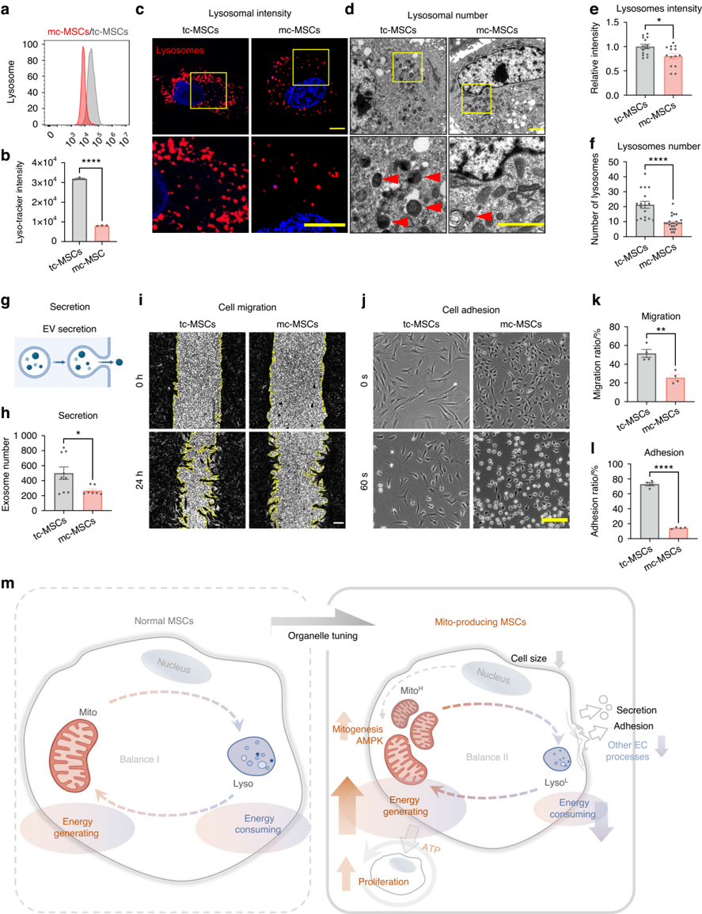

1234567890();,:

## ARTICLE OPEN

## Organelle-tuning condition robustly fabricates energetic mitochondria for cartilage regeneration

Xuri Chen 1,2 , Yunting Zhou , Wenyu Yao , Chenlu Gao , Zhuomin Sha , Junzhi Yi 2 2 2 2 1,2 , Jiasheng Wang 1,2 , Xindi Liu , Chenjie Dai , 2 2 Yi Zhang 1,2 , Zhonglin Wu , Xudong Yao , Jing Zhou 2 3 1,2 , Hua Liu 1,2 ✉ , Yishan Chen 1,2,4 ✉ and Hongwei Ouyang 1,2,4,5 ✉

Mitochondria are vital organelles whose impairment leads to numerous metabolic disorders. Mitochondrial transplantation serves as a promising clinical therapy. However, its widespread application is hindered by the limited availability of healthy mitochondria, with the dose required reaching up to 10 9 mitochondria per injection/patient. This necessitates sustainable and tractable approaches for producing high-quality human mitochondria. In this study, we demonstrated a highly ef /uniFB01 cient mitochondriaproducing strategy by manipulating mitobiogenesis and tuning organelle balance in human mesenchymal stem cells (MSCs). Utilizing an optimized culture medium (mito-condition) developed from our established formula, we achieved an 854-fold increase in mitochondria production compared to normal MSC culture within 15 days. These mitochondria were not only signi /uniFB01 cantly expanded but also exhibited superior function both before and after isolation, with ATP production levels reaching 5.71 times that of normal mitochondria. Mechanistically, we revealed activation of the AMPK pathway and the establishment of a novel cellular state ideal for mitochondrial fabrication, characterized by enhanced proliferation and mitobiogenesis while suppressing other energy-consuming activities. Furthermore, the in vivo function of these mitochondria was validated in the mitotherapy in a mouse osteoarthritis model, resulting in signi /uniFB01 cant cartilage regeneration over a 12-week period. Overall, this study presented a new strategy for the off-the-shelf fabrication of human mitochondria and provided insights into the molecular mechanisms governing organelle synthesis.

Bone Research (2025) 13:37

; https://doi.org/10.1038/s41413-025-00411-6

## INTRODUCTION

Cells contain various sophisticated organelles that act as intracellular biofactories by transforming chemical energy and substances. Among these, the mitochondria are particularly indispensable, providing 90% of the bioenergy required for human life. Thus, their dysfunction inevitably leads to pathological conditions. 1 5 -When cells fail to compensate for mitochondrial damages, organelle transplantation becomes an alternative approach to restore tissue homeostasis, serving as more precise and less immunogenic management compared to cell transplantation. 6 The advantages of organelle transplantation have been implied in several studies. 7,8 For example, one study employed plant-derived nanothylakoids to precisely modulate the metabolic disorder in osteoarthritis (OA), 9 a prevalent degenerative joint disease. 10

Given the crucial role of mitochondria in metabolic wellness, arti /uniFB01 cial mitochondrial transplantation has been developed for managing a wide range of diseases. For instance, mitochondrial transplantation has been shown to be an effective therapy for improving cardiac function and alleviating symptoms of ischaemic heart disease, 11 13 -a leading cause of disability and death 14 characterized by mitochondrial dysfunction in cardiomyocytes. This strategy has also been advantageous in the treatment of mitochondrial DNA (mtDNA) disorders, 15 infertility, 16 and wound healing, 17 where healthy mitochondria from donor cells are injected into the disease tissues to replace or fuse with the dysfunctional mitochondria. Additionally, given the increasing global burden of metabolic diseases, this approach has been proposed for widespread application in metabolic syndrome as a promising strategy for maintaining metabolic homeostasis and restoring energy supply. 18 20 -However, despite the broad potential application, a signi /uniFB01 cant challenge remains in harvesting safe and healthy mitochondria resources. Due to their complex doublemembrane structure and intricate chemical machinery, de novo arti /uniFB01 cial synthesis of mitochondria is exceedingly dif /uniFB01 cult. 21,22 Consequently, mitochondria-rich human tissues, such as the liver and muscle, currently serve as the major resource for donor mitochondria in clinical use. Nevertheless, the mitochondria invasively isolated from non-expandable tissues 23 cannot sustainably meet the growing demand for mitotherapy (e.g., over 10 9 mitochondria for one ischemia-reperfusion injury patient). 24 Additionally, the quality of mitochondria obtained in this manner cannot be adequately controlled, as it varies with donors ' age 25 and health status. 15 Consequently, a signi /uniFB01 cant gap exists between the current mitochondrial harvesting strategy and the need for highly ef /uniFB01 cient mitochondrial fabrication to meet clinical

1 Department of Sports Medicine of the Second Af /uniFB01 liated Hospital, and Liangzhu Laboratory, Zhejiang University School of Medicine, Hangzhou, China; 2 Dr. Li Dak Sum &amp; Yip Yio Chin Center for Stem Cells and Regenerative Medicine, Zhejiang University School of Medicine, Hangzhou, China; 3 Center of Regenerative and Aging Medicine, the Fourth Af /uniFB01 liated Hospital of School of Medicine, and International School of Medicine, International Institutes of Medicine, Zhejiang University, Yiwu, China; 4 Zhejiang UniversityUniversity of Edinburgh Institute, Zhejiang University School of Medicine, Haining, China and 5 China Orthopedic Regenerative Medicine Group (CORMed), Hangzhou, China Correspondence: Hua Liu (liuhua@zju.edu.cn) or Yishan Chen (YishanChen@intl.zju.edu.cn) or Hongwei Ouyang (hwoy@zju.edu.cn)

2

demands. Therefore, it is imperative to develop new strategies that guarantee sustainable and controllable production of highquality human mitochondria.

To address this issue, stem cells provide a good platform for off-the-shelf cell derivative fabrication due to their self-renewal capability in long-term culture, 26 28 -while cell engineering enables the manipulation of stem cell fate and function. 29 -32 For example, in our previous studies, we have successfully developed a customized serum-free culture system to rapidly expand human adipose-derived mesenchymal stem cells (MSCs) to provide cellular resources in tissue regeneration. 29 However, biofabrication of mitochondria presents greater challenges, requiring sophisticated organelle-level manipulations. This is especially true given our limited understanding and the fact that mitochondria, unlike secreted exosomes, are essential intracellular components crucial for cell survival. Furthermore, mitochondrial synthesis involves the coordinated cooperation of numerous other organelles (such as the nucleus, ribosomes, and transport vesicles) within a complex regulatory network. As a result, it is challenging yet essential to prevent an imbalance in bioenergy /uniFB02 ow or overloading of a single organelle type during live-cell mitochondrial fabrication. This may be addressed by establishing a new metabolic balance or tuning the overall cellular regulation of organelle synthesis. Moreover, to achieve a producible and sustainable mitochondrial fabrication, cell expansion must be facilitated in an optimal culture that simultaneously improves both cell proliferation and mitobiogenesis.

In this study, we proposed a novel strategy for ef /uniFB01 cient largescale fabrication of human mitochondria by identifying a customized mitochondria-producing condition (mito-condition). We used human adipose-derived MSCs, which were effective cell sources for OA therapy, can be conveniently obtained from human donors, and can be stably expanded in long-term culture. 33 Through phenotypic screening and optimization based on our previous study, we developed a mito-condition that signi /uniFB01 cantly enhanced both mitochondrial quantity and quality in MSC culture. The sustainable production was achieved by continuous cell passage, resulting in a /uniFB01 nal mitochondria yield ~ 854-fold greater than the initial cells after 5 passages. This approach enables the production of ~10 13 off-the-shelf mitochondria within 15 days. In addition to the increased quantity, the optimized mitochondria demonstrated robust bioenergetic function in mitochondrial assays, exhibiting a 5.71-fold readout compared to normal MSCs. Using transcriptomics and other validations, we uncovered that the mito-condition regulated cell mitobiogenesis by activating the Adenosine 5 -monophosphate ' (AMP)-activated protein kinase (AMPK) pathway and modifying the balance between energy-generating and energy-consuming programs. In vivo, our tailor-made mitochondria were applied in a mouse OA model, successfully promoting cartilage regeneration and ameliorating OA. Overall, this study provides a new perspective on the arti /uniFB01 cial manipulation of cellular organelle synthesis and lays a foundation for the development of mitochondrial engineering techniques in regenerative medicine.

## RESULTS

A combinatorial phenotypic screen identi /uniFB01 es mito-condition for robust mitochondria production

To construct a mitochondrial fabrication platform within MSCs, we performed a phenotypic screen focusing on cell proliferation and mitochondrial activity (Fig. 1a). Building upon our previously established serum-free culture expansion system which yielded MSCs with high proliferative capacity, maintained stemness and low immunogenicity comparable to serum cultured MSCs, 29 we conducted a combinatorial screening to optimize the culture medium. By systematically excluding components that did not contribute to mitochondrial biogenesis (mitobiogenesis), we identi /uniFB01 ed 8 factors that positively in /uniFB02 uenced cell proliferation and total mitochondrial content (Fig. 1b and Fig. S1a). To further enhance the mitochondrial content, we incorporated human platelet lysate (HPL), a commonly used serum alternative known to promote both cell proliferation and mitochondrial function. 34 36 -The addition of HPL to the 8 factors medium signi /uniFB01 cantly increased the total mitochondrial content in MSCs (Fig. S1b). Consequently, our optimized mito-condition medium comprised nine factors: basic /uniFB01 broblast growth factor (bFGF), sodium bicarbonate (NaHCO3), lipid concentrate, Insulin-TransferrinSelenium (ITS), progesterone (Prog), hydrocortisone (Hc), Vitamin C (Vc), heparin sodium (HS) and HPL. Notably, 4 factors of these factors, bFGF, Hc, Vc, and HPL, have been previously reported to promote mitochondrial biogenesis. 37 39 -We also validated the contribution of each component by individually removing them from the medium; omission of any single factor led to a signi /uniFB01 cant decrease in mitochondrial intensity (Fig. S1c). With this optimized culture medium, we established conditions conducive to mitochondrial fabrication and designated the cultured MSCs as mitocondition MSCs (mc-MSCs). These mc-MSCs exhibited signi /uniFB01 cantly higher cell proliferation rates and mitochondrial quantities compared to MSCs cultured under typical serum-containing conditions (tc-MSCs) (Fig. 1c, d).

To validate the mitochondrial phenotype in mc-MSCs, we characterized their mitochondrial morphology and content. Highresolution images of the mitochondrial outer membrane protein TOMM20 revealed that mitochondria in mc-MSCs predominantly exhibited a short and rounded morphology, in contrast to the elongated mitochondria in tc-MSCs (Fig. 1e). These morphology features were further con /uniFB01 rmed by the transmission electron microscopy (TEM) analyses (Fig. 1f, g). Quantitive analysis showed that mc-MSCs contained signi /uniFB01 cantly increased amounts of mitochondria (2.83-fold), mitochondrial proteins (1.70-fold), and mtDNAs copies (8.69-fold) per cell on average compared to tcMSCs (Fig. 1h -j).

Overall, these data indicated that our screening successfully identi /uniFB01 ed a mito-condition that enhanced both cell proliferation and total mitochondrial quantity in MSC culture.

The mito-condition maintains sustainable mitochondrial reproduction during stem cell passaging

Building upon our /uniFB01 ndings that the mito-condition enhanced both cell proliferation and mitobiogenesis, we explored whether sustainable mitochondrial reproduction could be achieved during MSC passaging. Data from MSCs derived from the different donors ( n = 3) demonstrated that cells cultured under the mitocondition proliferated signi /uniFB01 cantly faster than those in typical conditions (Fig. 2a). The population doubling time (PDT) of mcMSCs was 21.23 h, markedly shorter than the 38.45 h observed for tc-MSCs (Fig. 2b). After 5 passages (~15 days) of expansion, the total number of mc-MSCs was 302 times greater than that of tcMSCs (Fig. 2c). Morphological analysis using F-actin cytoskeleton staining revealed that mc-MSCs had a reduced cell size, consistent with their robust proliferative phenotype (Fig. 2d, e). Immunostaining for proliferation markers Ki67 and 5-ethynyl-2 -′ deoxyuridine (EdU) staining displayed a higher proportion of proliferative cells in mc-MSCs compared to tc-MSCs (Ki67: 81.29% vs. 63.88%, EdU: 30.20% vs. 8.24%) (Fig. 2f, g), corroborated by /uniFB02 ow cytometric data (28.35% vs. 7.86%) (Fig. S2a). Besides, the cell cycle assay showed an increased S phase proportion in mcMSCs (Fig. S2b). In the colony-forming unit assays assessing selfrenewal ability, mc-MSCs formed signi /uniFB01 cantly more and larger colonies than tc-MSCs (Fig. 2d, h). While both tc-MSCs and mcMSCs positively expressed standard MSC surface markers (Fig. S3a), mc-MSCs exhibited higher muti-lineage differentiation potential (Fig. S3b, c).

Comparative analyses across different passages con /uniFB01 rmed that mc-MSCs stably consistently maintained a higher mitochondrial

Fig. 1 A combinatorial phenotypic screen identi /uniFB01 es mito-condition for robust mitochondria production. a Schematic illustration of mitochondrial production for cartilage regeneration. b Schematic illustration of the screening of the ingredients of the medium. c The relative cell viability of tc-MSCs and mc-MSCs (well = 4). d The relative mitochondrial intensity of tc-MSCs and mc-MSCs (well = 4). e Representative images of mitochondria in tc-MSCs and mc-MSCs. Scale bar, 5 μ m. Yellow arrows: mitochondria. f Representative transmission electron microscope (TEM) images of tc-MSCs and mc-MSCs. Scale bar, 2 μ m. Red arrows: mitochondria. g Sphericity ratio of mitochondria of tc-MSCs and mc-MSCs from TEM images (54 and 40 mitochondria were calculated for tc-MSCs and mc-MSCs group respectively). h Number of mitochondria tc-MSCs and mc-MSCs from TEM images (17 and 23 cells were calculated for tc-MSCs and mc-MSCs group respectively). i Quanti /uniFB01 cation of mitochondrial protein content (well = 3). j Quanti /uniFB01 cation of the copy number of mtDNA (well = 3). All data are presented as mean ± SEM. *** P &lt; 0.001, **** P &lt; 0.000 1. P values were determined using unpaired two-tailed t-test ( , c d g j , -)

quantity than tc-MSCs (Fig. 2i). Speci /uniFB01 cally, the relative MitoTracker intensity in mc-MSCs at passage 1, 3 and 5 were 1.36-fold, 1.58-fold and 1.23-fold higher, respectively, compared to tc-MSCs (Fig. 2j). After 5 passages over 15 days, the estimated total mitochondrial yield from mc-MSCs was at least 854-fold greater than that from tc-MSCs. This was calculated by multiplying the fold increase in mitochondria per cell (from Fig. 1h) by the fold increase in total cell number (from Fig. 2c); thus, 302 × 2.83 = 854 (Fig. 2k). This substantial increase demonstrates the ef /uniFB01 cacy of the mito-condition as a powerful methodology for large-scale synthesis of human mitochondria.

The mito-condition improves mitochondrial function for a robust energy supply

Beyond increasing mitochondrial quantity, we investigated whether the mito-condition boosted mitochondrial metabolic activity. The bioenergetics measurements using the Seahorse extracellular /uniFB02 ux analyzer recorded a signi /uniFB01 cant increase in mitochondrial respiration levels in mc-MSCs (Fig. 3a). The data demonstrated enhanced basal respiration, ATP production, and spare respiration capacity (Fig. 3b). Consistently, ATP assay results showed that mc-MSCs produced higher levels of total cellular ATP compared to tc-MSCs (Fig. 3c). In addition, mc-MSCs demonstrated

a

Fig. 2 The mito-condition maintains sustainable mitochondrial reproduction during stem cell passaging. a Representative bright /uniFB01 eld images of primary cells from 3 donors. Scale bar, 20 μ m. b PDT of tc-MSCs and mc-MSCs at P1-P5 (sample = 3 from different donors). c Total cell number of tc-MSCs and mc-MSCs at P1-P5 (sample = 3 from different donors). d Representative images of phalloidin staining, immunostaining of Ki67 and EdU, and CFU. Scale bar, 100 μ m (for Ki67 and EdU) and 1 mm (for CFU). e Relative cell size of tc-MSCs and mcMSCs (well = 3 for each group, 54 and 40 cells were calculated for tc-MSCs and mc-MSCs group respectively). f Percent of Ki67 positive cells in tc-MSCs and mc-MSCs (cells in 9 /uniFB01 elds of view from 3 wells were calculated). g Percent of EdU positive cells in tc-MSCs and mc-MSCs (cells in 11 /uniFB01 elds of view from 3 wells were calculated). h The number of colonies of tc-MSCs and mc-MSCs (well = 3). i Representative images of MitoTracker labeled mitochondria in tc-MSCs and mc-MSCs at P1, P3, and P5. Scale bar, 20 μ m. j Relative total MitoTracker /uniFB02 uorescence intensity in tc-MSCs and mc-MSCs at P1, P3, and P5 (well = 5). Cells at different passages were seeded with the same initial density and compared after a 3-day culture. k Relative mitochondrial number change of mc-MSCs/tc-MSCs at different passages (sample = 3 from different donors). All data are presented as mean ± SEM. * P &lt; 0.05, ** P &lt; 0.01, *** P &lt; 0.001, **** P &lt; 0.000 1. P values were determined using unpaired two-tailed t -test ( b c , , e h -, j )

superior performance in assessments of mitochondrial membrane potential (MMP) and reactive oxygen species (ROS). The /uniFB02 ow cytometric analysis revealed that mc-MSCs displayed a decreased mitochondrial depolarization ratio (4.32% vs. 10.41%) and reduced ROS accumulation (0.9 × 10 5 vs. 1.8 × 10 ) compared to tc-MSCs 5

(Fig. 3d, e). Furthermore, we examined the expression levels of representative functional genes ( ATP5A1 , UQCRC1 , and SDHB ) and proteins (ATP5A1, UQCRC1, SDHB, and MTCO2) involved in oxidative phosphorylation (OXPHOS) and demonstrated their levels were increased in mc-MSCs compared to tc-MSCs (Figs. 3f,

a

b

Fig. 3 The mito-condition produces energetic mitochondria for a robust energy supply. a OCR assay of tc-MSCs and mc-MSCs (replicate = 4). b Quantitative analysis of mitochondrial respiration pro /uniFB01 les (well = 4). c ATP content in tc-MSCs and mc-MSCs (well = 3). d JC-1 staining followed by /uniFB02 ow cytometric analysis and depolarization ratio of tc-MSCs and mc-MSCs (well = 3). e Analysis of ROS intensity through /uniFB02 ow cytometry and quanti /uniFB01 cation in tc-MSCs and mc-MSCs (replicate = 3). f Gene expression anylysis of OXPHOS-related genes ( ATP5A1 UQCRC1 , , and SDHB ) in tc-MSCs and mc-MSCs (well = 3). g Western blot (WB) analysis of OXPHOS-related proteins (ATP5A1, UQCRC1, SDHB, and MTCO2) expression in tc-MSCs and mc-MSCs. h Schematic diagram of mitochondria isolated from tc-MSCs and mc-MSCs. i ATP content of tc-Mito and mc-Mito (well = 3). j Quanti /uniFB01 cation of the JC-1 /uniFB02 uorescence ratio of tc-Mito and mc-Mito (well = 3). k OCR assay of tc-Mito and mc-Mito (well = 12). l Schematic illustration of the transplantation of tc-Mito and mc-Mito into MSCs. m Relative cell viability of MSCs after mitochondrial transplantation (well = 3). n ATP content of MSCs after (well = 3). All data are presented as mean ± SEM. * P &lt; 0.05, ** P &lt; 0.01, *** P &lt; 0.001, **** P &lt; 0.000 1. P values were determined using unpaired two-tailed t -test ( b f -, i , j ) or one-way ANOVA ( , f m n , )

6

g and S4). These /uniFB01 ndings con rmed /uniFB01 that mc-MSCs exhibited improved mitochondrial function under the mito-condition culture.

To verify that these energetic mitochondria preserved their function during mitochondrial transplantation procedures, we compared the activity of isolated mitochondria from mc-MSCs and tc-MSCs (Fig. 3h). Post-isolated, mc-mitochondria produced elevated levels of ATP and displayed higher MMP (Fig. 3i, j). The analysis of ADP-driven mitochondrial activity demonstrated a slight increase in the measured OCR of mc-Mito compared to tcMito (Fig. 3k). Notably, these energetic mitochondria remained enhanced MMP after 24 h of storage at 4°C or 37°C (Fig. S5a), indicating their advantageous capacity to maintain function in vitro. Besides, we detected the ATP production levels of mcmitochondria at different time points and found that the function of mc-mitochondria stored at 4°C was more stable than those stored at 37°C (Fig. S5b), indicating a preferred storage temperature for clinical practices. Furthermore, after transplanting these mitochondria into other MSCs, we observed that mcmitochondria could boost both cell proliferation and ATP production in the recipient cells (Fig. 3l -n).

In summary, the mito-condition improved the metabolic function of mitochondria in mc-MSCs. These mitochondria produced higher levels of ATP before and after isolation, potentially ensuring improved outcomes in clinical mitochondrial transplantation.

The mito-condition improves mitobiogenesis by activating the AMPK pathway

To gain insights into how the mito-condition regulated cell mitobiogenesis, we employed bulk RNA sequencing (RNA-seq). Mc-MSCs and tc-MSCs exhibited distinctive transcriptomic pro /uniFB01 les, with 9 524 differentially expressed genes (mc-MSC/tc-MSCs, fold change ≥ 2) (Figs. 4a and S6a, b). The Gene Ontology (GO) analysis illustrated that mc-MSCs were enriched for genes involved mRNA splicing , DNA replication , cell division , ribosome biogenesis , and mitochondrial translation (Fig. 4b), while tc-MSCs were enriched for terms including cell adhesion , extracellular matrix organization , cell migration , vesicle-mediated transport , and autophagy (Fig. 4c). Notably, mc-MSCs showed signi /uniFB01 cant upregulation of key genes related to mitochondrial biogenesis such as TFAM , TFB2M , NRF1 , and CYCS (Fig. 4d). The Kyoto Encyclopedia of Genes and Genomes (KEGG) pathways associated with cell proliferation and metabolism ( cell cycle , DNA replication , citrate cycle (TCA cycle) , fatty acid metabolism , and oxidation phosphorylation ) were signi /uniFB01 cantly enhanced in mc-MSCs (Fig. 4e). Conversely, the pathways about lysosome , phagosome , endocytosis , actin cytoskeleton , and focal adhesion were down-regulated (Fig. S6c). These all suggested that mc-MSCs acquired a proliferative and metabolic phenotype compared to tc-MSCs, with other cellular processes being relatively suppressed.

To further uncover the underlying mechanisms, we noticed that the AMPK pathway was impressively activated in mc-MSCs (Fig. 4e), which was well known to play a key role in sensing bioenergy demand and promoting mitochondrial biogenesis to meet cellular energy requirements. 40 This observation was consistent with data showing that glycolysis was also promoted in mc-MSCs (Fig. S7). The up-regulation of AMPK pathway in mcMSCs was con /uniFB01 rmed by different characterizations. In the RNA-seq data, related genes including PPARG , CCNA2 , PPP2R3A , STRADB , PPP2CB , and ELAVL1 were enriched in the mito-condition group (Fig. S6d). The Gene Set Enrichment Analysis (GSEA) results further displayed signi /uniFB01 cant enrichment of the AMPK pathway (Fig. 4f). To con /uniFB01 rm the expression levels of AMPK and phosphorylated-AMPK (p-AMPK), the latter indicating activation status, 40 we conducted western blot which showed notable elevations of both in mcMSCs (Fig. 4g). Furthermore, we realized an upregulation of a key downstream transcription factor of AMPK, transcription factor A, mitochondrial (TFAM), which was essential for the replication and transcription of mtDNA during mitochondrial biogenesis (Fig. 4h, i). 41 Consistent with TFAM activation, both mtDNA copy number and the expression of the mitochondrial structural protein TOMM20 were elevated in mc-MSCs compared to tc-MSCs (Figs. 4h, i and Fig. 1j), collectively suggesting a boost of mitochondrial biogenesis in mc-MSCs. Notably, we also veri /uniFB01 ed the critical role of AMPK activation in the mito-condition. Treatment with the AMPK inhibitor Compound C (CC) resulted in a signi /uniFB01 cant reduction of total mitochondrial intensity in mc-MSCs (Fig. 4j).

In summary, we demonstrated that the mito-condition modi /uniFB01 ed cellular programs of mitobiogenesis by activating the AMPK pathway (Fig. 4k).

The mito-condition tunes energy balance by compromising other energy-consuming processes

Having uncovered the activation of the AMPK pathway, we further characterized the cellular status by comparing the down-regulated processes in mc-MSCs and tc-MSCs. Interestingly, the transcriptome data revealed that genes related to several energyconsuming cellular activities, including lysosome digestion, cell migration, adhesion, and secretion, were inhibited under the mitocondition (Fig. 4c). This indicated an overall alteration of intracellular components and programs. Therefore, we veri /uniFB01 ed these /uniFB01 nding by detecting the abundance of other organelles and their activities. Our data showed no evident changes in both the quantity and structure of the Golgi apparatus (Fig. S8). The quantity of the endoplasmic reticulum (ER) did not change signi /uniFB01 cantly (Fig. S8a, b), while TEM indicated amelioration of ER swelling under the mito-condition (Fig. S8c). What s ' more, we realized an obvious reduction of lysosome quantity in mc-MSCs, as demonstrated by /uniFB02 ow cytometry (Fig. 5a, b), immuno /uniFB02 uorescence (Fig. 5c, d) and TEM (Fig. 5e, f), which correlated with the downregulation of autophagy-related genes (Fig. 4c). Autophagy biomarkers, including Beclin1 and the LC3-II/I ratio, were signi /uniFB01 cantly decreased in mc-MSCs, con /uniFB01 rming a reduced level of autophagy and indicating a new balance of organelle activities (Fig. S9a, b). Previous studies have shown that ER swelling, a sign of ER stress, was often coupled with increased autophagy. 42,43 This suggested that the mito-condition relieved ER stress induced by serum-containing medium, resulting in mc-MSCs exhibiting lower levels of autophagy, which might not be essential for their survival. Besides the changes in intracellular organelles, mc-MSCs demonstrated attenuation of other energy-consuming cellular activities, including extracellular vesicle secretion (Fig. 5g, h), cell migration (Fig. 5i, k) and cell adhesion (Fig. 5j, l).

Given the frequent crosstalk between mitochondria and other organelles, it was unexpected that the abundance of other structures, especially lysosomes, was reduced under the mitocondition. In other studies, lysosomal activity was often synchronized with mitochondrial function to facilitate cell catabolism and homeostasis. 44,45 On the contrary, our data suggested that enrichment of lysosomes, levels of autophagy, and other cellular functions (migration/secretion/adhesion) were not necessarily maintained in a proliferative and energetic cell status. This further suggested that the mito-condition was specialized to generate and reproduce mitochondria by restricting other unnecessary energy-consuming processes (Fig. 5m).

Mc-mitochondria exhibit superior performance for in vivo mitotherapy

To further demonstrate the therapeutic potential of mcmitochondria in tissue regeneration, we applied them to OA models, a prevalent cartilage degenerative disease associated with chondrocyte mitochondrial dysfunction. 46

Before in vivo studies, we transplanted mitochondria into human OA chondrocytes and measured their effects on chondrocyte metabolism in vitro (Fig. S10a). Results showed that both tc-Mito and mc-Mito could increase ATP production in OA

Fig. 4 The mito-condition creates a sustainable energy-generating homeostasis by activating the AMPK pathway. a Volcano plots showing differently expressed genes between tc-MSCs and mc-MSCs. b Up-regulated GO terms. c Down-regulated GO terms. d Relative mRNA expression of mitobiogenesis-related genes from RNA-seq data. e Upregulated KEGG pathways. f The GSEA analysis of the AMPK signaling pathway. g Western blot (WB) analysis of AMPK and p-AMPK expression in tc-MSCs and mc-MSCs. h WB analysis of TFAM and TOMM20 expression in tc-MSCs and mc-MSCs. i Quanti /uniFB01 cation of WB results in ( h ) (well = 3). j The relative mitochondrial intensity of MSCs after being treated with CC (well = 3). k Schematic diagram showing the mito-condition promotes mitochondrial biogenesis by the AMPK pathway. All data are presented as mean ± SEM. * P &lt; 0.05, ** P &lt; 0.01, *** P &lt; 0.001, **** P &lt; 0.000 1. P values were determined using unpaired two-tailed t -test ( d i , ) or one-way ANOVA ( ). CC Compound C j

Fig. 5 The mito-condition tunes energy balance by compromising other energy-consuming processes. a Flow cytometry of lyso-Tracker labeled tc-MSCs and mc-MSCs. b Lysosomal intensity of tc-MSCs and mc-MSCs (well = 3). c Representative images of lysosomes in tc-MSCs and mcMSCs. Scale bar, 20 μ m. d Representative transmission electron microscope (TEM) images of tc-MSCs and mc-MSCs. Scale bar, 2 μ m. Red arrows: lysosomes. e Relative lysosomal intensity of tc-MSCs and mc-MSCs (observed cell = 14 for each group). f Number of lysosomes of tc-MSCs and mc-MSCs from TEM images (17 and 23 cells were calculated for tc-MSCs and mc-MSCs group respectively). g Schematic diagram of extracellular vesicles (EVs) secretion by MSCs. h Number of EVs in tc-MSCs and mc-MSCs (well = 9 in tc-MSCs group; well = 7 in mc-MSCs group). i Cell scratch migration assay of tc-MSCs and mc-MSCs. Scale bar, 200 μ m. j Cell adhesion assay of tc-MSCs and mc-MSCs. Scale bar, 200 μ m. k Migration ratio of tc-MSCs and mc-MSCs (well = 4). l Adhesion ratio of tc-MSCs and mc-MSCs (well = 4). m Schematic diagram showing the mito-condition was specialized to generate and reproduce mitochondria by increasing the energy-generating process and restricting other unnecessary energy-consuming processes. All data are presented as mean ± SEM. * P &lt;0.05, ** P &lt;0.01, **** P &lt;0.000 1. P values were determined using unpaired two-tailed t -test ( b e f , , , h k l , , )

chondrocytes (Fig. S10b). However, mitochondria derived from mc-MSCs induced a more pronounced improvement in ATP production and MMP in OA chondrocytes (Fig. S10c, d) and also reduced the rate of cellular apoptosis compared to mitochondria derived from tc-MSCs (Fig. S10e, f). In addition, mc-Mito transplantation effectively enhanced the expression of TFAM in chondrocytes (Fig. S10g, h), con /uniFB01 rming that this approach could modify mitochondrial function in OA chondrocytes.

We then tested whether mitochondria could enter targeted tissues and persist in situ when they were injected into joints. Using a mouse cartilage explant model, we observed that cocultured mitochondria attached to the cartilage surface (Fig. S11a). In vivo imaging with a DiR label to track mitochondria in mouse joints revealed /uniFB02 uorescence diminished by half after 7 days and completely vanished after more than 21 days (Fig. S11b, c), suggesting that these mitochondria might survive and function in vivo.

In the treatment of a murine medial meniscectomy (MMx) OA model, equal quantities of mc-mitochondria and tc-mitochondria were injected into murine joints (10 μ g per injection, once a week), with phosphate-buffered saline (PBS) serving as a blank control (Fig. 6a). Owing to the differences in cell expansion and mitogenesis ef /uniFB01 ciency, harvesting the same amount of mitochondria using mito-condition saved 44.66% of expansion time or 66.72% of initial cells relative to the typical method (Fig. 6a). For instance, to produce 140 μ g of mitochondria, the mito-condition required only 4.18 days (PDT = 20.26 h at passage 3), whereas the typical condition needed 7.49 days (PDT = 36.61 h at passage 3) starting with 2 × 10 5 MSCs on day 1. If these mitochondria need to be fabricated within 3 days, the mito-condition strategy demanded only 5.11 × 10 5 cells on the /uniFB01 rst day, which was 1/3 of the cell quantity required for typical culture. This further suggested that mito-condition served as an ef /uniFB01 cient platform for mitochondria fabrication.

Histological analysis of animal study results demonstrated that mitochondrial transplantation exhibited therapeutic effects on OA in both 8-week and 12-week post-surgery samples compared to the untreated group. Notably, the mc-mitochondria group showed a superior outcome in cartilage repair in the 12-week samples among the three groups (Figs. 6b, c and S12a,b). Particularly, the safranin-O staining showed that mc-mitochondria treatment resulted in a more intact cartilage surface (especially in the tibia) when compared to tc-mitochondria treatment, which was consistent with the Osteoarthritis Research Society International (OARSI) scoring evaluation (Fig. 6b, c). The immunostaining illustrated that mc-mitochondria therapy preserved the expression of cartilage functional markers collagen type II (COL2) and aggrecan (ACAN) at joint surfaces of 12-week samples (Fig. 6d, e and S12c, d). Moreover, periarticular osteophyte formation and subchondral bone sclerosis are hallmarks of OA progression. Micro-CT analysis showed that both mc-mitochondria and tcmitochondria were capable of alleviating subchondral bone sclerosis at 8 weeks. Notably, only mc-mitochondria demonstrated the ability to reduce osteophyte formation at 8 weeks (Fig. S13).

Taken together, our animal study validated that mitochondrial transplantation could act as an effective intervention for OA. Our proposed mito-condition culture showed advantages in mitochondria production and long-term cartilage surface protection, indicating that the mito-condition could rapidly supply highfunctioning mitochondria for in vivo disease management.

## DISCUSSION

Mitochondrial transplantation serves as an encouraging therapeutic approach for various metabolic diseases. 47 49 -However, obtaining suf /uniFB01 cient quantities of healthy human mitochondria remains a signi /uniFB01 cant challenge. In this study, we proposed a novel mitochondrial fabrication strategy by identifying customized conditions that programmed stem cell mitobiogenesis and organelle balance.

We demonstrated that our live-cell mitochondria factory could robustly and sustainably fabricate off-the-shelf human mitochondria using adipose-derived MSCs, while traditional invasive methods rely on isolating mitochondria from liver or muscle tissues for one-time use. Notably, compared to typical culture conditions, our customized condition achieved a signi /uniFB01 cantly higher yield within 15 days. With a dramatic improvement in cell expansion rate (a 302-fold increase) and an increase in mitochondrial quantity per cell in the mito-condition (a 2.83-fold change), the /uniFB01 nal fold change in total yield was estimated to exceed 850 (302 × 2.83 = 854). This approach potentially provides suf /uniFB01 cient mitochondria for a substantial number of patients in future mitotherapy. Furthermore, mitochondria cultured under our conditions (mc-mitochondria) gained enhanced homeostasis in vitro and superior function in tissue repair in vivo. These /uniFB01 ndings imply that our strategy is a promising method to ef /uniFB01 ciently fabricate high-quality human mitochondria for clinical mitotherapy.

Cell engineering allows the arti /uniFB01 cial programming of cellular functions by modulating key regulatory pathways. 31 Inspired by this concept, we developed a mitochondrion-producing condition to boost cell proliferation and mitobiogenesis. In this study, we uncovered the activation of AMPK in mc-MSCs, which serves as a highly conserved energy-sensing mechanism in energy stress and mitobiogenesis regulation. 40 AMPK senses intracellular energy demands and stimulates the downstream effectors to promote cell proliferation and metabolism. 40 We found that TFAM, a critical downstream target of AMPK that controlled mitochondrial transcription and replication, was signi /uniFB01 cantly up-regulated in mc-MSCs (Fig. 4h). While further investigations are needed to fully elucidate the underlying mechanisms, these data partially explained the up-regulation of mitochondrial functional and structural proteins (Figs. 3g and 4h), and the rapid mitobiogenesis observed in mc-MSCs (Fig. 4k).

Interestingly, the cellular state induced by the mito-condition differed from other reported AMPK-activated states. 40 Notably, the number of lysosomes was unexpectedly reduced in mc-MSCs, in contrast to previous /uniFB01 ndings that lysosomal activity is typically promoted in energetic cells. 50,51 Since ATP was required for all steps of autophagy and preservation of the lysosome microenvironment, this reduction may result from decreased autophagy in the new cellular state, where cells experience lower stress levels compared to typical culture MSCs (tc-MSCs), as indicated by mitochondrial membrane potential depolarization and ER morphology (Figs. 3d and S8c). Furthermore, we observed downregulation of other energy-consuming cellular activities, including secretion, migration, and adhesion (Fig. 5g l). -These /uniFB01 ndings supported that the mito-condition was an optimal mitobiogenesis design, as it suppressed unnecessary programs and reallocated resources toward rapid cell cycling and mitochondrial synthesis. In the absence of robust autophagy, high-speed cell division might maintain cellular homeostasis by consuming excess bioenergy and preventing mitochondrial overload in individual cells. Therefore, this arti /uniFB01 cially tuned cellular state was specialized for the generation of mitochondria, providing insights into organelle homeostasis and informing the development of new approaches in organelle therapy.

In our optimized condition, we recognized that multiple factors contributed to metabolic homeostasis. Our previous study illustrated that these factors promoted cell proliferation. 29 We found that bFGF, Hc, Vc, and HPL were indispensable for the mito-condition, as their exclusion signi /uniFB01 cantly hindered mitochondrial biosynthesis. Particularly, HPL has been shown to dramatically promote cell cycle and migration via AMPK/mTOR pathway. 34 Additionally, Vc and bFGF have been reported to promote mitochondrial biogenesis and ATP synthesis in various

9

Subchondral

Fig. 6 Mc-mitochondria exhibit superior performance for in vivo mitotherapy. a Schematic illustration of the establishment of the mouse OA model and the experimental design to evaluate the value of mitochondrial ampli /uniFB01 cation for in vivo applications. b Safranin-O/Fast green staining of joint sections at 12 weeks. Scale bar, 50 μ m. c Modi ed and maximum OARSI scoring system (sample /uniFB01 = 6 for each group). d Immunohistochemical staining (COL2, ACAN) of joint sections at 12 weeks. Scale bar, 50 μ m. e Quanti /uniFB01 cation of COL2 and ACAN in cartilage tissues at 12 weeks (sample = 6 for each group). All data are presented as mean ± SEM. * P &lt; 0.05, ** P &lt; 0.01, *** P &lt; 0.001. P values were determined using one-way ANOVA ( , c e ). OARSI Osteoarthritis Research Society International

cell types. 38,52,53 Low-dose hydrocortisone (0.1 ~ 1 mmol/L) has also been shown to increase the proliferative and metabolic activity of MSCs. 39 These /uniFB01 ndings aligned with our results and supported the necessity of these components. Although the effects of other components have not been clearly reported, our results suggested their critical roles in elevating mitobiogenesis. While further optimization is needed, we have achieved a combinatory condition that successfully promoted cell mitobiogenesis, which could aid in developing the organelle synthesis industry.

For the in vivo application, we selected OA, a predominant degenerative disease featured by metabolic impairment. 10 Previous studies have shown the effectiveness of mitotherapy in treating various OA models, 54 56 -primarily attributed to the

Table 1. Human samples information

| Individual                        |   Age/year | Gender   | Disease                            | Sample location          | Figures                                |
|-----------------------------------|------------|----------|------------------------------------|--------------------------|----------------------------------------|
| Human adipose-derived stem cells  |         56 | M        | Fracture                           | Thigh fat                | Fig. 2a(#1), 2b, 2c and 2k             |
| Human adipose-derived stem cells  |         64 | M        | Osteoarthritis (joint replacement) | Thigh fat                | Fig. 2a(#2), 2b, 2c and 2k             |
| Human adipose-derived stem cells  |         72 | F        | Osteoarthritis (joint replacement) | Thigh fat                | Fig. 2a(#3), 2b, 2c and 2k             |
| Human adipose-derived stem cells  |         26 | M        | Fracture                           | Thigh fat                | Figs. 1c, 1d, S1, and S3               |
| Human adipose-derived stem cells  |         10 | M        | Fracture                           | Thigh fat                | Figs. 1e-j, 2d-j, 3, 4, 5, S2 and S4-9 |
| Human osteoarthritis chondrocytes |         64 | F        | Osteoarthritis (joint replacement) | Osteoarthritis cartilage | Fig. S10                               |

restoration of mitochondrial function and energy supply in affected chondrocytes. 57 Here, we discovered that mitochondrial transplantation increased chondrocyte homeostasis, mitochondrial function, and biogenesis in vitro (Fig. S10). In our animal study, we not only con /uniFB01 rmed the therapeutic effect of mitotherapy in OA but also demonstrated the advantages of our approach in rapid mitochondrial fabrication and joint protection (Fig. 6 and Fig. S11-13). However, we also acknowledge limitations in this study, including the lack of evidence for ef /uniFB01 cient mitochondria transfer and retention in targeted cells. Consequently, the development of advanced mitochondria delivery systems and validation of mitochondria functionality after transplantation are imperative for future research.

Overall, our organelle-tuning strategy demonstrated robust mitochondrial production under customized condition, which could be used to greatly promote in vivo tissue regeneration. This study provided new insights into the molecular regulation of intrinsic organelle biogenesis and energy balance, potentially informing the development of novel approaches in organelle therapy.

## MATERIALS AND METHODS

## Isolation and culture of human adipose-derived MSCs

Human samples were obtained from patients undergoing speci /uniFB01 c surgical procedures with the approval of the Ethics Committee of Second Af /uniFB01 liated Hospital, Zhejiang University (Approval number: 2018-037, 20230735). All sampling was performed with the patients ' informed consent. The information of donor individuals was included in Table 1. The isolation of adipose-derived MSCs was collected as previously described. 58 In the typical condition, MSCs were cultured in low glucose Dulbecco s modi ' /uniFB01 ed Eagle s ' medium (DMEM) (Gibco, USA) supplemented with 10% fetal bovine serum (FBS; Gibco, USA). In the mitochondrion-producing condition, MSCs were cultured in DMEM/F12 (Gibco, USA) supplemented with 5 ng/mL bFGF (100-18B, Peprotech, USA), 1.722 g/L NaHCO3 (25080-094, Gibco, USA), 0.1% lipid concentrate (11905-031, Gibco, USA), 1× ITS (41400-045, Gibco, USA), 17.8 nmol/L Prog (S1705, Selleck, USA), 100 nmol/L Hc (S1696, Selleck, USA), 197.6 μ mol/L Vc (A8960, Sigma, USA), 10 μ g/mL HS (S1346, Selleck, USA) and 1% HPL (PLTGOLD100R, Biological Industries, Israel). Human chondrocytes were isolated as previously described. 59 Chondrocytes were cultured in DMEM/F12 with 10% FBS.

## Cell viability and cell proliferation assay

Cells were seeded into 96-well plates at a density of 3 000 cells/ cm 2 and incubated for 3 days in the typical condition and mitocondition, then cell viability was measured using a Cell Counting Kit-8 (CCK-8, Dojindo, Japan) assay following the manufacturer s ' instructions. Brie /uniFB02 y, the CCK-8 solution was added into the culture medium at 1:10. Absorbance at 450 nm was measured after 2 h. The PDT of the cells was calculated using the following formula: PDT = culture time ∗ log2/log( /uniFB01 nal cell numbers/initial cell numbers). Cell cycle assay was measured using the cell cycle and apoptosis analysis kit (C1052, Beyotime, China). The EdU proliferation assay was performed using the BeyoClick ™ EdU cell proliferation kit (C0071, Beyotime, China).

## Ultrastructure visualization

For TEM observation, ~2 × 10 6 cells were centrifuged to form pellets and /uniFB01 xed with 2.5% glutaraldehyde at 4°C for 24 h. Then, the cells were rinsed 3 times in PBS for 10 min each and post /uniFB01 xed in 1% osmium acid solution for 1 h. After 3 washes with PBS for 15 min each, the cells were stained by 2% aqueous uranyl acetate for 30 min and dehydrated in a graded ethanol series (50%, 70%, 90%, 100%) and acetone (100%, 100%) for 20 min each and then embedded in a 100% Epon. Thin sections were stained with lead citrate and visualized using Philips Tecnai 10 TEM (Philips, Netherlands).

## mtDNA copy number assay

Cell genomic DNA was extracted using DNeasy Blood &amp; Tissue Kit (69504, Qiagen, USA). The mtDNA content was determined as the ratio of the copy number of mtDNA to the copy number of nuclear DNA using the human mtDNA monitoring primer set (7246, Takara, Japan).

## Immuno uorescence staining /uniFB02

Cells were /uniFB01 xed in 4% polyformaldehyde (PFA) for 20 min and then incubated in 0.3% Triton X-100 for 10 min and blocked with 1% bovine serum albumin (BSA; Sangon, China) for 30 min at RT. Afterwards, samples were incubated with primary antibodies at 4°C overnight and then with appropriate /uniFB02 uorescent probeconjugated secondary antibodies for 2 h at RT. For organelle staining, cells were stained with Mito-Tracker Red CMXRos (C1035, Beyotime, China) and Lyso-Tracker Red (C1046, Beyotime, China). Cell nuclei were stained with 4 ,6-Diamidino-2-′ phenylindole (DAPI; C1002, Beyotime, China). Imaging was performed with an Olympus FV1000 confocal microscope and analyzed by Fiji or Imaris software. The antibodies were listed in Table 2.

## Flow cytometry analysis

Cells were harvested and blocked with 1% BSA for 30 min at 4°C. Subsequently, the cells were stained with /uniFB02 uorescein-conjugated antibodies for 30 min at 4°C. The corresponding isotype antibodies were used as controls. For organelle staining, cells were stained with Lyso-Tracker Red (C1046, Beyotime, China), Golgi-Tracker Red (C1043, Beyotime, China), and ER-Tracker Green (C1042, Beyotime, China) for 20 min at 37°C. The assay was performed by DxFLEX (Backman Coulter, USA) and analyzed using FlowJo software. The antibodies were listed in Table 2.

Table 2. Antibody List

| Name                        | Source                          | Application               |
|-----------------------------|---------------------------------|---------------------------|
| CD34-APC                    | Biolegend, 343607               | 1:20 (FC)                 |
| CD45-PE                     | Biolegend, 368510               | 1:20 (FC)                 |
| CD73-PE                     | Biolegend, 344003               | 1:20 (FC)                 |
| CD90-APC                    | Biolegend, 328114               | 1:20 (FC)                 |
| CD105-PE                    | eBioscience, 12-1057-42         | 1:20 (FC)                 |
| Mouse anti-TOMM20           | Abcam, ab283317                 | 1:500 (IF)                |
| Rabbit anti-Ki67            | Abcam, ab16667                  | 1:250 (IF)                |
| Rabbit anti-GM130           | Proteintech, 11308-1-AP         | 1:200 (IF)                |
| Rabbit anti-Calnexin        | Proteintech, 10427-2-AP         | 1:200 (IF)                |
| Rabbit anti-AMPK            | Abcam, ab32047                  | 1:3 000 (WB)              |
| Rabbit anti-phospho- AMPK   | Cell Signaling Technology, 2535 | 1:1 000 (WB)              |
| Rabbit anti-ATP5A1          | Proteintech, 14676-1-AP         | 1:2 000 (WB)              |
| Rabbit anti-UQCRC1          | Proteintech, 21705-1-AP         | 1:2 000 (WB)              |
| Rabbit anti-SDHB            | Proteintech, 10620-1-AP         | 1:2 000 (WB)              |
| Rabbit anti-MTCO2           | Proteintech, 55070-1-AP         | 1:2 000 (WB)              |
| Rabbit anti-TFAM            | Proteintech, 22586-1-AP         | 1:5 000 (WB)              |
| Rabbit anti-TOMM20          | Proteintech, 11802-1-AP         | 1:5 000 (WB)              |
| Rabbit anti-LC3             | Proteintech, 81004-1-RR         | 1:2 000 (WB)              |
| Mouse anti- β -Actin        | Proteintech, 66009-1-Ig         | 1:5 000 (WB)              |
| Mouse anti-GAPDH            | Proteintech, 60004-1-Ig         | 1:5000 (WB)               |
| Mouse anti-COL2             | Santa cruz, sc-52658            | 1:50 (IHC)                |
| Rabbit anti-ACAN            | Abcam, ab36861                  | 1:200 (IHC)               |
| Acti-stain ™ 488 phalloidin | Cytoskeleton, PHDG-1            | 1:500 (IF)                |
| Goat anti-Rabbit 488        | Invitrogen, A11008              | 1:500 (IF)                |
| Donkey anti-Mouse 488       | Invitrogen, A21202              | 1:500 (IF)                |
| Goat anti-Rabbit HRP        | Jackson, 111-035-003            | 1:500 (IHC); 1:3 000 (WB) |
| Goat anti-Mouse HRP         | Jackson, 115-035-003            | 1:500 (IHC); 1:3 000 (WB) |

FC, /uniFB02 ow cytometry; IF, immuno /uniFB02 uorescence; IHC, immunohistochemistry; WB, western blot

## Trilineage Differentiation

For osteogenic differentiation, cells were seeded at a density of 1 × 10 4 cells/cm . After 24 h, the culture media were replaced with 2 osteogenic differentiation media, which comprised high glucose DMEM (H-DMEM) supplemented with 10% FBS, 0.1 μ mol/L dexamethasone, 50 μ mol/L Vc, 10 mmol/L β -glycerol phosphate. After 21 days, the cells were /uniFB01 xed in 95% ethanol and stained with 2% alizarin red solution. The stained calcium-rich extracellular matrix was visualized under an inverted microscope (IX73, Olympus, USA). For quantitative analysis, 5% sodium dodecyl sulfonate (SDS; SB0485, Bio Basic, Canada) with hydrochloric acid (SDS/HCl) was added into the well and incubated for 30 min. Supernatants were used to obtain optical density (OD) values of the dye by measuring the absorbance at 405 nm.

For chondrogenic differentiation, cells were seeded at a density of 5 × 10 4 cells/cm . After 24 h, the culture media were replaced 2 with chondrogenic differentiation media, which comprised H-DMEM supplemented with 1% sodium pyruvate, 1% ITS, 100 nmol/L dexamethasone, 50 μ g/mL Vc and 10 ng/mL TGFβ 3. After 21 days, the production of glycosaminoglycan (GAG) was measured by alcian blue staining and visualized under an inverted microscope. For the quantitative analysis of alcian blue staining, the staining intensity was measured and analyzed using ImageJ.

For adipogenic differentiation, cells were seeded at a density of 5 × 10 4 cells/cm . 2 After 24 h, the culture medium was replaced with adipogenic differentiation media, which comprised H-DMEM supplemented with 10% FBS, 1 μ mol/L dexamethasone, 500 μ mol/L 3-isobutyl-1-methylxanthine, and 200 μ mol/L indomethacin. After 14 days, the cells were /uniFB01 xed in 4% PFA for 30 min. Lipid droplets of the differentiated cells were stained by oil red. The stained samples were visualized using an inverted microscope. For quantitative analysis, 100% isopropanol was added into the well and incubated for 30 min. The supernatant was transferred to obtain the OD value of the dye by measuring its absorbance at 510 nm.

## Colony formation unit (CFU) assay

Cells were seeded into 6-well plates at a density of ~200 cells per well followed by culturing for 14 days. Cells were /uniFB01 xed with 4% PFA and stained with 0.1% crystal violet methanol solution at RT for 20 min. After removing the /uniFB02 oat dyestuff, the clone formation was observed under the microscope.

## Isolation and transplantation of mitochondria

The isolation of mitochondria was achieved using the cell mitochondria isolation kit (C3601, Beyotime, China) combined with a glass homogenizer. Cell pellets were suspended into 1 mL of ice-cold lysis buffer for 15 min incubation followed by homogenate by 24 strokes. The large cell debris was separated by centrifugation at 600 × g for 10 min at 4°C, and the supernatant was further centrifuged at 11 000 × g for 10 min at 4°C to collect the mitochondrial pellets. The mitochondrial pellets were rinsed with 1 mL mitochondria storage buffer and isolated by another centrifugation at 11 000 × g for 10 min at 4°C. Isolated mitochondria were suspended with PBS and applied freshly for the subsequent experiments. Isolated mitochondria were transplanted to MSCs by coculture 60 or transplanted to chondrocytes by centrifugation 61 using published protocols.

## Live-cell metabolic assay

The oxygen consumption rate (OCR) and extracellular acidi /uniFB01 cation rate (ECAR) values were measured with a Seahorse XF96 extracellular /uniFB02 ux analyzer (Agilent, USA). Brie /uniFB02 y, cells were seeded in an XF96 microplate at a density of 10 4 cells per well and preincubated overnight. Before the assays, cells were equilibrated for 1 h in unbuffered XF assay medium (for OCR: base medium with 10 mmol/L glucose, 2 mmol/L glutamine, and 1 mmol/L pyruvate, pH 7.4; for ECAR: base medium with 1 mmol/L glutamine). The XF Cell Mito Stress Test kit and XF Glycolysis Stress Test kit were used following standard protocols. During the assay, compounds were injected at the following /uniFB01 nal concentrations: 1.5 μ mol/L oligomycin, 1 μ mol/L carbonyl cyanide 4-(tri /uniFB02 uoromethoxy)phenylhydrazone (FCCP), and 0.5 μ mol/L rotenone/antimycin A(AA) for OCR or 10 mmol/L glucose, 1 mmol/L oligomycin and 50 mmol/L 2-2-deoxyglucose (2-DG) for ECAR. All Seahorse measures were normalized by the number of cells counted in each well at the end of the Seahorse experiments.

Seahorse assays also be performed on isolated mitochondria. Mitochondrial assay solution (MAS) was composed of 70 mmol/L sucrose, 220 mmol/L mannitol, 5 mmol/L KH2PO4, 5 mmol/L MgCl2, 2 mmol/L HEPES, 1 mmol/L EGTA, and 0.2% (w/v) fatty acid-free BSA, pH 7.2 at 37°C. 25 μ L isolated mitochondria were suspended in MAS and loaded at a density of 6 μ g/well into the XF 96-well cell culture microplate by centrifugation at 2 000 ×g for 20 min at 4°C. After centrifugation, 155 μ L of prewarmed (37°C) MAS + substrate (10 μ mol/L succinic acid and 10 μ mol/L malic acid) was added to each well. During the assay, compounds were injected at the following /uniFB01 nal concentrations:

Table 3. Primer sequences for RT-qPCR

| Primer Name    | Base sequence          |
|----------------|------------------------|
| Human-ATP5A1-F | GTATTGCCCGCGTACATGG    |
| Human-ATP5A1-R | AGGACATACCCTTTAAGCCTGA |
| Human-UQCRC1-F | GGGGCACAAGTGCTATTGC    |
| Human-UQCRC1-R | GTTGTCCAGCAGGCTAACC    |
| Human-SDHB-F   | ACAGCTCCCCGTATCAAGAAA  |
| Human-SDHB-R   | GCATGATCTTCGGAAGGTCAA  |
| Human-GAPDH-F  | TGACGCTGGGGCTGGCATTG   |
| Human-GAPDH-R  | GGCTGGTGGTCCAGGGGTCT   |

4 mmol/L adenosine 5 -diphosphate (ADP), 2.5 ′ μ g/mL oligomycin, 4 μ mol/L FCCP, and 4 μ mol/L AA for OCR.

## ATP assay, JC-1 assay, ROS assay, and apoptosis assay

The ATP concentration of MSCs/chondrocytes and isolated mitochondria was measured using the enhanced ATP assay kit (S0027, Beyotime, China) according to the manufacturer s instruc-' tions. MMP of MSCs/chondrocytes and isolated mitochondria was measured using the enhanced MMP assay kit with JC-1 (C2003, Beyotime, China) according to the manufacturer s ' instructions. Total intracellular ROS levels in MSCs were detected by a ROS assay kit (S0033, Beyotime, China) based on the standard protocol. The detection of MMP of isolated mitochondria was measured using a Varioskan Flash luminometer (ThermoFisher Scienti /uniFB01 c, USA). Apoptosis of chondrocytes was assessed using an Annexin V-FITC apoptosis detection kit (C1062, Beyotime, China) by /uniFB02 ow cytometry, following the manufacturer s instructions. ' Flow cytometry was performed by DxFLEX (Backman Coulter, USA) and analyzed using FlowJo software.

## Real-time quantitative PCR

Total RNA of MSCs was extracted using RNAiso Plus (9109, Takara, Japan), and cDNA was obtained using a reverse transcription kit (Toyobo, Japan). The RNA levels were quanti /uniFB01 ed by real-time PCR with TB Green Premix Ex Taq (TaKaRa, Japan). Fluorescence quanti /uniFB01 cation analysis was carried out by a high throughput /uniFB02 uorescent quantitative PCR instrument (Roche, Deutschland). The primers were shown in Table 3.

## Bulk RNA-seq analysis

The total RNA of MSCs was extracted using RNAiso Plus (9109, Takara, Japan) according to the manufacturer s ' instructions. Library construction and sequencing were conducted using BGISEQ-500 platform (BGI, China). Differentially expressed genes (DEGs) with adjusted P values &lt; 0.05 and fold change ≥ 2 were selected for further analyses. Bioinformatics analysis, including heatmap clustering, principal component analysis (PCA), GO analysis, KEGG pathway analysis, and GSEA analysis was also carried out with the online platform Dr. Tom (BGI Company, China)

## Western blot analysis

Cells were lysed with lysis buffer (P0013, Beyotime, China), and protein concentrations were determined by the enhanced BCA protein assay kit (P0010, Beyotime, China). Protein samples were separated by 10% sodium dodecyl sulfate-polyacrylamide gel electrophoresis (SDS-PAGE) and transferred onto a polyvinylidene di /uniFB02 uoride (PVDF) membrane (Millipore, USA). The membranes were blocked in 5% BSA at RT for 1 h and then incubated with primary antibodies at 4°C overnight. Later, the membranes were washed three times with Tris-buffered saline with Tween 20 (TBST) and continued to be incubated with the secondary antibodies at RT for 2 h. Finally, the membranes were developed using an enhanced chemiluminescence (ECL) kit (P0018, Beyotime, China). The antibodies were listed in Table 2.

## Cell scratch migration assay

A scratch migration assay was performed when cell density reached ~100%. Floating cells were cleaned with PBS washing and serum-free DMEM was applied to each well for 24 h. The ratio of cell migration was calculated using Fiji software.

## Cell adhesion assay

Cells were seeded into 6-well plates at a density of 3 000 cells/cm 2 and incubated for 3 days. Then 1% trypsin was added to the well and the cell dissociation was observed by the microscope and analyzed using Fiji software.

## Isolation of extracellular vesicles (EVs)

The isolation of EVs from MSCs was performed as previously described. 62 EVs quanti /uniFB01 cation was assessed with the NanoSight NS500 system (Malvern, UK).

## Animal experiments

All animal experiments were approved by the Laboratory Animal Welfare and Ethics Committee of Zhejiang University (ZJU20220411). C57BL/6 mice (8-week-old, bodyweight 20-25 g, purchased from Shanghai Laboratory Animal Company) were used in this study. The MMx OA model was performed as previously described. 63 Brie /uniFB02 y, a 1 cm longitudinal incision was made along the distal patellar tendon. The medial meniscus was exposed and then removed using surgical scissors along the lower edge of the meniscus. Then, the medial capsular incision was sutured and the skin was closed. All surgical procedures followed the aseptic principle. At 4 weeks after surgery, intra-articular injections were performed once a week for 4 weeks. Mice were randomly divided into three groups: sterilized PBS group, tc-mitochondria (10 μ g tcmitochondria suspended in 10 μ L PBS) group, and mcmitochondria (10 μ g mc-mitochondria suspended in 10 μ L PBS) group. The mice were sacri /uniFB01 ced at 8 weeks and 12 weeks after the surgery and the knee joints were collected for further experiments.

## Micro-computed tomography (micro-CT) analysis

The knee joint samples were /uniFB01 xed with 4% PFA and were scanned using a high-resolution micro-CT scanner U-CT-XUHR (Milabs, Netherlands). The bone volume (BV) of calci /uniFB01 ed meniscus and synovium, as well as trabecular separation (Tb.Sp) of subchondral bone, was measured using Imalytics Preclinical software (Philips, Germany).

## Histological analysis and immunohistochemistry

The knee joint samples were /uniFB01 xed with 4% PFA for 48 h and subsequently decalci /uniFB01 ed in 10% ethylenediaminetetraacetic acid disodium salt (EDTA) solution for 2 weeks. Then the samples were paraf /uniFB01 n-embedded and cut into 5 μ m thick sections. Safranin-O and fast green (SO/FG) staining were carried out following standard protocols. Histological scoring based on the OARSI grading system (grades 0 -6) 64 was performed, and the average and maximum of the scores were calculated. Immunohistochemistry was performed to assess COL2 and ACAN levels. After gradient dewaxing, paraf /uniFB01 n sections were soaked in the sodium citrate buffer solution at 65°C overnight for antigen retrieval. The sections were permeabilized with 0.1% Triton X-100 followed by blockade with 3% H2O2. Next, the sections were blocked with 5% BSA, and then incubated with the primary antibodies overnight at 4°C. Corresponding horseradish peroxidase(HRP-) conjugated secondary antibodies were used for 2 h at RT. The staining was visualized with diaminobenzidine (DAB; DA1010, Solarbio, China) and co-stained with hematoxylin. A slide scanner (VS200, Olympus, Japan) was used to acquire digital micrographs.

14

Semi-quanti /uniFB01 cation analysis of immunohistochemical staining intensity of COL2 was performed by ImageJ. 65 The antibodies were listed in Table 2.

## Bioluminescence imaging (BLI)

DiR-labeled mitochondria were intra-articular injected into the mice s knee joints. For in vivo luminescence imaging, mice were ' anesthetized with iso /uniFB02 urane and measured by the IVIS Spectrum imaging system (Perkin Elmer, USA).

## Statistical analysis

Data were tested for homogeneity of variances and normality. Homogeneity of variances was estimated with the Levene test. Data normality was tested using Shapiro -Wilk normality test and the D Agostino-Pearson omnibus test. The data were presented as ' mean ± standard error of the mean (SEM). Unpaired two-tailed Student s ' t-test was used for comparisons between the two groups. Comparisons between multiple groups were performed by one-way analysis of variance (ANOVA) with the post-hoc Tukey test. Statistical signi /uniFB01 cance is denoted as below: ns (indicating no statistical signi /uniFB01 cance), * P &lt; 0.05, ** P &lt; 0.01, *** P &lt; 0.001, **** P &lt; 0.000 1. Statistical analysis was performed using GraphPad Prism 9.

## DATA AVAILABILITY

All data and material in this study are available upon request.

## ACKNOWLEDGEMENTS

This work was supported by the National Key Research and Development Program of China (2022YFA1106800) and the National Natural Science Foundation of China (T2121004, 82394441, 92268203). The authors thank Shuangshuang Liu and Qianbing Zhao from the Core Facilities, Zhejiang University School of Medicine for technical assistance. The authors thank Beibei Wang in the Center of Cryo-Electron Microscopy (CCEM), Zhejiang University for her technical assistance on TEM. The authors also thank Biorender (BioRender.com) and Figdraw (https://www. /uniFB01 gdraw.com) for creating /uniFB01 gures.

## AUTHOR CONTRIBUTIONS

X.C.: Conceptualization, Methodology, Investigation, Formal analysis, Data curation, Visualization, Writing -original draft; Y.Z.: Investigation, Formal analysis, Writing -original draft; W.Y., C.G., Z.S., J.Y., J.W.: Investigation, Formal analysis; X.L.: Visualization, Writing -original draft; C.D., Y.Z., Z.W.: Investigation; X.Y.: Writing -review and editing; J.Z.: Methodology, Supervision; H.L.: Conceptualization, Methodology, Writing -review and editing, Supervision; Y.C.: Conceptualization, Methodology, Visualization, Writing -review and editing, Supervision, Funding acquisition; H.O.: Conceptualization, Methodology, Writing -review and editing, Supervision, Funding acquisition.

## ADDITIONAL INFORMATION

Supplementary information The online version contains supplementary material available at https://doi.org/10.1038/s41413-025-00411-6.

Competing interests: The authors declare no competing interests.

## REFERENCES

- 1. Lin, C. et al. Impaired mitochondrial oxidative metabolism in skeletal progenitor cells leads to musculoskeletal disintegration. Nat. Commun. 13 , 6869 (2022).
- 2. López-Otín, C., Blasco, M. A., Partridge, L., Serrano, M. &amp; Kroemer, G. Hallmarks of aging: an expanding universe. Cell 186 , 243 -278 (2023).
- 3. Zong, W.-X., Rabinowitz, J. D. &amp; White, E. Mitochondria and Cancer. Mol. Cell 61 , 667 676 (2016). -
- 4. Lin, M. T. &amp; Beal, M. F. Mitochondrial dysfunction and oxidative stress in neurodegenerative diseases. Nature 443 , 787 795 (2006). -
- 5. Peoples, J. N., Saraf, A., Ghazal, N., Pham, T. T. &amp; Kwong, J. Q. Mitochondrial dysfunction and oxidative stress in heart disease. Exp. Mol. Med. 51 , 1 13 (2019). -
- 6. Wang, J. et al. Stem cell-derived mitochondria transplantation: a novel strategy and the challenges for the treatment of tissue injury. Stem Cell Res. Ther. 9 , 106 (2018).
- 7. Cheng, X.-T., Huang, N. &amp; Sheng, Z.-H. Programming axonal mitochondrial maintenance and bioenergetics in neurodegeneration and regeneration. Neuron 110 , 1899 -1923 (2022).
- 8. Cunnane, S. C. et al. Brain energy rescue: an emerging therapeutic concept for neurodegenerative disorders of ageing. Nat. Rev. Drug Discov. 19 , 609 -633 (2020).
- 9. Chen, P. et al. A plant-derived natural photosynthetic system for improving cell anabolism. Nature 612 , 546 -554 (2022).
- 10. Loeser, R. F., Collins, J. A. &amp; Diekman, B. O. Ageing and the pathogenesis of osteoarthritis. Nat. Rev. Rheumatol. 12 , 412 420 (2016). -
- 11. Guariento, A. et al. Autologous mitochondrial transplantation for cardiogenic shock in pediatric patients following ischemia-reperfusion injury. J. Thorac. Cardiovasc Surg. 162 , 992 1001 (2021). -
- 12. Emani, S. M., Piekarski, B. L., Harrild, D., del Nido, P. J. &amp; McCully, J. D. Autologous mitochondrial transplantation for dysfunction after ischemia-reperfusion injury. J. Thorac. Cardiovascular Surg. 154 , 286 289 (2017). -
- 13. Baharvand, F. et al. Safety and ef /uniFB01 cacy of platelet-derived mitochondrial transplantation in ischaemic heart disease. Int. J. Cardiol. 410 , 132227 (2024).
- 14. GBD 2017 DALYs and HALE Collaborators. Global, regional, and national disability-adjusted life-years (DALYs) for 359 diseases and injuries and healthy life expectancy (HALE) for 195 countries and territories, 1990-2017: a systematic analysis for the Global Burden of Disease Study 2017. Lancet 392 , 1859 1922 -(2018).
- 15. Jacoby, E. et al. Mitochondrial augmentation of hematopoietic stem cells in children with single large-scale mitochondrial DNA deletion syndromes. Sci. Transl. Med. 14 , eabo3724 (2022).
- 16. Rodríguez-Varela, C. &amp; Labarta, E. Role of mitochondria transfer in infertility: a commentary. Cells 11 , 1867 (2022).
- 17. Taner, O. F. et al. Effects of mitochondrial transplantation on chronic pressure wound healing in a human patient. Cytotherapy 26 , 579 585 (2024). -
- 18. Shanmughapriya, S., Langford, D. &amp; Natarajaseenivasan, K. Inter and Intracellular mitochondrial traf /uniFB01 cking in health and disease. Ageing Res. Rev. 62 , 101128 (2020).
- 19. Borcherding, N. &amp; Brestoff, J. R. The power and potential of mitochondria transfer. Nature 623 , 283 -291 (2023).
- 20. Liu, D. et al. Intercellular mitochondrial transfer as a means of tissue revitalization. Signal Transduct. Target Ther. 6 , 65 (2021).
- 21. Kumar, S. et al. Programmed exosome fusion for energy generation in living cells. Nat. Catal. 4 , 763 -774 (2021).
- 22. Biner, O., Schick, T., Ganguin, A. A. &amp; von Ballmoos, C. Towards a synthetic mitochondrion. CHIMIA 72 , 291 -291 (2018).
- 23. Zhang, T. &amp; Miao, C. Mitochondrial transplantation as a promising therapy for mitochondrial diseases. Acta Pharmaceutica Sin. B 13 , 1028 1035 (2023). -
- 24. Emani, S. M. &amp; McCully, J. D. Mitochondrial transplantation: applications for pediatric patients with congenital heart disease. Transl. Pediatr. 7 , 169 -175 (2018).
- 25. Fu, A., Hou, Y., Yu, Z., Zhao, Z. &amp; Liu, Z. Healthy mitochondria inhibit the metastatic melanoma in lungs. Int. J. Biol. Sci. 15 , 2707 2718 (2019). -
- 26. Pan, W., Chen, H., Wang, A., Wang, F. &amp; Zhang, X. Challenges and strategies: Scalable and ef /uniFB01 cient production of mesenchymal stem cells-derived exosomes for cell-free therapy. Life Sci. 319 , 121524 (2023).
- 27. Nakamura, Y. et al. Adiponectin stimulates exosome release to enhance mesenchymal stem-cell-driven therapy of heart failure in mice. Mol. Ther. 28 , 2203 2219 (2020). -
- 28. Debbi, L., Guo, S., Sa /uniFB01 na, D. &amp; Levenberg, S. Boosting extracellular vesicle secretion. Biotechnol. Adv. 59 , 107983 (2022).
- 29. Yi, J. et al. Chemical-empowered human adipose-derived stem cells with lower immunogenicity and enhanced pro-angiogenic ability promote fast tissue regeneration. Stem Cells Transl. Med. 11 , 552 565 (2022). -
- 30. Wen, Y. et al. Hyperplastic human macromass cartilage for joint regeneration. Adv. Sci. (Weinh) 10 , e2301833 (2023).
- 31. Lim, W. A. The emerging era of cell engineering: harnessing the modularity of cells to program complex biological function. Science 378 , 848 852 (2022). -
- 32. Chen, Y. et al. High-resolution dissection of chemical reprogramming from mouse embryonic /uniFB01 broblasts into /uniFB01 brocartilaginous cells. Stem Cell Rep. 14 , 478 -492 (2020).
- 33. Zhou, W. et al. Single-cell pro /uniFB01 les and clinically useful properties of human mesenchymal stem cells of adipose and bone marrow origin. Am. J. Sports Med. 47 , 1722 1733 (2019). -
- 34. Yan, L. et al. Growth factors-based bene /uniFB01 cial effects of platelet lysate on umbilical cord-derived stem cells and their synergistic use in osteoarthritis treatment. Cell Death Dis. 11 , 857 (2020).

- 35. Palombella, S. et al. Systematic review and meta-analysis on the use of human platelet lysate for mesenchymal stem cell cultures: comparison with fetal bovine serum and considerations on the production protocol. Stem Cell Res. Ther. 13 , 142 (2022).
- 36. Guiotto, M., Raffoul, W., Hart, A. M., Riehle, M. O. &amp; di Summa, P. G. Human platelet lysate to substitute fetal bovine serum in hMSC expansion for translational applications: a systematic review. J. Transl. Med. 18 , 351 (2020).
- 37. Li, C.-J., Chen, P.-K., Sun, L.-Y. &amp; Pang, C.-Y. Enhancement of mitochondrial transfer by antioxidants in human mesenchymal stem cells. Oxid. Med. Cell Longev. 2017 , 8510805 (2017).
- 38. Jeong, Y.-H. et al. The effect of hexanoyl glycol chitosan on the proliferation of human mesenchymal stem cells. Polym. (Basel) 10 , 839 (2018).
- 39. Gopi, I. K. &amp; Rattan, S. I. S. Biphasic dose -response and hormetic effects of stress hormone hydrocortisone on telomerase-immortalized human bone marrow stem cells in vitro. Dose Response 17 , 1559325819889819 (2019).
- 40. Herzig, S. &amp; Shaw, R. J. AMPK: guardian of metabolism and mitochondrial homeostasis. Nat. Rev. Mol. Cell Biol. 19 , 121 135 (2018). -
- 41. Harrington, J. S., Ryter, S. W., Plataki, M., Price, D. R. &amp; Choi, A. M. K. Mitochondria in health, disease, and ageing. Physiol. Rev. 103 , 2349 2422 (2023). -
- 42. Chino, H. &amp; Mizushima, N. ER-Phagy: quality control and turnover of endoplasmic reticulum. Trends Cell Biol. 30 , 384 398 (2020). -
- 43. Reggiori, F. &amp; Molinari, M. ER-phagy: mechanisms, regulation, and diseases connected to the lysosomal clearance of the endoplasmic reticulum. Physiol. Rev. 102 , 1393 1448 (2022). -
- 44. Julian, L. M. &amp; Stanford, W. L. Organelle cooperation in stem cell fate: lysosomes as emerging regulators of cell identity. Front. Cell Dev. Biol. 8 , 591 (2020).
- 45. Deus, C. M., Yambire, K. F., Oliveira, P. J. &amp; Raimundo, N. Mitochondria-lysosome crosstalk: from physiology to neurodegeneration. Trends Mol. Med. 26 , 71 88 (2020). -
- 46. Mobasheri, A. et al. The role of metabolism in the pathogenesis of osteoarthritis. Nat. Rev. Rheumatol. 13 , 302 311 (2017). -
- 47. Wang, Z.-H., Chen, L., Li, W., Chen, L. &amp; Wang, Y.-P. Mitochondria transfer and transplantation in human health and diseases. Mitochondrion 65 , 80 87 (2022). -
- 48. Liu, Z., Sun, Y., Qi, Z., Cao, L. &amp; Ding, S. Mitochondrial transfer/transplantation: an emerging therapeutic approach for multiple diseases. Cell Biosci. 12 , 66 (2022).
- 49. Chen, Y. et al. Mitochondrial transplantation: opportunities and challenges in the treatment of obesity, diabetes, and nonalcoholic fatty liver disease. J. Transl. Med. 20 , 483 (2022).
- 50. Malik, N. et al. Induction of lysosomal and mitochondrial biogenesis by AMPK phosphorylation of FNIP1. Science 380 , eabj5559 (2023).
- 51. He, C. Balancing nutrient and energy demand and supply via autophagy. Curr. Biol. 32 , R684 R696 (2022). -
- 52. Luo, G., Xie, Z. Z., Liu, F. Y. &amp; Zhang, G. B. Effects of vitamin C on myocardial mitochondrial function and ATP content in hypoxic rats. Zhongguo Yao Li Xue Bao 19 , 351 355 (1998). -
- 53. Fiorillo, M., Tóth, F., Sotgia, F. &amp; Lisanti, M. P. Doxycycline, Azithromycin and Vitamin C (DAV): a potent combination therapy for targeting mitochondria and eradicating cancer stem cells (CSCs). Aging (Albany NY) 11 , 2202 2216 (2019). -
- 54. Yu, M., Wang, D., Chen, X., Zhong, D. &amp; Luo, J. BMSCs-derived mitochondria improve osteoarthritis by ameliorating mitochondrial dysfunction and promoting mitochondrial biogenesis in chondrocytes. Stem Cell Rev. Rep. 18 , 3092 3111 -(2022).
- 55. Kim, H.-R. et al. Fusogenic liposomes encapsulating mitochondria as a promising delivery system for osteoarthritis therapy. Biomaterials 302 , 122350 (2023).
- 56. Lee, A. R. et al. Mitochondrial transplantation ameliorates the development and progression of osteoarthritis. Immune Netw. 22 , e14 (2022).
- 57. Zhang, Y. et al. Reprogramming of Mitochondrial Respiratory Chain Complex by Targeting SIRT3-COX4I2 Axis Attenuates Osteoarthritis Progression. Adv. Sci. (Weinh.) 10 , e2206144 (2023).
- 58. Zhou, W. et al. High-resolution aging niche of human adipose tissues. Signal Transduct. Target Ther. 8 , 105 (2023).
- 59. Chen, Y. et al. A high-resolution route map reveals distinct stages of chondrocyte dedifferentiation for cartilage regeneration. Bone Res. 10 , 38 (2022).
- 60. Yao, X. et al. In-cytoplasm mitochondrial transplantation for mesenchymal stem cells engineering and tissue regeneration. Bioeng. Transl. Med 7 , e10250 (2022).
- 61. Kim, M. J., Hwang, J. W., Yun, C.-K., Lee, Y. &amp; Choi, Y.-S. Delivery of exogenous mitochondria via centrifugation enhances cellular metabolic function. Sci. Rep. 8 , 3330 (2018).
- 62. Wang, Y. et al. Exosomes from embryonic mesenchymal stem cells alleviate osteoarthritis through balancing synthesis and degradation of cartilage extracellular matrix. Stem Cell Res. Ther. 8 , 189 (2017).
- 63. Du, X. et al. Ezh2 ameliorates osteoarthritis by activating TNFSF13B. J. Bone Miner. Res 35 , 956 965 (2020). -
- 64. Glasson, S. S., Chambers, M. G., Van Den Berg, W. B. &amp; Little, C. B. The OARSI histopathology initiative -recommendations for histological assessments of osteoarthritis in the mouse. Osteoarthr. Cartil. 18 ,S17 -S23 (2010).
- 65. Crowe, A. R. &amp; Yue, W. Semi-quantitative determination of protein expression using immunohistochemistry staining and analysis: an integrated protocol. Bio Protoc. 9 , e3465 (2019).

Open Access This article is licensed under a Creative Commons Attribution 4.0 International License, which permits use, sharing, adaptation, distribution and reproduction in any medium or format, as long as you give appropriate credit to the original author(s) and the source, provide a link to the Creative Commons licence, and indicate if changes were made. The images or other third party material in this article are included in the article s Creative Commons licence, unless ' indicated otherwise in a credit line to the material. If material is not included in the article s Creative Commons licence and your intended use is not permitted by statutory ' regulation or exceeds the permitted use, you will need to obtain permission directly from the copyright holder. To view a copy of this licence, visit http:// creativecommons.org/licenses/by/4.0/.

© The Author(s) 2025

15